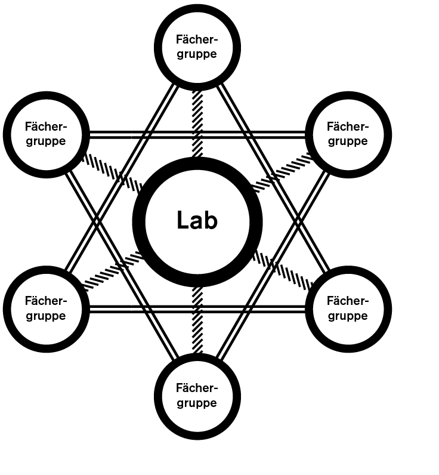

### HF Interactiondesign
# Herzlich willkommen!

Stefan Huber, Zürich – 2017 <!-- .element: class="footer" -->
--s--
## Übersicht – Morgen

* **08:15** · Begrüssung
* **09:00** · Informatik (Christian Huber)
* **10:15** · Schulleitung & Administration
* **10:30** · «Marshmallow Challenge» mit Alex
* 1. Quartal IAD
* Durchgang durchs Gebäude
* **11:45** · Mittag

--s--
## Übersicht – Nachmittag

* **13:15** · Accounts erstellen & Installation
* Sicherheit von Accounts
* Dokumente Strukturieren
* **16:00** · Apéro

--s--
# Haben alle einen Computer?

* Laptop während meinem Unterricht bitte parat haben
* Bei Problemen/Fragen immer melden

--s--
## Slides
Diese Slides sind online verfügbar.

[→ signalwerk.github.io/IAD.LAB.SLD/](https://signalwerk.github.io/IAD.LAB.SLD/)

 
### Lizenz
Lizenz Creative Commons Attribution-ShareAlike 4.0 International ([CC-BY-SA 4.0](https://creativecommons.org/licenses/by-sa/4.0/))
--s--
## Infos
Allgemeine Informationen zum Studium für  Dozierende (und Studenten):

[→ github.com/logrinto/IAD2017](https://github.com/logrinto/IAD2017)

--s--
## Begrüssung – Stefan Huber

* **1981** · Geburt
* **1997 – 2001** · Lehre zum Polygraf, Zürich
* **2002 – 2004** · Typografischer Gestalter, Zürich
* **2006 – 2008** · CAS Type Design, Zürich
* **2016 – ?** · CAS Arts & Design in Practice, Zürich

--s--
## Programmierung
* **~1999** · Erste private Website
* **~1999** · Erste kommerzielle Programmierung
* **~2000** · Erste kommerzielle Website
* **2006** · Selbständigkeit
--s--

## Kontakt

# Slack: @signalwerk
Sonst unter sh@signalwerk.ch

--s--
# Jetzt Ihr!
--s--
## Lektionen

08:15 – 09:00  
09:05 – 09:50  
10:05 – 10:50  
11:00 – 11:45  

Mittag 1.5h

13:15 – 14:00  
14:10 – 14:55  
15:05 – 15:50  
16:00 – 16:45

--s--
## Mögliche Abmachungen
8:15 – 11:45 · eine Pause (30 min)

Mittag 1.5h

13:15 – 16:45 · eine Pause (30 min)

--s--
# Informatik
* 09:00 · Informatik (Christian Huber) ~45–60min
  * Serverzugang – Nextcloud
  * E-Mail-Zugang für Studenten(...@stud.sfgz.ch)
  * Installation Adobe CC
  * Farbig drucken
  * sonstiges
--s--
# Schulleitung & Administration
* 10:15 · Jonas Schudel & Yvonne Koppitsch

--s--
# «Marshmallow Challenge»

*  10:30 · Alex Jenter

### Sind Fotos OK für Euch?
* [Twitter: @logrinto](https://twitter.com/logrinto)  
* Wer macht Instagram?

--s--
## 1. Quartal IAD
[→ Online Stundenplan](https://logrinto.github.io/IAD2017.timetable/)

--s--
## 1. Quartal IAD

# Lernziele
* [Agile Planung – Martin Werren](https://github.com/logrinto/IAD2017/lernziele/HS2017/agil.md)
* [Experimentelles Erzählen – Basil Vogt](https://github.com/logrinto/IAD2017/lernziele/HS2017/expstory.md)
* [Lab 1. Semester – Stefan Huber](https://signalwerk.github.io/IAD.LAB.DOC/ziele/)
* [Leseführung am Bildschirm (eBook) – Laurent Gachnang](https://github.com/logrinto/IAD2017/lernziele/HS2017/readscreen.md)
* [Medien-/Technologiegeschichte – Ulrike Felsing](https://github.com/logrinto/IAD2017/lernziele/HS2017/artcontext.md)

--s--
## Agile Planung – Martin Werren

* Wichtig für den Erfolg eines Projekts
* Planung in der Informatik ist häufig anders als in der Gestaltung
* Agile Methoden sind oft noch nicht verbreitet
* Hoher Bezug zum Alltag

--s--
## Experimentelles Erzählen – Basil Vogt

* Was erzählt man wenn man keine Geschichte hat?
* Experiment vor dem Produkt
* Bruch zum Alltag
--s--
## Leseführung am Bildschirm (eBook) – Laurent Gachnang

* Ein sanfter Wechsel von Druck zu Web
* Gekanntes adaptieren
* Verwandte Technologie fremder Markt
* Paralell zum Alltag
--s--
## Medien-/Technologiegeschichte – Ulrike Felsing

* «Wer die Vergangenheit nicht kennt, kann die Gegenwart nicht verstehen und die Zukunft nicht gestalten» – Helmut Kohl (1930 – 2017)
* Die Kunst im Kontext der neuen Medien
* Background zum Alltag
--s--
## Lab
→ Schauen wir am Nachmittag an
--s--
## Ausblick 2. Quartal IAD
[→ Online Stundenplan](https://logrinto.github.io/IAD2017.timetable/)
--s--
## Noten und Anwesenheit

* **Anwesenheitspflicht** – 80 % Anwesenheit um ins nächste Semester aufgenommen zu werden.
* **3 Noten im Zeugnis**
  * Kontext und Konzeption
  * Design und Interaktion
  * Realisation und Controlling

--s--
## Cluster «Kontext und Konzeption»
* Medien-/Technologiegeschichte
* Experimentelles Erzählen
* Community Building
<!-- * Technologiegeschichte der Schrift -->
--s--
## Cluster «Design und Interaktion»
<!-- * Interaktive Grafiken -->
* Interaktion mit DIY–Hardware
* Leseführung am Bildschirm (eBook)
* Grids & Modules – Systeme für die Gestaltung
--s--
## Cluster «Realisation und Controlling»
* Lab
* Agile Planung
<!-- * Was kostet meine Stunde? -->
--s--
## Anteil
Die Schüler erhalten dann, basierend auf den Anzahl Lektionen der einzelnen Module, eine Durchschnitts-Note für die drei Cluster.
--s--
## Selbststudium/Hausaufgaben

* Pro Woche können bis zu 3 Stunden Selbststudium – je 4 Lektionseinheiten – den Studierenden in Auftrag gegeben werden.

= **maximal 12h** Selbststudium pro Woche

--s--
## Selbststudium/Hausaufgaben
### Grundsatz
Hausarbeiten müssen pünktlich abgegeben werden. Ist dies nicht der Fall, so wird die Arbeit mit der Note 1 bewertet.

--s--
# Durchgang durchs Gebäude
## um 13:15 Uhr wieder hier

--s--
## Übersicht – Nachmittag

* **13:15** · Accounts erstellen & Installation
* Sicherheit von Accounts
* Dokumente Strukturieren
* **16:00** · Apéro

--s--
## Ziel vom Lab
 <!-- .element: style="height: 550px;" -->

--s--
## Ziel vom Lab

* Studenten bei technischen Problemen helfen
* Technisches Verständnis aufbauen (Grundlagen)
* Portfolioaufbau unterstützen
* Austausch zwischen Studenten fördern

--s--
## Herausforderungen

* Unterschiedlicher Wissensstand
* Diverse Technologien –   ich zeige oft nur einen möglichen Weg

--s--
## Accounts erstellen

# Slack (Business-Chat)
* [Anmeldung](https://join.slack.com/t/logrinto/shared_invite/MjI5OTA0MDE2MjU3LTE1MDM0NzQ5NjYtMWJkMzJhYjlhNw)

--s--
## Channel eröffnen
* Lab-Channel
* join #lab
--s--
## Sicherheit eines Accounts

* Was ist ein «sicheres» Passwort
* Wie werden Passwörter gespeichert
  * Beim User
  * Beim Anbieter

--s--
## «sicheres» Passwort

* Hohe Entropie (Chaos)
* Länge unbekannt
* Verwendete Zeichen unbekannt

--s--
## Hohe Entropie (Chaos)

* Passwörter nicht 2x benutzen!
* [xkcd: Password Strength](https://xkcd.com/936/)
--s--
## Länge unbekannt

* minimale Längen sind gut
* maximale Längen meist nicht sinnvoll

--s--
## Verwendete Zeichen unbekannt

* Zeichensatz-Einschränkungen sind meist sinnlos
* Sonderzeichen sind nicht zwingend eine gute Idee (schwerer zum erinnern)

--s--
## Zeichensatz für «existenzielle» Passwörter

* [Keyboard-Layout](https://en.wikipedia.org/wiki/British_and_American_keyboards#/media/File:KB_United_Kingdom.svg) berücksichtigen
* Eventuell eine Hardcopy (Papier)
--s--
## Passort Prüfen

* [Artikel zum Thema](https://blogs.dropbox.com/tech/2012/04/zxcvbn-realistic-password-strength-estimation/)
* [Online-Test](https://dl.dropboxusercontent.com/u/209/zxcvbn/test/index.html)
--s--
# 🙈🙈🙈😭😭😭😭😭😭😭😭😭😭😭😭😭😭😭😭😭😭😭😭😭😭😭😭😭😭😭😭😭😭😭😭😭😭😭😭😭😭😭😭😭😭😭😭😭😭😭😭😭😭😭😭😭😭😭😭😭😭😭😭😭😭😭😭😭😭🙈🙈🙈
--s--
## Passwörter speichern

* Beim User
  * Verwendet ein Passwort-Manager!
  * wirklich!

--s--
## Passwörter speichern

* Wie speichert ein Anbieter ein Passwort?

--s--
## Richtig?

#In meiner Datenbank steht:  
**Username:** stefan  
**Passwort:** katze.123

--s--
## Passwörter speichern

* Nie im Klartext speichern!
* Hacker oder Administratoren könnten sonst das Passort klauen
--s--
## Passwörter als Hash speichern

### Beispiel Quersumme als «Hash»
* **115 → 7** kann in eine Richtung ausgeführt werden  
* **7 → ???** nicht aber in die Andere

--s--
## Bekannte «unsichere» Hashes

* MD5
* SHA-1
* ...

--s--
## Beispiel – SHA-1

Aus **katze.123** wird mit SHA-1 **3f410a362f229340652275bddd3a72fa4a013063**

[Online Testen](http://www.sha1-online.com/)
--s--
## Richtig?

# In meiner Datenbank steht:  
**Username:** stefan  
**Passwort:** 5baa61e4c9b93f3f0682250b6cf8331b7ee68fd8

--s--
## Passwörter als Salted-Hash speichern

**katze.123** und  
**nsLkOEmYjQbL6S8dXzH3XfYzyw** (Zufall)  

zusammen ergeben einen Hash.

--s--
## Beispiel blowfish

* 3 Informations-Einheiten Speichern (Username, Salt, Hash)
* Langsame Hash-Funkton = sicherer

[Online Testen](http://www.passwordtool.hu/blowfish-password-hash-generator)

--s--

## Richtig?

#In meiner Datenbank steht:  
**Username:** stefan  
**Passwort:**  
<small>$2a$07$ZX48iEznJwnHHcIMn0JgcOwzlpqCwpywNmv6gE9GcNnyy2kzorjcG</small>
--s--
# Im Jahr 2017 😻
--s--
# Im Jahr 2117 😭?
--s--
# okeeee... next... →→→→→→→→→→→→→→→→→→→→→→→→→→→→→→→→→→→→→→→→→→→→→→→→→→→→→→→→→→→→→→→→→→→→→→→→→→→→→→→→→→→→→→→→→→
--s--
## Dokumente Strukturieren

* Wie kannich Struktur übermitteln?
* Wie kann ich Information codieren?
--s--
## Aufgabe
# Struktur soll übermittelt werden
* Titel (1 Level)
* Text
* Liste

--s--
## Aufgabe

* vier Teams
* Regelsatz entwickeln (simpel) → Slack an Partner-Team
* Nachricht in Word erstellen (Titel, Text, Liste)
* Nachricht «codieren» → Slack an Partner-Team
* Partner-Team rekonstruiert Nachricht in Word

HTML/XML oder sonstige bekannte Formate vermeiden.

--s--
## Beispiel-Regelsatz

* Ein Titel ist von öffnenden und schliessenden Nasenklammern umschlossen: `{Titel}`
* Ein Text ist von öffnenden und schliessenden Rundklammern umschlossen: `(Text text)`
* Eine Aufzählung/Liste beginnt immer auf einer neuen Zeile und startet mit einem Ausrufezeichen: `! Liste`
--s--
## Beispiel Nachricht

{1. Schultag}  
(Heute hatten wir:)  
! Lab  
! Informatik-Einführung  
! Marshmallow Challenge  
--s--
## Beispiel Rekonstruktion

#1. Schultag
Heute hatten wir:
* Lab  
* Informatik-Einführung  
* Marshmallow Challenge  

--s--
## Los gehts! Sagen wir 15min?

--s--
## Merci
--s--
