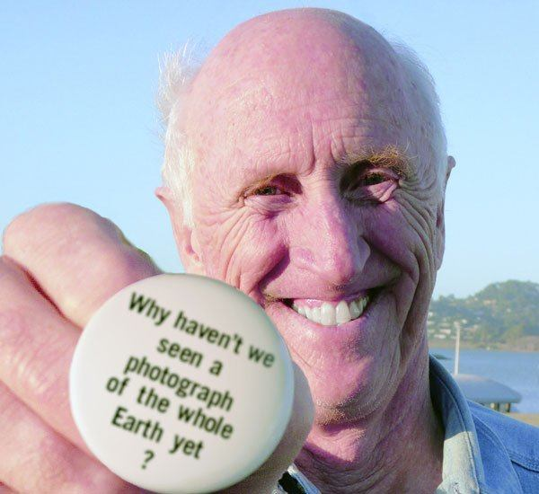
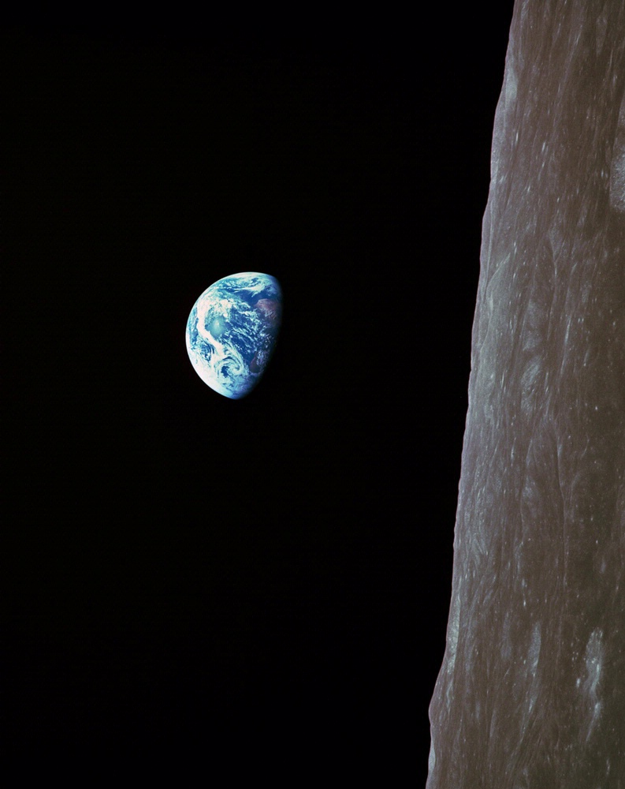
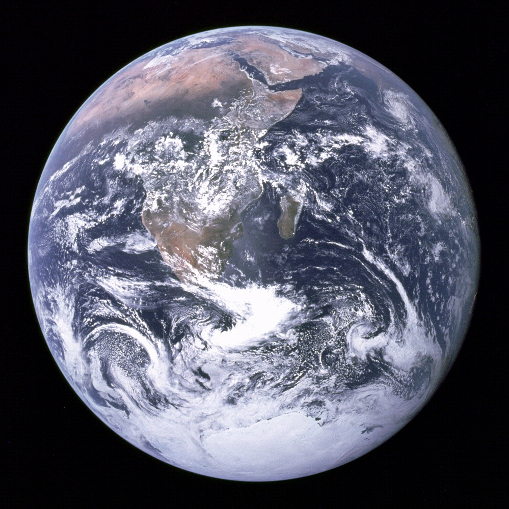

### HF Interactiondesign
# Projektwoche

Stefan Huber, Zürich – 2018 <!-- .element: class="footer" -->
--s--
## Übersicht
* Rückmeldung Semesterprüfung
* Semsteranmeldung ausfüllen
* Sebastian Einführung
* Stefan Technologie

--s--
## Rückmeldung Semesterprüfung
* Jede studierende Person setzt den Schwerpunkt selber
* Nicht jede Arbeit kann gleich Gut erfüllt werden

 

### Ablauf · 7.2.2018
**10:00 – 10:20** · Marius Becker   
**10:20 – 10:40** · Natasha Ruf  
**10:40 – 11:00** · Severin Kilchhofer  
**11:00 – 11:20** · Tieu Khe Mayer  

--s--
## Stefan Technologie

* [→ Clone Vorlage](https://github.com/logrinto/IAD2017.projektwoche.wec)
* Vorlage ist nur eine Möglichkeit
* Fragen am 7.2.2018 vor Ort
* Ich bin per Slack erreichbar

--s--
## Zuständige Admins
* Pascale Anderegg
* Marius Becker
* Wolfgang Schoeck
* Nicole Watrinet
--s--
## Stewart Brand
 <!-- .element: class="pic" -->
--s--
## Stewart Brand

* geboren 1938
* Studierte Biologie, Design & Fotografie
* California & LSD & counterculture
* «Autor»

--s--
## ab 1966 – «NASA–Kampagne»

# Why haven't we seen a photograph of the whole Earth yet?
--s--
## ab 1966 – «NASA–Kampagne»

 <!-- .element: class="pic" -->

--s--
## 1961

# Erster Amerikaner im Weltall
(Alan Shepard)
--s--
## 1967
 <!-- .element: class="pic" -->

ATS-3 Satelliten <!-- .element: class="footer" -->
--s--
## 1968

 <!-- .element: class="pic" -->

Earthrise, Apollo 8, Bill Anders <!-- .element: class="footer" -->
--s--
## 1972 – The Blue Marble

 <!-- .element: class="pic" -->

7\. Dezember 1972, Apollo 17 <!-- .element: class="footer" -->

--s--
## 1968 – Whole Earth Catalog
--s--
## 1994 – How Buildings Learn

## [→ Video-Serie](https://www.youtube.com/user/brandst/videos)
--s--
## 1996 – Long Now Foundation
* Fokus auf 10000 Jahre
* Folgen Abschätzen
* Langzeitdenken

 
[→ longnow.org](http://longnow.org/)

--s--
## Rosetta Project

 <!-- .element: class="pic" -->
--s--
## Rosetta Project

1500 Sprachen erhalten/dokumentieren

 
[→ rosettaproject.org](http://rosettaproject.org/)

--s--
## Rosetta Project

 <!-- .element: class="pic" -->
--s--
## Frangen?
