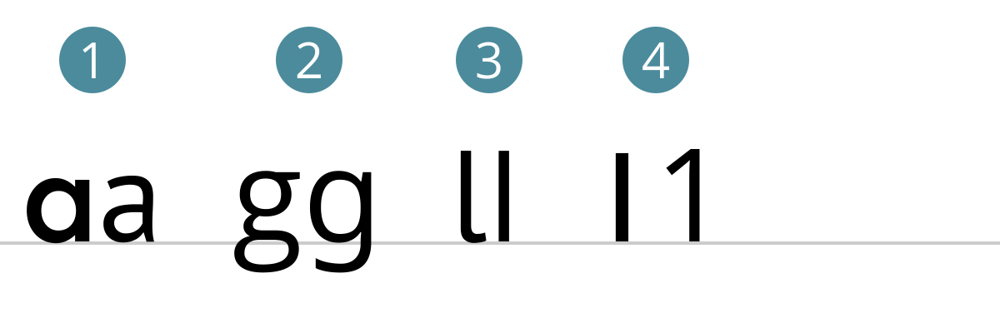

### HF Interactiondesign

# Fonts · <br>Eigenschaften & Verwendung

Stefan Huber, Zürich – 2018 <!-- .element: class="footer" -->

--s--

## Übersicht – Vormittag

* **12:45**
  * Organisation/News/Agenda
  * Rückschau & Festigung
  * Timeline «Medien-/Technologiegeschichte»
  * Fonts · Eigenschaften & Verwendung
* **16:15** · Ende

--s--
# Organisation

--s--

## Auswertung 1. Semester

--s--
## Module

* es gibt einen Wunsch längere Module zu machen
* Module können durch die Dozierenden bedingt oftmals nicht sehr lange sein
* wir versuchen unser bestes die Module zu koordinieren. jedes thema soll aber mehrfach angeschnitten werden.

--s--
## Semestergebühren

Ob Umfang/Gebühren um 15% gekürzt wird oder nicht ist im Klassendurchschnitt nicht ausschlaggebend.
--s--
## Arbeitssituation

Wechselt den Job, wenn ihr in der Praxis zu wenig digitalen Kommunikation/Interaktion habt!

--s--
## Unterstützung bei Ausbildung

Drei Personen (von 11) werden vom Arbeitgeber unterstütz.


--s--
## Lohngleichheit

### Frauen verdienen 10–20% weniger Lohn! <br>Das geht so nicht!
* [Lohnunterschied](https://www.bfs.admin.ch/bfs/de/home/statistiken/arbeit-erwerb/loehne-erwerbseinkommen-arbeitskosten/lohnniveau-schweiz/lohnunterschied.html)
* Wollt ihr wissen, was die anderen verdienen?

--s--
## Sonstiges
* Die Vermittlung kan besser sein
* Welcher Anteil an Technik?
* Welcher Anteil an Gruppenarbeit?
* Mischung aus Teorie und Praxis
* (Zeit-) Planung

--s--
## Semestersitzung
* Zwei Studivertreter
* Do. 31.5.2018 – 18:00 → Sitzungszimmer 110
--s--
## Technik

* MacOS, Adobe CC und Fonts ok?
* Google Drive ok?
--s--
## Tag der Schrift

--s--
## News
* Abstimmungen digital/analog
* [→ Museum für Gestaltung](http://www.museum-gestaltung.ch/de/information/ueber-uns/standorte/ausstellungsstrasse/eroeffnungsfest/)
--s--
## Agenda
* 6\. April 2018 ~~HeK~~
* 26.–30. April 2018 [→ The Libre Graphics Meeting](https://libregraphicsmeeting.org/2018/)
* 2.–4. Mai 2018 [→ re:publica](https://re-publica.com/)

--s--
## Entwurf

* Wie entwerft ihr?
* Wie kommt ihr mit der Technik klar?
--s--
## Entwurf
* Vorstellung verschiedener Tools?
  * Indesign PDF → verlinkung
  * Illustrator
  * PSD → Pixelgenau
  * Sketch
  * Adobe XD
  * Code
  * others?


--s--
## Arbeitslast

# Umfrage
* Wie war die Arbeitslast in den letzten Wochen?


--s--
# Rückschau
## Schriftmuster-Analyse


--s--
## Timeline

* Braucht ihr Unterstützung? Gibt es offene Fragen?

--s--
## Fonts · Eigenschaften & Verwendung
--s--
## Anatomie einer Schrift
 <!-- .element: class="pic" -->

--s--
## Anatomie einer Schrift

 <!-- .element: class="pic" -->


--s--
## Anatomie einer Schrift


 <!-- .element: class="pic" -->


--s--
## Anatomie einer Schrift

 <!-- .element: class="pic" -->

--s--
## Heimarbeit

# Präsentation · Schrift

--s--
## Grundlegende Eigenschaften


* Serifenschrift | serifenlose Schrift
* Offene Punzen | geschlossene Punzen
* Horizontale oder vertikale orientierung
* ...
--s--
## Fonts beziehen

* Mieten pro Monat
* Fonts kaufen
* Views Kaufen
--s--
## Mieten (pro Monat)
* [fonts.com](http://www.fonts.com/subscriptions)
* [Typekit](https://typekit.com/)
--s--
## Fonts kaufen
* [Fontshop](https://www.fontshop.com/)
--s--
## Views Kaufen
* [Linotype](http://www.linotype.com)
--s--
## Gratis-Fonts
* [google Fonts](https://fonts.google.com)
* Womit bezahlen wir?
--s--
## Icon-Fonts & Variable Fonts
* [Icon-Fonts](http://fontello.com/)
* [Variable fonts](https://blog.typekit.com/2016/09/14/variable-fonts-a-new-kind-of-font-for-flexible-design/)
--s--
## Heimarbeit

* 3 Schriftmuster
  * 2 Schrifthersteller
  * redaktioneller Inhalt

--s--
## Präsentation · Schrift
* Dokumentation der Schriftwahl
* Dokumentation der «digitalen Schriftmuster»
--s--
## Fonts im Web

* Web Safe Fonts (Systemfonts)
* Fonts mitsenden (Webfonts)
--s--
## Web Safe Fonts (Systemfonts)

```CSS
p {
  font-family: Arial, Helvetica, sans-serif;
}
```

* Schrift ist bei Host installiert
* Fallbacks um mehrere mögliche Schriften ab zu decken

<!-- .element: class="footer" --> [→ sfgz.ch](http://sfgz.ch/)
--s--
## Fonts mitsenden (Webfonts)

* Verschiedene Formate
  * .woff2
  * .woff
  * .eot
  * andere (svg/otf/fft)

--s--
## Fonts mitsenden (Webfonts)


```css
@font-face {
  font-family: 'Open Sans';
  src: url('opensans-regular-webfont.eot');
  src: url('opensans-regular-webfont.eot?#iefix') format('embedded-opentype'),
  url('opensans-regular-webfont.woff2') format('woff2'),
  url('opensans-regular-webfont.woff') format('woff'),
  url('opensans-regular-webfont.ttf') format('truetype');
  font-weight: normal;
  font-style: normal;
}
```

anwenden
```CSS
p {
  font-family: "Open Sans", Arial, Helvetica, sans-serif;
}
```

<!-- .element: class="footer" --> [→ Webfont konvertieren](http://www.fontsquirrel.com/tools/webfont-generator)


--s--
## Fonts vom CDN

### CSS

```CSS
@import url('https://fonts.googleapis.com/css?family=Open+Sans');

p {
  font-family: 'Open Sans', sans-serif;
}
```
--s--
## Fonts vom CDN

### HTML

```
<link href='https://fonts.googleapis.com/css?family=Open+Sans' rel='stylesheet'>
```
### CSS

```CSS
p {
  font-family: 'Open Sans', sans-serif;
}
```
--s--
## Prsxisarbeit – Test
* [codepen](https://codepen.io/)
  * Einbinden von google-Fonts in CSS und HTML
* Lokal
  * Woff erstellen
  * Icon-Font erstellen
  * HTML erstellen und Woff einbinden
--s--
## Fonts testen

* [google Fonts](https://fonts.google.com/)
* [typecast.com](https://www.google.ch/search?q=typecast+google+fonts)
--s--
## Hausarbeit
* SVG-Testdatei korrigieren
* 1000 Zeichen zur Schrift verfassen
