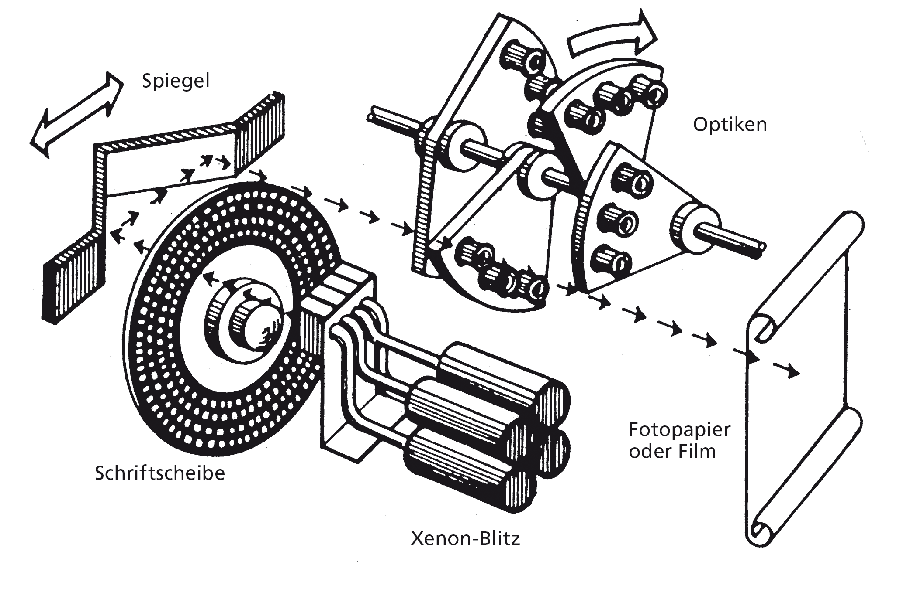

## HF Interactiondesign

# Technologiegeschichte der Schrift

Stefan Huber, Zürich – 2018 <!-- .element: class="footer" -->

--s--
## Übersicht

* **8:15**
* Technologiegeschichte der Schrift
* **11:45**

Mittag
* **12:45**
* Technologiegeschichte der Schrift
* **15:00** · Abfahrt Toni-Areal
* **16:15** · Ende
--s--
# Organisation
* Sa 16.06.2018 – Technologiegeschichte der Schrift
* Fr 22.06.2018 – Bildschirme und Fonts (4 Lektionen)
* Fr 29.06.2018 – Bildschirme und Fonts (4 Lektionen)
--s--
## Aufbau

* Fokus auf europäischer Raum
* Fokus auf 19./20. Jahrhundert
* Fokus auf profesionelle Schriftgestaltung/Publikation
* Neueste Technologien eher kurz, da bekannt
--s--
## Versuch

* Möglichst visuell
* Möglichst viele Übungen und Versuche
* Let's try...

--s--
## Intro

[→ Übersicht über die Geschichte der Schrift](https://www.ardmediathek.de/tv/LexiTV/Geschichte-der-Schrift/MDR-Fernsehen/Video?bcastId=7545188&documentId=20112174)
--s--
## Römische Capitalis Monumentalis

--s--
## Karolingische Minuskel

--s--
## Werkzeug
 <!-- .element: class="pic" -->
--s--
## Achslage

--s--
## Breitfeder

  <iframe src="https://www.youtube.com/embed/i6fWPSMwJT8?start=322&end=345" frameborder="0" allow="autoplay; encrypted-media" allowfullscreen></iframe>

--s--
## Spitzfeder

  <iframe src="https://player.vimeo.com/video/62849657" frameborder="0" webkitallowfullscreen mozallowfullscreen allowfullscreen></iframe>

--s--
## Aufgabe

* Versucht mit Spitzfeder und mit Breitfeder ein n zu machen
* Versucht digital einen der Stile in Illustrator zu immitieren

--s--
## Buchdruck
--s--
## Johann Gensfleisch zum Gutenberg

 <!-- .element: class="pic" -->

Kupferstich nach André Thevet, 1584. <!-- .element: class="footer" -->

--s--
## B42 – Gutenberg-Biebel

 <!-- .element: class="pic" -->

B42 Bd. / Vol. 1 - fol. 102r <!-- .element: class="footer" -->
--s--
## Bleibuchstaben
 <!-- .element: class="pic" -->

--s--
## Schriftherstellung

--s--
## Stempel herstellen

--s--

## Stempel schneiden

<!-- .element: class="footer" --> Quelle: [Wikipedia](https://en.wikipedia.org/wiki/Punchcutting#/media/File:Cutting_a_punch_for_a_Qu_ligature.jpg)
--s--

## Stempel schlagen

 <!-- .element: class="pic" -->

--s--

## Matrizen schlagen

 <!-- .element: class="pic" -->

<!-- .element: class="footer" --> Quelle: [Dutchtypelibrary](https://www.dutchtypelibrary.nl/index_desktop.html)

--s--
## Matrizen schlagen

 <!-- .element: class="pic" -->

<!-- .element: class="footer" --> Quelle: [Wikipedia](https://en.wikipedia.org/wiki/Punchcutting#/media/File:De_Vinne_1904_-_Punch_and_matrix.jpg)
--s--

## Handsatz

 <!-- .element: class="pic" -->
--s--
## Setzmaschinen
* Monotype
* Linotype
--s--

## Monotype

 <!-- .element: class="pic" -->

--s--
## Linotype
 <!-- .element: class="pic" -->
--s--

## Linotype

  <iframe src="https://www.youtube.com/embed/13trF0_XIMs?start=34" frameborder="0" allow="autoplay; encrypted-media" allowfullscreen></iframe>

--s--
## Linotype

  <iframe src="https://www.youtube.com/embed/avDuKuBNuCk" frameborder="0" allow="autoplay; encrypted-media" allowfullscreen></iframe>

--s--

## Montoype Keyboard

  <iframe src="https://www.youtube.com/embed/LcphfMlOzk4?start=20" frameborder="0" allow="autoplay; encrypted-media" allowfullscreen></iframe>

 
--s--

## Montoype Caster

  <iframe src="https://www.youtube.com/embed/M9DV95IEKGU?start=690" frameborder="0" allow="autoplay; encrypted-media" allowfullscreen></iframe>

--s--
## Fotosatz
 <!-- .element: class="pic" -->

--s--
## Fotosatz

 <!-- .element: class="pic" -->
--s--
## Übung

* Versuche den «unscharfen» Buchstabe so zu verändern, dass er nach der Reproduktion «schärfer» wirkt.
--s--
## Demo

--s--
## Beispiel
 <!-- .element: class="pic" -->

--s--

## Rubbelbuchstaben (Lettraset)

 <!-- .element: class="pic" -->
--s--

## Rubbelbuchstaben (Lettraset)

 <!-- .element: class="pic" -->

--s--
## Licht- & Lasersatzsysteme

--s--
## Kathodenstralröhre
 <!-- .element: class="pic" -->

--s--
## Fonts werden Digital
 <!-- .element: class="pic" -->

--s--

## Aufgabe

* Zeichne die Zeichen «Aakg» als `.pbm` in einem Texteditor
--s--
## Systeme ohne Monitor
 <!-- .element: class="pic" -->
--s--
## Systeme ohne Monitor
 <!-- .element: class="pic" -->
--s--
## Erste WYSIWYG-Systeme

--s--
## Erste WYSIWYG-Systeme
 <!-- .element: class="pic" -->
--s--
## Erste WYSIWYG-Systeme
 <!-- .element: class="pic" -->
--s--
## Nadeldrucker

 <!-- .element: class="pic" -->

--s--
## Prinzip
 <!-- .element: class="pic" -->

--s--
## Schriftbild

--s--
## Nadeldrucker vs. Tintenstrahldrucker  

--s--
## Ikarus
--s--
## Ikarus

 <!-- .element: class="pic" -->
--s--
## Ikarus

* [Making Faces: Metal Type in the 21st Century](https://vimeo.com/82013261)   Zeitmarke: 12:15

--s--
## Aufgabe

* Versuche ein s mit einem [→ «Ikarus-ähnlichen»](https://codepen.io/osublake/pen/wKGvVG) System zu Zeichnen

--s--
## Apple und TrueType
 <!-- .element: class="pic" -->

--s--
## MacOS 1 – Pixelfonts

--s--
## MacOS 7 – TrueType

--s--
## Quadratische Kurven (TrueType)

--s--
## Aufgabe

* [→Teste](https://pomax.github.io/bezierinfo/) den Unterschied zwischen quadratische Kurven und kubische Kurven

--s--
## Adobe und PostScript

 <!-- .element: class="pic" -->
--s--
## Kubische Kurven (PostScript)

--s--

### Laserdrucker

  <iframe src="https://www.youtube.com/embed/WB0HnXcW8qQ" frameborder="0" allow="autoplay; encrypted-media" allowfullscreen></iframe>

--s--
## Übungen

* 3 Gruppen
* [→ HackMD](https://hackmd-ce.herokuapp.com/) für Präsi?
* Aufbauend
--s--
## Übung Beschriftungen

* Wie heisst dieses System?
* Welche Alternativen kennst du?
* [→ Blinkenrocket]( http://blinkenrocket.de)
--s--
## Übung XY-Systeme

* Was ist das?
* Kurz zur Geschichte...
* Wer ist Hektor?
--s--
## Schreibmaschine

* Nutzung?
* Kugelkopf-Schreibmaschine? Bedeutung...
* Keyboard-Layout?
* CR LF?

--s--
## Übung

* Vergleiche die Druckverfahren Hochdruck, Tiefdruck und Offsetdruck
* Vergleiche die verschiedenen Papiere
* Vergleiche die Schwärzung
--s--
## Merci
