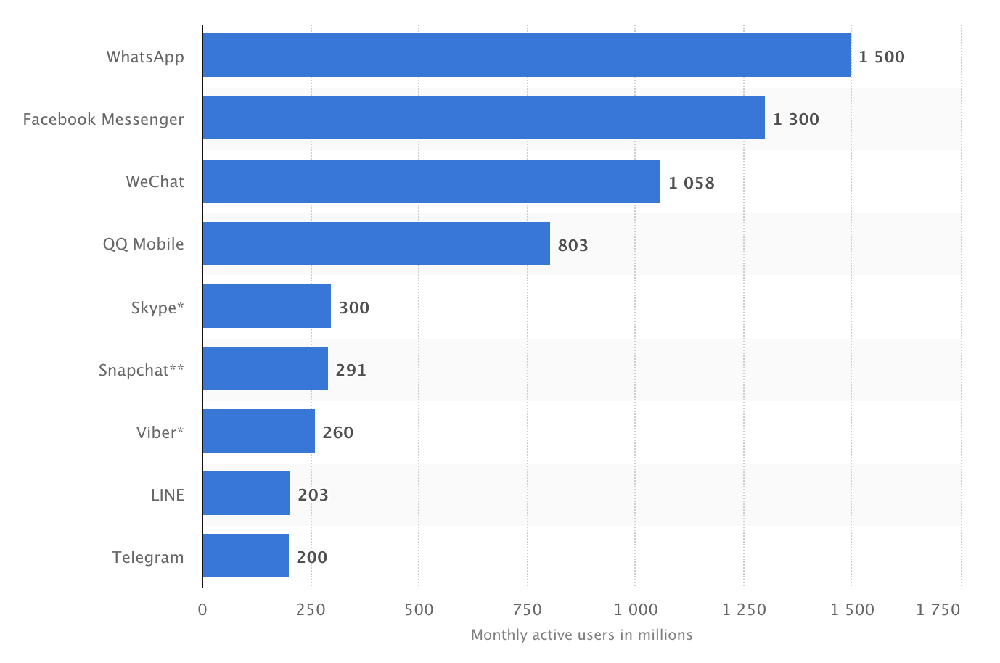
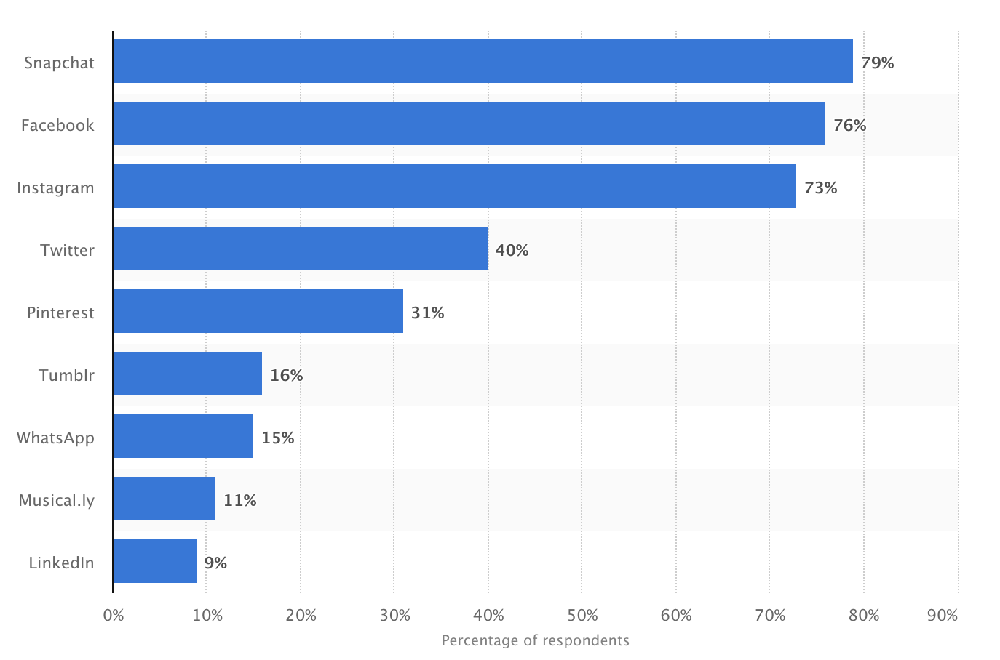

### HF Interactiondesign

# Cookie Clicker

Stefan Huber, Zürich – 2018 <!-- .element: class="footer" -->
--s--
## Übersicht

* **12:45**
* Organisation/News/Agenda
* Cookie Clicker
* Infografik
* **16:15** · Ende

--s--
# Organisation
--s--
## Arbeitslast

# Umfrage
* Wie war die Arbeitslast in den letzten Wochen? (😭 💤 ☺️)

--s--
## News
* [GitHub Education](https://education.github.com/)
* [Marokko hat anstatt vier Zeiten nur noch Eine](https://m.20min.ch/ausland/news/story/keiner-weiss--was-nun-in-marokko-fuer-uhrzeit-ist-23068876)
* [WhatsApp Stickers](https://www.iol.co.za/business-report/technology/whatsapp-launches-stickers-for-ios-and-android-17686360)

--s--
#### October 2018
## Messanger – Aktive Nutzer

 <!-- .element: class="pic" -->

<!-- .element: class="footer" --> Quelle: [statista.com](https://www.statista.com/statistics/258749/most-popular-global-mobile-messenger-apps/)

--s--
#### Altersgruppe 13 – 24 Jahre – Februar 2017
## Messanger – Social Media Nutzung – USA

 <!-- .element: class="pic" -->

<!-- .element: class="footer" --> Quelle: [statista.com](https://www.statista.com/statistics/199242/social-media-and-networking-sites-used-by-us-teenagers/)
--s--
#### 2015
## Marktverteilung Messanger

 <!-- .element: class="pic" -->

<!-- .element: class="footer" --> Quelle: [ondeviceresearch.com](https://ondeviceresearch.com/blog/messenger-wars-how-facebook-climbed-number-one)

--s--
## Stickers

* In anderen Messangern schon länger vorhanden
* In Japan sehr populär
* In diversen Messangern käuflich zu erwerben
* Big Business ([→ Line](https://line.me/en/) $271 mio. im 2015)

--s--
## Agenda
* 9. – 11. November 2018 [→ gameZfestival 18](http://www.gamezfestival.ch/)
* 1. Dezember 2018 [→ Food Revolution 5.0](https://www.gewerbemuseum.ch/veranstaltungen/ausstellungseroeffnung-food-revolution/)

--s--
## Variable Font!
* Fertig bis 23. 11. 2018
--s--
## Cookie Clicker
--s--
## The Köln Concert – Keith Jarrett
* [→ Hören](https://open.spotify.com/album/3MyXPG2AYKTXZyjfzkMOmx?si=B8W3Yw33QxOYQXze-c65OQ)
* Januar 1975 gespielt
* Vera Brandes (17) – hat Keith Jarrett eingeladen
* Reise von Zürich nach Köln, wenig schlaf, schlechtes Essen
* falscher Flügel – verstimmt, zu leise, unspielbar
* Aufnahme war nur noch für «interne Zwecke» gedacht
* Best verkauftes Piano-Album
* erst 1990 autorisiertes Transkript

<!-- .element: class="footer" --> Quelle: [grammy.com](https://www.grammy.com/grammys/news/pianist-keith-jarrett-story-k%C3%B6ln-concert) & [Wikipedia](https://en.wikipedia.org/wiki/The_K%C3%B6ln_Concert)
--s--
## Cookie Clicker
### Alle
* Variablen
* if/else
* ins DOM schreiben
* im DOM Klassen hinzufügen/löschen
* funktionen

--s--
## Cookie Clicker
### Einige
* Zeit-Events
* Arrays

--s--
## Cookie Clicker
* Abgabe – heute
* Übersichtsseite – 23. 11. 2018
* Review – 23. 11. 2018
* Präsentation – 23. 11. 2018

--s--
## Abgabe

* Auf eigenes GitHub-Repo pushen (Branch-Name: `gh-pages`)
* In [→ globalem Repo](https://github.com/logrinto/IAD2017.clicker-game) Instruktionen folgen
* Wenn der Push nicht funktioniert → jemand anderes fragen → problem später lösen

--s--
## Übersichtsseite

* Back-Button
* Übersichtsbild?

--s--
## Review

* Matthias Koch & Pascale Anderegg
* Lars Mäder & Marius Becker
* Nils Mäder & Stephanie Fuchs
* Tieu Khe Mayer & Marc Hatt
* Natasha Ruf & Severin Kilchhofer
* Nicole Watrinet & Wolfgang Schoeck

--s--
## Review
* Aufgabe vergeben & besprechen → etwa 2 h
* Mögliche Aufgabe: responsive
* Pull Requests über Github bis 23. 11. 2018 angenommen

--s--
## Präsentation
* 23. November 2018

--s--
## Infografik

--s--
