### HF Visuelle Gestaltung

# eBook

Stefan Huber, Zürich – 2019 <!-- .element: class="footer" -->
--s--
## Übersicht
* **26. Januar 2019** · Umfeld · Typografie · eBooks
* **1. Februar 20919** · Screens · eBooks
--s--
## Heute

* **8:15**
* Umfeld · Typografie
* Versuche
* **11:45** · Ende

* **12:45**
* Paper-Prototype
* Übung
* **16:15** · Ende

--s--
## Hello World!

**Stefan Huber** · Lebt und arbeitet als selbständiger Entwickler und Gestalter in Zürich. Macht die Konzeption und Realisation für blinkende Dinge im Web und ist Dozent an der Schule für Gestaltung Zürich.

--s--
## Etherpad

## https://etherpad.gnome.org/p/2019-ebook

--s--
# eBook
## Digitales Publizieren von Mengentext

--s--
## Lernziele (gekürzt)
* Zugänglich machen von Information (≠ Kunst)
* Umfeld eBook – keine technische Realisation
* Aufgabe von Gestaltung am eBook/Screen
* Technische Möglichkeiten/Beschränkungen
* Mengentext und Gestaltung  

--s--
## Gestaltung im traditionellen Umfeld
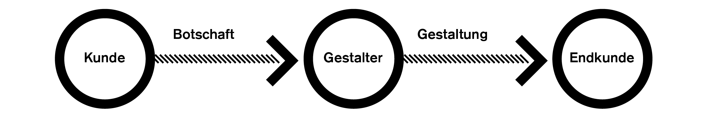

--s--
## Gestaltung im digitalen Umfeld

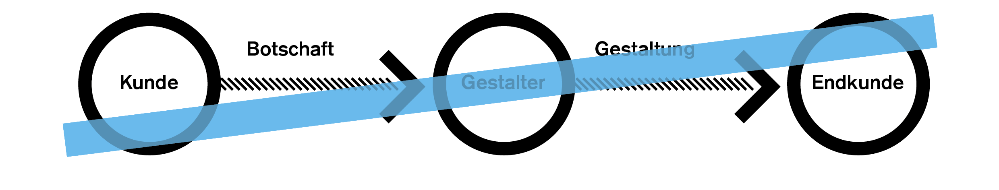

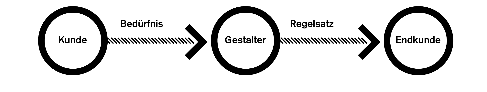

--s--
# eBook · Umfeld
--s--
## Daten haltbar machen
* Modernes Buch  4. Jhr. n. Chr
* Lochkarte für Webstuhl  ~ 1725
* Moderne Fotografie  ~ 1826
* Festplatte (magnetisch)  ~ 1956
* CD-ROM (Daten)  ~ 1988

--s--
## Buchproduktion
Vergleich handschriftliche Codices vs. modernem Buch <!-- .element: class="small" -->

--s--
## Buchproduktion
Vergleich handschriftliche Codices vs. modernem Buch <!-- .element: class="small" -->

--s--

> ##  «The medium is the message»

Marshall McLuhan

--s--
## Nachricht = Medium

<!-- .element: class="footer" --> Quelle: [wikimedia.org](https://commons.wikimedia.org/wiki/File:Fortbewegung_um_1800.svg)

--s--
## Information reist schneller als ein Medium
Informationsübertragung nach London in km/h <!-- .element: class="small" -->

 <!-- .element: style="width: 70%;" -->

--s--
## Das Physische Medium wird überflüssig

<!-- .element: class="footer" --> Börsentelegrafen, Thomas Edison, 1869

--s--

## Book reader · 1935

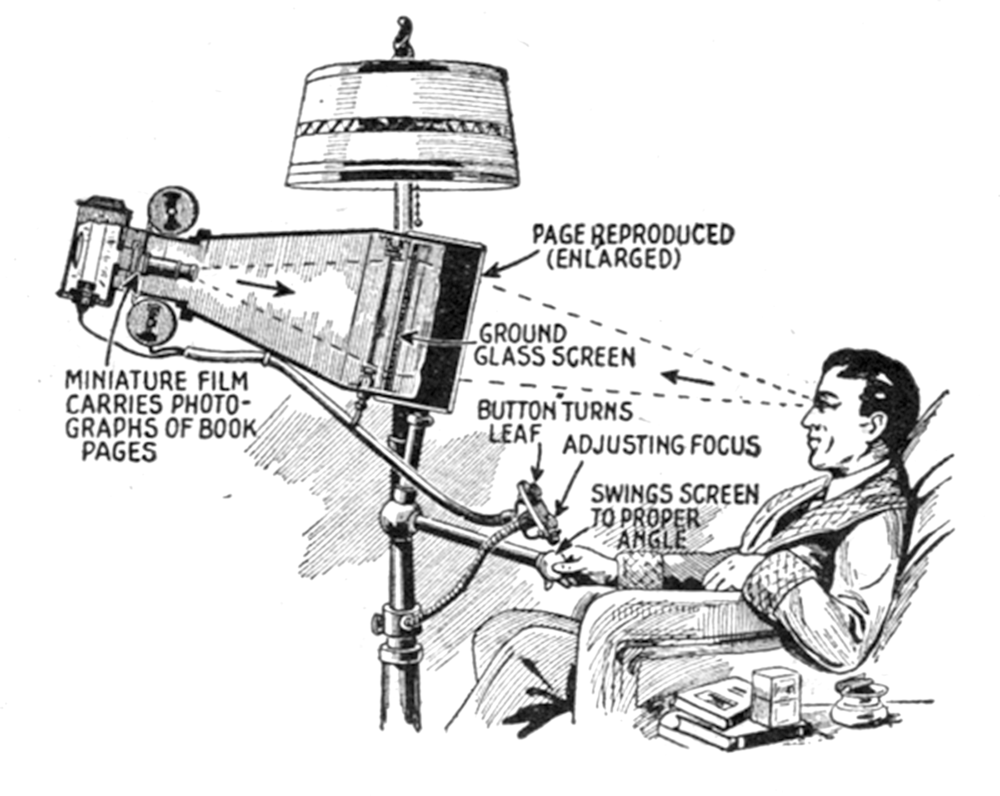 <!-- .element: style="width: 60%;" -->

<!-- .element: class="footer" -->  Quelle: [Everyday Science and Mechanics, April 1935](http://www.smithsonianmag.com/history/the-ipad-of-1935-115653218/)

--s--

## 1945 – Memex · 1945

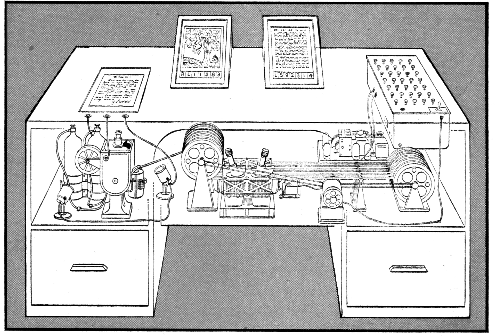 <!-- .element: style="width: 60%;" -->

<!-- .element: class="footer" --> Quelle: [«As We May Think», Vannevar Bush, 1945, «The Atlantic Monthly»](http://www.computerhistory.org/revolution/the-web/20/370/2111?position=0)

--s--

## 20. Jahrhundert · Das Medium wird digital

--s--
## Was bedeutet «digital»?
--s--
## Bedeutung

Vom Lateinischen:  

**digitus** → Finger
--s--
## Bedeutung
Digital meint eine (mit den Fingern) **abzählbare Einordnung** von Dingen.
--s--
## Apple · 1984
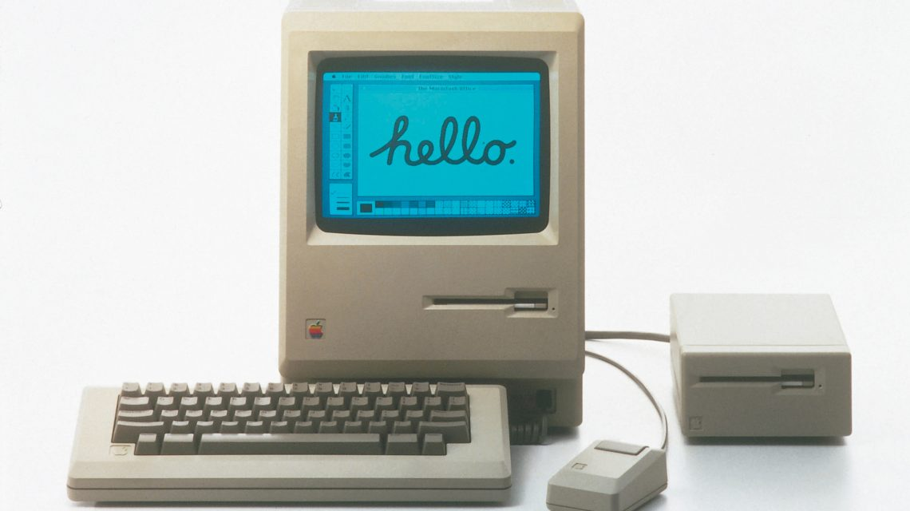  <!-- .element: style="width: 90%;" -->

--s--
## MacOS 1 – Pixelfonts · 1984

Fonts von Susan Kare für Apple Macintosh entwickelt. <!-- .element: class="small" -->

<!-- .element: class="footer" --> Quelle: [Wikipedia](https://en.wikipedia.org/wiki/Susan_Kare#/media/File:Original_Mac_fonts.png)

--s--
## MacOS 7 – TrueType · 1991
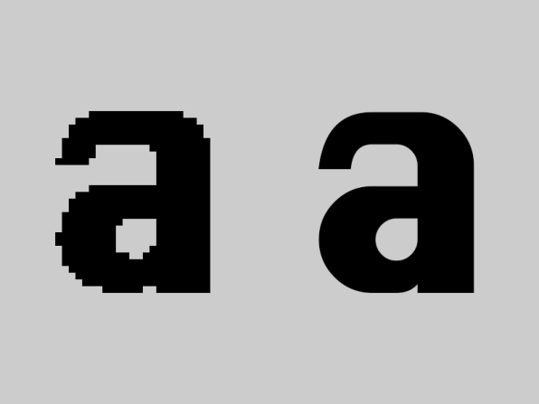

--s--
## Adobe und PostScript · 1982

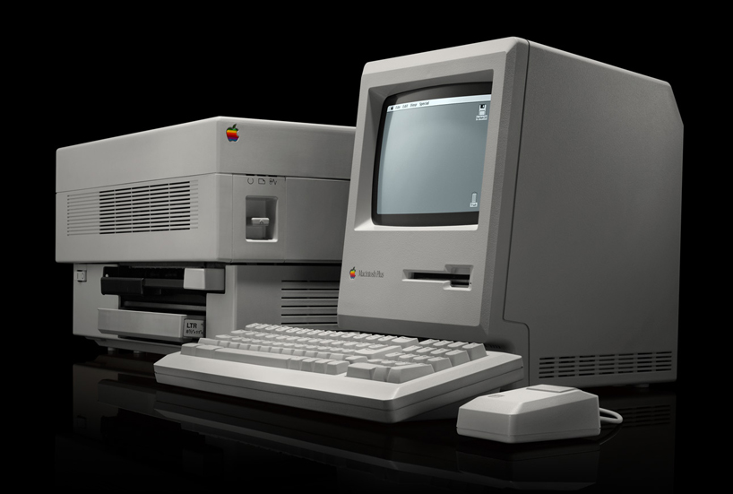 <!-- .element: class="pic" -->

--s--
## PDF · 1993

* Fixes Layout
* Schriften inkludiert
* WYSIWYG...

--s--
## Gerätetypen

### Wichtige Einführungen

* **iPhone** · 29. Juni 2007
* **iPad** · 3. April 2010

--s--
## Gerätetypen

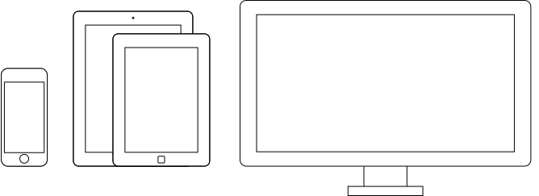 <!-- .element: class="pic" -->

--s--

## Internet-Durchdringung

<!--

	 The World Bank Group – <a href="http://data.worldbank.org/indicator/SP.POP.TOTL">Population (Total) </a>
	&amp; <a href="http://data.worldbank.org/indicator/IT.NET.USER.P2">Internet users (per 100 people) 1985 – 2012</a>
	 www.asymco.com – <a href="http://www.asymco.com/2014/01/03/on-the-future-of-the-internet-and-everything/">On the future of the Internet and everything, Jan. 2014</a>

 -->

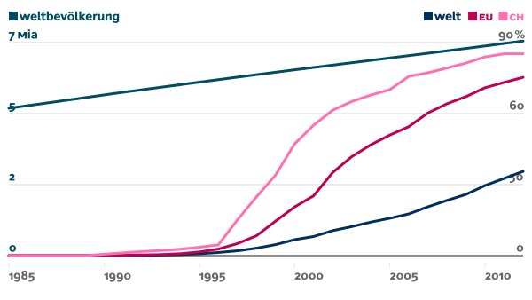 <!-- .element: style="width: 80%;" -->

<!-- .element: class="footer" --> Quelle: [The World Bank Group](http://data.worldbank.org/indicator/SP.POP.TOTL) & [asymco.com](http://www.asymco.com/2014/01/03/on-the-future-of-the-internet-and-everything/)
--s--
## Mobiles Internet
#### Schweiz – Internetnutzung nach Gerätetypen in %
 <!-- .element: class="stats" -->

  

    <svg xmlns:ct="http://gionkunz.github.com/chartist-js/ct" width="100%" height="100%" class="ct-chart-line" style="width: 2em; height: 1em;" version="1.1" xmlns="http://www.w3.org/2000/svg" viewBox="0 0 30 15">
      <line class="ct-line" x1="3" y1="10" x2="27" y2="10"></line>
    </svg>
    Desktop
  

  

    <svg xmlns:ct="http://gionkunz.github.com/chartist-js/ct" width="100%" height="100%" class="ct-chart-line" style="width: 2em; height: 1em;" version="1.1" xmlns="http://www.w3.org/2000/svg" viewBox="0 0 30 15">
      <line class="ct-line" x1="3" y1="10" x2="27" y2="10"></line>
    </svg>
    Mobile
  

  

    <svg xmlns:ct="http://gionkunz.github.com/chartist-js/ct" width="100%" height="100%" class="ct-chart-line" style="width: 2em; height: 1em;" version="1.1" xmlns="http://www.w3.org/2000/svg" viewBox="0 0 30 15">
      <line class="ct-line" x1="3" y1="10" x2="27" y2="10"></line>
    </svg>
    Tablet
  

--s--
## Mobiles Internet
#### Weltweit – Internetnutzung nach Gerätetypen in %

 <!-- .element: class="stats" -->

  

    <svg xmlns:ct="http://gionkunz.github.com/chartist-js/ct" width="100%" height="100%" class="ct-chart-line" style="width: 2em; height: 1em;" version="1.1" xmlns="http://www.w3.org/2000/svg" viewBox="0 0 30 15">
      <line class="ct-line" x1="3" y1="10" x2="27" y2="10"></line>
    </svg>
    Desktop
  

  

    <svg xmlns:ct="http://gionkunz.github.com/chartist-js/ct" width="100%" height="100%" class="ct-chart-line" style="width: 2em; height: 1em;" version="1.1" xmlns="http://www.w3.org/2000/svg" viewBox="0 0 30 15">
      <line class="ct-line" x1="3" y1="10" x2="27" y2="10"></line>
    </svg>
    Mobile
  

  

    <svg xmlns:ct="http://gionkunz.github.com/chartist-js/ct" width="100%" height="100%" class="ct-chart-line" style="width: 2em; height: 1em;" version="1.1" xmlns="http://www.w3.org/2000/svg" viewBox="0 0 30 15">
      <line class="ct-line" x1="3" y1="10" x2="27" y2="10"></line>
    </svg>
    Tablet
  

--s--
##  Smartphone

#### Weltweit – Verkaufte Smartphones in Mio.
 <!-- .element: class="stats" -->

Zum Vergleich: Im Jahr 2014 wurden weltweit 308 Millionen Computer verkauft. <!-- .element: class="footer" -->

--s--
##  Mobiles Internet – Datenübertragung

#### Mobilfunk-Standards – 3G und neuer
 <!-- .element: class="stats" -->

  

    <svg xmlns:ct="http://gionkunz.github.com/chartist-js/ct" width="100%" height="100%" class="ct-chart-bar" style="width: 2em; height: 1em;" version="1.1" xmlns="http://www.w3.org/2000/svg" viewBox="0 0 30 15">
      <line class="ct-bar" x1="3" y1="10" x2="27" y2="10"></line>
    </svg>
    Download
  

  

    <svg xmlns:ct="http://gionkunz.github.com/chartist-js/ct" width="100%" height="100%" class="ct-chart-bar" style="width: 2em; height: 1em;" version="1.1" xmlns="http://www.w3.org/2000/svg" viewBox="0 0 30 15">
      <line class="ct-bar" x1="3" y1="10" x2="27" y2="10"></line>
    </svg>
    Upload
  

 <!-- .element: class="stats" -->

Angaben in MBit/s  <!-- .element: class="footer" -->

--s--

# eBook · Grundlagen
--s--
# Wer liest eBooks?
* Welche Geräte?
* Wo kaufen?

--s--

## Lesefluss im Buch

 <!-- .element: style="width: 70%;" -->
--s--

## Lesefluss im eBook

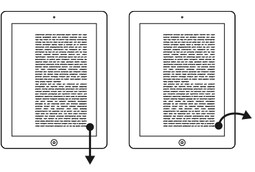 <!-- .element: style="width: 70%;" -->

--s--

## Fixes Layout

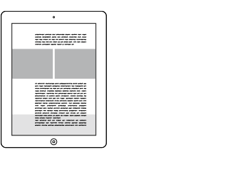 <!-- .element: style="width: 70%;" -->

--s--

## Fliessender Text

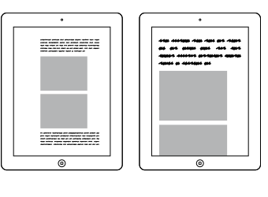 <!-- .element: style="width: 70%;" -->

--s--

## Zusätzliche Mediendaten
* Audio
* Video
* Interaktion
* (Fonts)

--s--
## Lesezeichen, Vermerk und Social Bookmarking/Social Reading
* Abhängig von Reader
* Service von Drittanbietern

--s--

## DEMO

* Lesefluss im Buch
* Lesefluss im eBook
* Fixes Layout
* Fliessender Text
* Audio
* Lesezeichen

--s--

##  Typografie im eBook

* Grundschrift
* Titel
* Auszeichnungen/Links
* ((Bilder))

--s--
##  Erweiterte Typografie

* Tabellen (!)
* Listen
* ((Zitate))
* ...
--s--

## Grundschrift

* Wie breit läuft der Text?
* Zeilenabstand
* Laufweite (Tracking)

--s--
## Abstufungen

* Grundtext is die Ausgangslage
* 50 – 80 Zeichen – eher 50 als 80

--s--

## Übung A

* Erstelle ein minimales [HTML](https://typecast.com/preview/google)
* Setze [Bildtext](http://www.blindtextgenerator.de/) in einer zentrierten Textspalte (ohne Titel)
* Definiere die Grundschrift als [Open Sans Regular](https://fonts.google.com/specimen/Open+Sans?selection.family=Open+Sans)
* Definiere ein angenehmes Leseerlebnis für «Desktop-Computer»

### Erweiterung
* Definiere eine Mobile-Grösse mit 320 px (iPhone SE) Breite
* ((Erstelle Titel H1, H2, H3 in Desktop und Mobile))

--s--
## Analyse

* Wie wurde die Schriftgrösse definiert?
* Wie wurde der Zeilenabstand definiert?
* Wie wurde die Spaltenbreite definiert?
* Wie breit ist ein Desktop-Bildschirm?

--s--
## Bildschirmgrösse

--s--
## Spaltenbreite

* Wie wurde die Spaltenbreite definiert?

--s--
## Visuelle Grösse

* [Size Calculator](https://sizecalc.com/)
--s--

## Zeichensetzung · Leitfaden

* [→ Webtypo Wiki](https://github.com/logrinto/webtypo/wiki)

--s--
## Anführungszeichen
# In der Schweiz nur so: «Zitat»

 

# «Ich lese die Site ‹Typo-Nerd› täglich.»

--s--
## Ziffer-Leerzeichen
# Fr. 10.–
# Fr.  9.–
#### (Fr.·9.–)
--s--
## Geschützte Leerzeichen
# 10 Liter
#### (10␣Liter)
# Seite 3
#### (Seite␣3)
# Grau AG
#### (Grau␣AG)
--s--
## Geschützte schmales Leerzeichen
# 18. August 2018
#### (18.¦August␣2018)

 

## falsch
# 18. August 2018
--s--
## Geschützte schmales Leerzeichen
# 18. 8. 2018
#### 18.¦8.¦2018

 

## falsch
# 18. 8. 2018
--s--
## Geschützte schmales Leerzeichen
# 20 000
#### (20¦000)
 

## falsch
# 20 000
# 20000
--s--
## Geschützte schmales Leerzeichen
# 2000
#### (2000)
 

## falsch
# 2 000

--s--
## Halbgeviertstrich

# 14 – 16 Uhr
#### (14¦–¦16␣Uhr)
 

## falsch
# 14 – 16 Uhr
# 14 - 16 Uhr
--s--
## Halbgeviertstrich

# Winterthur – Bern
# Er ging – so glaubten wir – heim.
 

## falsch
# Winterthur - Bern
# Er ging - so glaubten wir - heim.
--s--
## Divis
# Kuppel-Wörter
 
# bei Tren- nung
#### (nicht manuell einfügen)

--s--
## Titel

* Wie viele Titel-Stufen gibt es?
* Auszeichnungen im Titel?

--s--
## Titelabstufung
# h1
## h2
### h3
#### h4

--s--
### Übung A · Erweiterung
* Definiere eine Mobile-Grösse mit 320 px (iPhone SE) Breite
* Erstelle Titel H1, H2, H3 in Desktop und Mobile

--s--
## Analyse

--s--
## Titelabstufung

* [W3C Recommendation](https://www.w3.org/TR/html5/rendering.html#sections-and-headings)
* [Bootstrap](https://getbootstrap.com/docs/4.1/content/typography/)
* [Foundation](https://foundation.zurb.com/sites/docs/v/5.5.3/components/typography.html)
* [Materialize](https://materializecss.com/typography.html)

--s--
## Titelabstufung

 <!-- .element: style="width: 70%;" -->

--s--
## Titelabstufung

# `h1` = 2 rem
# `h2` = ? rem
# `h3` = 1 rem
--s--
## Titelabstufung

# `h1` = 2 rem
### 100 % ÷ 1.5 × 2 = 133.33 %
# `h2` = 1.5 rem
### 100 % ÷ 1 × 1.5 = 150 %
# `h3` = 1 rem

--s--
## Titelabstufung

# `h1` = 2 rem
### 100 % ÷ 1.414 × 2 = 141.4 %
# `h2` = 1.414 rem
### 100 % ÷ 1 × 1.414 = 141.4 %
# `h3` = 1 rem

<!-- .element: class="footer" --> Rechner: [Geometrisches Mittel](https://www.hackmath.net/en/calculator/geometric-mean)

--s--
## Titelabstufung

<!-- .element: class="footer" --> Quelle: [Interpolation Theory](https://www.lucasfonts.com/about/interpolation-theory/)
--s--

<table class="table table-striped table-bordered" style="font-size: 0.65em">
<thead>
<tr>
<th>Eigenschaft</th>
<th>Buch (Papier)</th>
<th>eBook (ePub)</th>
</tr>
</thead>
<tbody>
<tr>
<td>Inhalt</td>
<td>Bestimmt durch Autor</td>
<td>Bestimmt durch Autor  z. T. Ergänzt durch Reader wie zum Beispiel Lexikon-Funktion</td>
</tr>
<tr>
<td>Format/Dimension</td>
<td>Bestimmt durch Produzent</td>
<td>Bestimmt durch Lesegerät</td>
</tr>
<tr>
<td>Verweise/Quellen</td>
<td>Text-Referenz</td>
<td>Links &amp; Text-Referenz</td>
</tr>
<tr>
<td>Schriftwahl/Schriftgrösse</td>
<td>Bestimmt durch Gestalter</td>
<td>Bestimmt durch Leser</td>
</tr>
<tr>
<td>Navigation im Werk</td>
<td>Linear</td>
<td>Linear, selektiv, verweisend, …</td>
</tr>
<tr>
<td>Aktualisierung</td>
<td>je Auflage</td>
<td>Instantan, je Bezug</td>
</tr>
<tr>
<td>Vertrieb</td>
<td>direkt, Buchhandel</td>
<td>direkt, Vertriebspartner</td>
</tr>
<tr>
<td>Erwerb</td>
<td>Buch als Informationsträger</td>
<td>Nutzungsrecht an Information</td>
</tr>
<tr>
<td>Herstellungskosten</td>
<td>einmalig</td>
<td>einmalig</td>
</tr>
<tr>
<td>Stückkosten</td>
<td>Hoch (Materialkosten)</td>
<td>niedrig (Speicher/Übermittlung)</td>
</tr>
</tbody>
</table>

--s--
## Übung B

* Abgabe nächste Woche
* Aufgabe siehe Blatt

--s--

## Navigation
* Kapitelübersicht
* Volltextsuche
* Verlinkungen innerhalb des Buches
* Prozentzahl der bereits gelesenen Inhalte
* Visuelle Elemente (wie Balken) zur Positionsbestimmung
* Darstellung der Seitenabfolge
* Zeitangabe der bereits gelesenen Inhalte (meist errechnet)

--s--
## Prototype

* Darstellung der Interaktion
* [→ Paper Prototype](https://www.youtube.com/watch?v=x48qOA2Z_xQ)

--s--

## Vertrieb und Kopierschutz
* DRM
* Wasserzeichen und «social DRM»

--s--

## Preisgestaltung · Economy of scale

* Grösse des Bildschirmes
* Art des Bildschirmes
* Proportion des Bildschirmes
* Auflösung des Bildschirmes
* Orientierung des Geräts (Hoch-/Querformat)
* Lesesoftware
* Einstellungen in der Software
* Verfügbarkeit von Schriften

--s--
## eBook · Formate
<table class="table table-striped table-bordered" style="font-size: 0.65em">
<thead>
<tr>
<th>Eigenschaft</th>
<th>ePub</th>
<th>PDF/ePDF</th>
<th>Kindle</th>
<th>Apps</th>
</tr>
</thead>
<tbody>
<tr>
<td>Fixes Layout</td>
<td>möglich</td>
<td>Ja</td>
<td>beschränkt</td>
<td>Ja</td>
</tr>
<tr>
<td>Fliessender Text</td>
<td>Ja</td>
<td>beschränkt</td>
<td>Ja</td>
<td>Ja</td>
</tr>
<tr>
<td>Verweise im Werk</td>
<td>Ja</td>
<td>beschränkt</td>
<td>Ja</td>
<td>Ja</td>
</tr>
<tr>
<td>Schriftwahl/Schriftgrösse (vom Leser)</td>
<td>Ja</td>
<td>beschränkt</td>
<td>Ja</td>
<td>Ja</td>
</tr>
<tr>
<td>Navigation im Werk</td>
<td>sehr gut</td>
<td>möglich</td>
<td>sehr gut</td>
<td>Ja</td>
</tr>
<tr>
<td>Aktualisierung</td>
<td>möglich</td>
<td>nein</td>
<td>möglich</td>
<td>Ja</td>
</tr>
<tr>
<td>Vertrieb</td>
<td>offen</td>
<td>offen</td>
<td>Amazon</td>
<td>Stores</td>
</tr>
<tr>
<td>Filme/Ton</td>
<td>möglich</td>
<td>beschränkt</td>
<td>möglich</td>
<td>Ja</td>
</tr>
<tr>
<td>Verschlüsselung (Kopierschutz)</td>
<td>über Umwege</td>
<td>Ja</td>
<td>Ja</td>
<td>Ja</td>
</tr>
</tbody>
</table>

--s--

## ePub erstellen
* InDesign CC
* pandoc zum konvertieren
* Fachperson (HTML)

--s--

## Kriterien für ein eBook?
* Typ der Publikation (Zielpublikum)
* Dateiformat/Technologie
* Vertriebskanal
* Erscheinungsweise

--s--
## Lesen eines eBooks

* **eReader** → mehrere Tage
* **Tablet/Smartphone** → mehrere Stunden
* **Desktop** → (nicht mobil)

--s--

## Danke

--s--
