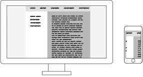

### HF Visuelle Gestaltung

# eBook

Stefan Huber, Zürich – 2019 <!-- .element: class="footer" -->
--s--
## Übersicht
*  ~~**26. Januar 2019** · Umfeld · Typografie · eBooks~~
* **1. Februar 20919** · eBooks · Screens
--s--
## Heute

* **8:15**
* eBooks
* Praxis
* **11:45** · Ende

* **12:45**
* Screens
* **16:15** · Ende

--s--
## Etherpad

## https://etherpad.gnome.org/p/2019-ebook

--s--
# eBook
## Digitales Publizieren von Mengentext
--s--
## eBook Markt

* Weniger als 10 % vom Gesammtmarkt in der Schweiz  (wohl eher ~5 %)
* Seit 2011 verkauft Amazone mehr eBooks als Papier-Bücher
* Amazone in den USA ~80 % Marktanteil von eBooks
* Was geschieht im Edu-Bereich?  (~ 5 – 8 % vom Schweizer Markt)

 <!-- .element: class="footer" --> Quelle: [sbvv](https://www.sbvv.ch/userfiles/file/Marktreport/Marktreport_2017_Buchhandel_DS_final2.pdf) · [publishdrive](https://publishdrive.com/amazon-ebook-market-share/)

--s--

## eBook anbieten
* Typ der Publikation (Zielpublikum)
* Dateiformat/Technologie
* Vertriebskanal
* Erscheinungsweise

--s--

## eBook kaufen/beziehen

* Technologie
* Dateiformat
* Vertriebskanal

--s--
## Technologie

* **eReader** → mehrere Tage
* **Tablet/Smartphone** → mehrere Stunden
* **Desktop** → (nicht mobil)

--s--

## Dateiformate
<table class="table table-striped table-bordered" style="font-size: 0.65em">
<thead>
<tr>
<th>Eigenschaft</th>
<th>ePub</th>
<th>PDF/ePDF</th>
<th>Kindle</th>
<th>Apps</th>
</tr>
</thead>
<tbody>
<tr>
<td>Fixes Layout</td>
<td>möglich</td>
<td>Ja</td>
<td>beschränkt</td>
<td>Ja</td>
</tr>
<tr>
<td>Fliessender Text</td>
<td>Ja</td>
<td>beschränkt</td>
<td>Ja</td>
<td>Ja</td>
</tr>
<tr>
<td>Verweise im Werk</td>
<td>Ja</td>
<td>beschränkt</td>
<td>Ja</td>
<td>Ja</td>
</tr>
<tr>
<td>Schriftwahl/Schriftgrösse (vom Leser)</td>
<td>Ja</td>
<td>beschränkt</td>
<td>Ja</td>
<td>Ja</td>
</tr>
<tr>
<td>Navigation im Werk</td>
<td>sehr gut</td>
<td>möglich</td>
<td>sehr gut</td>
<td>Ja</td>
</tr>
<tr>
<td>Aktualisierung</td>
<td>möglich</td>
<td>nein</td>
<td>möglich</td>
<td>Ja</td>
</tr>
<tr>
<td>Vertrieb</td>
<td>offen</td>
<td>offen</td>
<td>Amazon</td>
<td>Stores</td>
</tr>
<tr>
<td>Filme/Ton</td>
<td>möglich</td>
<td>beschränkt</td>
<td>möglich</td>
<td>Ja</td>
</tr>
<tr>
<td>Verschlüsselung (Kopierschutz)</td>
<td>über Umwege</td>
<td>Ja</td>
<td>Ja</td>
<td>Ja</td>
</tr>
</tbody>
</table>
--s--
## ePub erstellen
* InDesign CC
* [pandoc](https://pandoc.org/) zum konvertieren
* Fachperson (HTML)

--s--
## Vertriebskanal

* Durch die Technologie (mit-)bestimmt
* Händlernetz und Margen berücksichtigen

--s--
## Kopierschutz
* DRM (Digital rights management)
* Wasserzeichen (Social DRM)

--s--

## Preisgestaltung · Economy of scale

* Erstes Stück kostet viel
* Stückpreis kostet (fast) nichts

--s--
## Preisgestaltung · The Long Tail

--s--
# Screens für eBook
--s--
## Software

* Lesesoftware
* Einstellungen in der Software
* Verfügbarkeit von Schriften
* ...

--s--
## Hardware

* Grösse des Bildschirmes
* Proportion des Bildschirmes
* Auflösung des Bildschirmes
* Orientierung des Geräts (Hoch-/Querformat)
* Art des Bildschirmes

--s--
## Bildschirmauflösung
 <!-- .element: class="pic" -->

--s--
## Bildschirmauflösung
 <!-- .element: class="pic" -->

--s--

## Bildschirmgrösse

--s--
## Bildschirmabmessung
15" Zoll von was?

--s--
## Übung
* Kann die Spalte des abgegebenen Blattes auf dem Screen eures mobiles visuell gleich dargestellt werden? (nur Breite beachten)
* Meinungen?
--s--

## Visuelle Grösse

* [Size Calculator](https://sizecalc.com/)
--s--
## Auflösung

# 1920 ✕ 1080
--s--
## Auflösung
# 72 dpi
--s--
## Auflösung
# 1920 ✕ 1080 vs. 72 dpi
--s--
## Auflösungsdichte – DPI

Angabe, wieviel Pixel (Punkte) auf einer Strecke von 1 Inch (25.4 mm) dargestellt werden.

--s--
## Auflösungsdichte – DPI

1. Alle Screens haben 72 dpi
2. Alle Mac haben 72 dpi, alle PC haben 92 dpi
3. Alle Mac haben 72/144 dpi, alle PC haben 92 dpi
4. Es gibt keine Regel

--s--

## DPI Wert ermitteln
Höhe oder Breite des Bildes in Pixel  ÷  Höhe oder Breite in Ausgabe (in Inch)  =  Auflösung in DPI (Dots per Inch)
--s--
## Rechnungsbeispiel

Höhe oder Breite des Bildes in Pixel  ÷  Höhe oder Breite in Ausgabe (in Inch)  =  Auflösung in DPI (Dots per Inch)
>> 3000 Pixel ÷ 10 Inch (25,4 cm) = 300 Dots per Inch

--s--

## Display Technologien

--s--
## Übung

* Untersucht mit einer Lupe und einer Smartphone-Kamera ein anderes Smartphone.

--s--

## Elektrophoretische Anzeige

--s--
## Geräte mit eInk

--s--
## LCD-Anzeige

--s--

## Geräte mit LCD

--s--
#### OLED

<video controls>
  <source src="../../2018/KW25-screens/img/REC016.mp4" type="video/mp4" />
  <source src="../../2018/KW25-screens/img/REC016.webm" type="video/webm" />
</video>

--s--
#### OLED

<!-- .element: class="footer" --> Bildquelle: [LG](http://www.lg.com/global/business/information-display/technology-solution/oled)

--s--
## Bildwiederholrate

* Animation flüssig: ab [20 – 30 Frames pro Sekunde (fps)](https://en.wikipedia.org/wiki/Frame_rate#/media/File:Animhorse.gif)
* Ideal: [60 Frames pro Sekunde](https://www.youtube.com/watch?v=pfiHFqnPLZ4)
* iPad Pro? Filme? TV? Games?

--s--
## Kennzahlen zu Bildschirmen
* [Lichtstärke – Lumen](https://de.wikipedia.org/wiki/Lumen)
* [Leuchtdichte – Nits](https://de.wikipedia.org/wiki/Leuchtdichte)
* [Farbraum](https://de.wikipedia.org/wiki/Farbraum)

--s--
# Text auf dem Bildschirm

--s--
## Vektor zu Pixel

 <!-- .element: class="pic" -->

--s--
## Schriftgrösse
 <!-- .element: class="pic" -->

--s--
## Renderer

 <!-- .element: class="pic" -->

--s--
## 1-Bit (Bitmap)

 <!-- .element: class="pic" -->

--s--
## Auflösung

Microsoft Arial Unicode – MS-Renderer – S/W – 8 bis 48 Pixel Höhe (PPM) <!-- .element: class="footer" -->

--s--
## Wirkung

  <!-- .element: class="pic" -->

Microsoft Arial Unicode – MS-Renderer – S/W – 8 bis 18 Pixel Höhe (PPM) <!-- .element: class="footer" -->

--s--
## Wirkung

 <!-- .element: class="picWide" -->

Microsoft Arial Unicode – 8 Pixel Höhe (PPM) – MS-Renderer – S/W <!-- .element: class="footer" -->

--s--
## Wirkung

 <!-- .element: class="picWide" -->

Microsoft Arial Unicode – 24 Pixel Höhe (PPM) – MS-Renderer – S/W <!-- .element: class="footer" -->

--s--
## Unterschiede im Rendering

 <!-- .element: class="pic" -->

--s--
## FreeType-Renderer – S/W

 <!-- .element: class="pic" -->

13 Pixel Höhe (PPM) – Microsoft Arial Unicode <!-- .element: class="footer" -->

--s--
## MS-Renderer – S/W

 <!-- .element: class="pic" -->

13 Pixel Höhe (PPM) – Microsoft Arial Unicode <!-- .element: class="footer" -->

--s--
## Apple-Renderer – S/W

 <!-- .element: class="pic" -->

13 Pixel Höhe (PPM) – Microsoft Arial Unicode <!-- .element: class="footer" -->

--s--
## Hinting

--s--
## Outline

 <!-- .element: class="pic" -->

--s--
## Buchstabe a als Pixel ohne Hinting

 <!-- .element: class="pic" -->

--s--
## Buchstabe a als Outline mit Hinting

 <!-- .element: class="pic" -->

--s--
## Buchstabe a als Pixel mit Hinting

 <!-- .element: class="pic" -->

--s--
## TrueType vs. PostScript

* OpenType kennt beide «flavors»
* Woff 1/2 (Web-Fonts) sind technologisch (beinahe) OpenType-Fonts
* TrueType erlaubt bessere Steuerung von Hints

--s--
## TrueType mit von Hand eingefügten Hints

Microsoft Arial Unicode – MS-Renderer – S/W <!-- .element: class="footer" -->
--s--
## Autohints in PostScript

AMB Newut Medium – MS-Renderer – S/W <!-- .element: class="footer" -->

--s--
## Darstellung mit Graustufen

 <!-- .element: class="pic" -->

Microsoft Arial Unicode  – 8 bis 18 Pixel Höhe (PPM) – MS-Renderer – Graustufen   <!-- .element: class="footer" -->

--s--
## Wirkung
 <!-- .element: class="picWide" -->

Microsoft Arial Unicode – 8 Pixel Höhe (PPM) – MS-Renderer – Graustufen  <!-- .element: class="footer" -->

--s--
## Wirkung
 <!-- .element: class="picWide" -->

Microsoft Arial Unicode – 24 Pixel Höhe (PPM) – MS-Renderer – Graustufen  <!-- .element: class="footer" -->
--s--
## FreeType-Renderer – Graustufen
 <!-- .element: class="pic" -->

13 Pixel Höhe (PPM) – Microsoft Arial Unicode <!-- .element: class="footer" -->
--s--

## MS-Renderer – Graustufen
 <!-- .element: class="pic" -->

13 Pixel Höhe (PPM) – Microsoft Arial Unicode <!-- .element: class="footer" -->
--s--

## Apple-Renderer – Graustufen
 <!-- .element: class="pic" -->

13 Pixel Höhe (PPM) – Microsoft Arial Unicode <!-- .element: class="footer" -->

--s--
# Umfrage

[Auswertung](https://umfragen.sfgz.ch/kurs/983835)

--s--

## Danke

--s--
