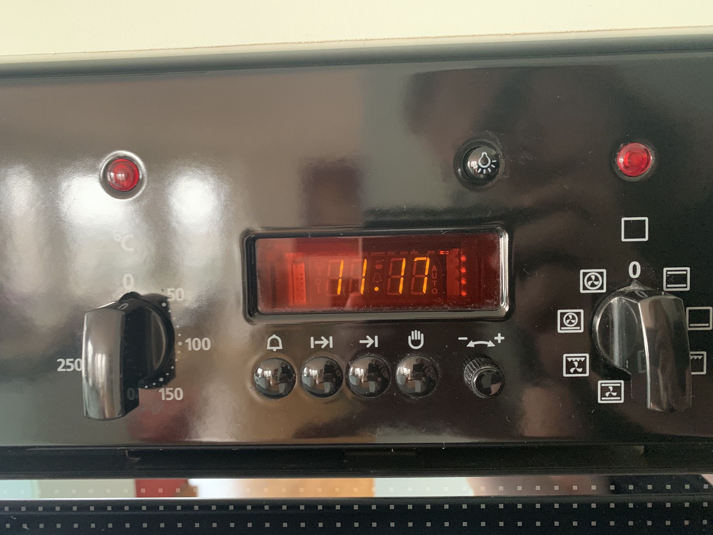

### HF Interactiondesign

# Case Study – Interface

Michael Scherrer-Kast & Stefan Huber, Zürich – 2019 <!-- .element: class="footer" -->
--s--
## Übersicht – Vormittag

* **bis 8:30** · Aufgabe
* **bis 9:00** · Kurzrecherche
* **bis 10:45** · Brainstorming
* **10:45** · Zwischenpräsentation
* **bis 11:45** · Erarbeitung

Pause nach eigenem Ermessen.

--s--
## Übersicht – Nachmittag

* **12:45** · Change Request Marketing
* **bis 15:00** · Erarbeitung
* **15:00** · Abgabe & Präsentation
* Zusammenfassung

Pause nach eigenem Ermessen.
--s--
## Aufgabe

* [Vollständige Aufgabe](https://github.com/logrinto/IAD2017.oven-design)

* Interface für den «idealen Backofen» im Schweizer Markt
* minimale (fiktive) Marktforschung als Grundlage
* Change Request Marketing (12:45 Uhr)
* Nicht Backofen neu erfinden, sondern Interface

--s--
## Veraltete Vorstellung vom Küchenofen

 <!-- .element: class="pic" -->

--s--
## Beispiel heute

* [Miele M Touch](https://www.youtube.com/watch?v=ziiJNZik6CY)
--s--
## Kurzrecherche bis 9:00
* Probleme
* Chancen
* Eigene Erfahrungen

Jede Gruppe nennt drei Keypoints ihres Ansatzes.
--s--
## Briefing Stakeholder

* für Privathaushalte
* maximal 2 Drehknöpfen (mit push/klick), keinen weiteren physischen Interfaces
* Touch-Display
* neue Art des Backofens – revolution nicht evolution
* ohne Bedienungsanleitung
* lieber Freund als Feind
* Es ist offen, was für Funktionen der Backofen abdecken soll
* Es soll inovativ gedacht werden

--s--
## Zwischenpräsentation · 10:45 Uhr

* Eine Präsentation vor den Stakeholdern
* PechaKucha (20 Slides je 20 Sekunden)
* Präsentation selber koordinieren

--s--
## Change Request Marketing
--s--
## Abgabe & Präsentation · 15 Uhr
* Funktionsumfang ist definiert
* Interface ist visualisiert
* Zu visualisieren ist ein typischer Nutzungsablauf
* Präsentation etwa 10 min
* Die Präsentation/Lösung muss abgegeben werden ([GitHub Issue](https://github.com/logrinto/IAD2017.oven-design/issues)).
* Technologie der Abgabe ist frei.

--s--
# Rückschau
--s--
