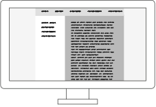
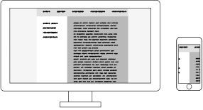
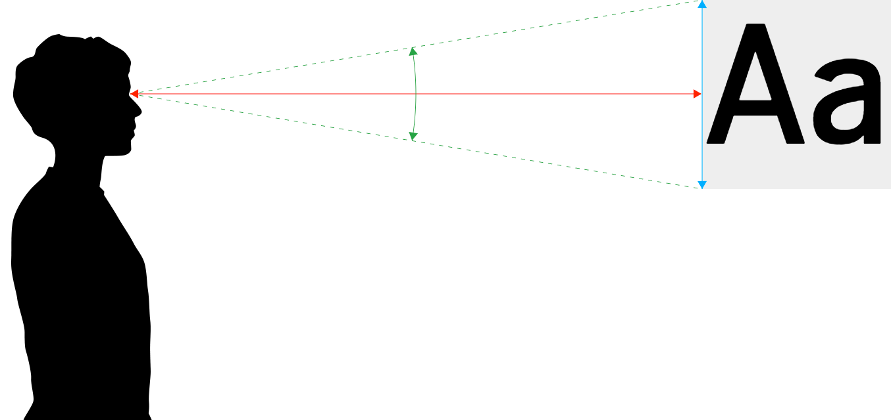

### HF Interactiondesign

# Screens

Stefan Huber · Zürich · 2019 <!-- .element: class="footer" -->


<style>
.reveal .embed-container {
  position: relative;
  padding-bottom: 50%;
  height: 0;
  overflow: hidden;
  max-width: 80%;
  height: auto;
}
.reveal .embed-container iframe,
.reveal .embed-container object,
.reveal .embed-container embed {
  position: absolute;
  top: 0;
  left: 0;
  width: 100%;
  height: 100%;
}
</style>

--s--
## Übersicht

* **8:15**
* Bildschirmauflösung
* Display Technologien
* ...
* **11:45** · Ende

--s--
## Organisation
* Fr · 27.09.2019 · **Technologiegeschichte der Schrift**

--s--
## Unterlagen
* [signalwerk.github.io/IAD2019/](https://signalwerk.github.io/IAD2019/)
* [Screens](https://signalwerk.github.io/learn.interaction/articles/screens/)

--s--
## Welt wird Digital
 <!-- .element: class="pic" -->


--s--

## Bildschirmauflösung
 <!-- .element: class="pic" -->
--s--
## Bildschirmauflösung
 <!-- .element: class="pic" -->

--s--
## Übung

* Bildschirmauflösung in [→ Spreadsheet](https://docs.google.com/spreadsheets/d/1C1EyRh_HGEXX_5WeOwIGFIHr4KgV5VvuxrLpnPiRV1U/edit?usp=sharing) eintragen
* Spalten A bis E verfollständigen
  * Welche Geräte nehmen wir?
--s--

## Standards


Bildquelle: [Wikipedia · Display resolution](https://en.wikipedia.org/wiki/Display_resolution)
<!-- .element: class="footer" -->
--s--
## Verwendung

* [Browser Market](http://gs.statcounter.com/)
* [Browser Display Statistics](http://www.w3schools.com/browsers/browsers_display.asp)

--s--
## Bildschirmabmessung

# 15" von was?

Warum Zoll?


--s--
## Zoll
```
1 Zoll (Inch) = 25.4 mm  
1 dpi ≈ 0.39 dpcm  
1 dpcm = 2.54 dpi  
```
--s--
## Übung
* Bildschirmabmessung in [→ Spreadsheet](https://docs.google.com/spreadsheets/d/1C1EyRh_HGEXX_5WeOwIGFIHr4KgV5VvuxrLpnPiRV1U/edit?usp=sharing) eintragen
* Spalten F bis H verfollständigen


--s--
## Visuelle Grösse


Bildquelle: [Size Calculator](https://sizecalc.com/)
<!-- .element: class="footer" -->

--s--
## Übung

* Typischer Leseabstand in [→ Spreadsheet](https://docs.google.com/spreadsheets/d/1C1EyRh_HGEXX_5WeOwIGFIHr4KgV5VvuxrLpnPiRV1U/edit?usp=sharing) eintragen
* Spalten J verfollständigen

--s--
## Übung
* Kann die Spalte des abgegebenen Blattes auf dem Screen visuell gleich dargestellt werden? (nur Breite beachten)
* Meinungen?
* [Size Calculator](https://sizecalc.com/)

--s--
## Auflösung

# 1920 ✕ 1080
--s--
## Auflösung
# 72 dpi
--s--
## Auflösung
# 1920 ✕ 1080 vs. 72 dpi
--s--
## Auflösungsdichte – DPI

Angabe, wieviel Pixel (Punkte) auf einer Strecke von 1 Inch (25.4 mm) dargestellt werden.

--s--
## Auflösungsdichte – DPI

1. Alle Screens haben 72 dpi
2. Alle Mac haben 72 dpi, alle PC haben 92 dpi
3. Alle Mac haben 72/144 dpi, alle PC haben 92 dpi
4. Es gibt keine Regel

--s--

## DPI Wert ermitteln
Höhe oder Breite des Bildes in Pixel <br>÷<br> Höhe oder Breite in Ausgabe (in Inch) <br>=<br> Auflösung in DPI (Dots per Inch)
--s--
## Rechnungsbeispiel

Höhe oder Breite des Bildes in Pixel <br>÷<br> Höhe oder Breite in Ausgabe (in Inch) <br>=<br> Auflösung in DPI (Dots per Inch)
>> 3000 Pixel ÷ 10 Inch (25,4 cm) = 300 Dots per Inch

--s--
## Übung

* Wieviele Punkte (Pixel) pro Inch (DPI) hat euer Screen? (Spalte K)
--s--
## Auflösungsdichte – DPI

1. Alle Screens haben 72 dpi
2. Alle Mac haben 72 dpi, alle PC haben 92 dpi
3. Alle Mac haben 72/144 dpi, alle PC haben 92 dpi
4. Es gibt keine Regel

--s--
## `1px` in CSS

--s--
## Übung

* Zeichne eine 1px Linie in CSS mit [→ Codepen](https://codepen.io/)
* Screenshot erstellen
* Screenshot untersuchen
--s--

* Bildschirmauflösung in [→ Spreadsheet](https://docs.google.com/spreadsheets/d/1C1EyRh_HGEXX_5WeOwIGFIHr4KgV5VvuxrLpnPiRV1U/edit?usp=sharing) eintragen
* Spalten A bis E verfollständigen

--s--
## Device Pixel Ratio/Pixel Density

[The Ultimate Guide To iPhone Resolutions](https://www.paintcodeapp.com/news/ultimate-guide-to-iphone-resolutions)

--s--
## Media-Query mit Pixel Density
```css
@media
only screen and ( min-device-pixel-ratio: 2),
only screen and ( min-resolution: 2dppx)
{
  /* Definitionen hier */
}
```

[Support-Matrix für Browser](https://caniuse.com/#feat=css-media-resolution)
<!-- .element: class="footer" -->
--s--
## Media-Query mit DPI

```css
@media
only screen and ( min-resolution: 190dpi),
only screen and ( min-resolution: 75dpcm)
{
  /* Definitionen hier */
}
```
[Support-Matrix für Browser](https://caniuse.com/#feat=css-media-resolution)
<!-- .element: class="footer" -->

--s--

## Display Technologien
--s--

## Kathodenstralröhre
 <!-- .element: class="pic" -->

--s--

## Elektrophoretische Anzeige


--s--
## Geräte mit eInk

--s--
## LCD-Anzeige


--s--

## Geräte mit LCD

--s--
#### OLED

<video controls>
  <source src="../../2018/KW25-screens/img/REC016.mp4" type="video/mp4" />
  <source src="../../2018/KW25-screens/img/REC016.webm" type="video/webm" />
</video>

--s--
#### OLED


Bildquelle: [LG](http://www.lg.com/global/business/information-display/technology-solution/oled)
<!-- .element: class="footer" -->

--s--
#### OLED


Bildquelle: [Gamezone/LG](https://www.mweb.co.za/games/NewsArticles/tabid/2561/Article/30977/Samsung-QLED-How-does-its-display-work-and-is-it-better-than-OLED.aspx)
<!-- .element: class="footer" -->

--s--
## Übung


* Welche Screen-Technologie verwendet euer Screen? (Spalte N)

--s--
## Dark Mode
--s--
## Betriebsystem
* **MacOS Mojave (2018)** erster Dark Mode auf Desktop
* **Android 9 (2018)** erster Dark Mode auf Mobile
* **iOS 13 (2019)** Dark Mode auch auf Apple Mobiles

--s--
## Dark Mode

* **OLED-Displays** → brauchen für hellere Farben mehr Strom
* **LCD-Displays** → bruachen für alle Farben immer (etwa) gleichviel Strom


--s--
## Stolpersteine

* Dark ≠ Black
* Farbabstufung muss neu gelernt werden
* [Black Smearing](https://gist.githack.com/signalwerk/a4084f47fb6b56f79ca33055dd2ea9a3/raw/592a8821f8f7448d57c25f39ddcc3778f649ebdc/black-smearing.html)

--s--
## Black Smearing

* Welche Mobiles haben wir?
* Let's test it!

--s--
# Merci
