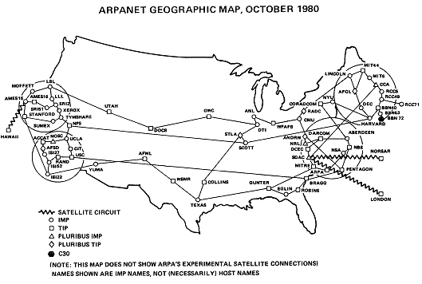

### HF Interactiondesign

# Internet · 1 × 1

Stefan Huber · Zürich · 2019 <!-- .element: class="footer" -->

--s--
## Übersicht

* **12:45**
* Organisation/News/Agenda
* Internet · 1 × 1
* Rückschau & CSS
* Praxisarbeit
* **16:15** · Ende

--s--
## Organisation
* Ausweise
--s--
## Arbeitslast

# Umfrage
* Wie war die Arbeitslast in den letzten Wochen? (😭 💤 ☺️)

--s--
## News

* [Apple Keynote](https://www.apple.com/apple-events/september-2019/)
* [Google Jobs](https://jobs.google.com/about/)

--s--
## Apple Keynote

* [iPhone 11](https://www.apple.com/iphone/)
* [iPad (low-end)](https://www.apple.com/ipad/)
* [Apple Watch Series 5](https://www.apple.com/apple-watch-series-5/)
* [Apple TV+](https://www.apple.com/apple-tv-plus/) – Kampf der Giganten...
* [Apple Arcade](https://www.apple.com/apple-arcade/)

--s--
## Google for Jobs | Google Jobs

* [Beispiel Google Jobs](https://www.google.com/search?q=interaction+design&ibp=htl;jobs)
* [Diverse Partner (jobs.ch, Xing, LinkedIn)](https://www.handelszeitung.ch/unternehmen-old/google-jobs-die-regeln-des-giganten)
* [Markt ist Fragmentiert](https://www.jobagent.ch/ratgeber-tools/relevante-jobboersen-schweiz)

--s--
## Bedürfnisse

* Firmen wollen möglichst einfach und günstig werben
* Jobsuchende wollen möglichst einfach Job finden

--s--
## Plattform

Möglicher Ablauf (Einschätzung):

* Partner-Plattformen liefern Daten an google um Sichtbarkeit zu erhöhen
* Google Jobs wird Marktleader und hat eine Gateway-Funktion
* Anbieter realisieren, dass google Jobs für sie reicht
* Partner-Plattformen verlieren an Bedeutung/Geld/Traffic

--s--
## Jobsuche IAD

* [15 – 20 % auf Initiativbewerbungen](https://www.beobachter.ch/arbeit/stellensuche/stellensuche-so-findet-man-versteckte-jobs)
* [LinkedIn Profil](https://www.linkedin.com/)
* [glassdoor](https://de.glassdoor.ch/Gehalt/Google-Z%C3%BCrich-Geh%C3%A4lter-EI_IE9079.0,6_IL.7,13_IM1144.htm)
* [Market Insights](https://www.jobcloud.ch/c/de-ch//app/uploads/2017/11/jmi-booklet-2017-de-web.pdf)

--s--
## Lohnumfrage


--s--
## Jahreseinkommen – HF2019

Eine ungültige Abgabe <!-- .element: class="small" -->


 <!-- .element: class="pic" -->


--s--
## Jahreseinkommen – HF2019

Höchst- und Tiefstverdienende gestrichen <!-- .element: class="small" -->


 <!-- .element: class="pic" -->


--s--
## Agenda

* [Virtual Reality Cinema @ Kino Houdini](https://www.wearecinema.ch/tickets-houdini)
* [Digitalfestival](https://digitalfestival.ch/) · 26. – 29. 9. 2019
* [World Interaction Design Day](https://www.eventbrite.com/e/world-interaction-design-day-trust-and-responsibility-tickets-69834881009?aff=erellivmlt) · 24. 9. 2019 (thx Matthias)

--s--
# Internet · 1 × 1
--s--


## Internet · 1 × 1
* Informationsausbreitung
* Entwicklung vom «modernen» Internet
--s--
# Internet <br>= Distribution von Information
--s--
## Pre-Internet

--s--
## Distribution von Information
* Persistent (schriftlich)
* Flüchtig (mündlich)
--s--
## Schriftliche Distribution
* Bruchstücke von Information
* Werke (Bücher)
--s--
## Bruchstücke von Information
Zettel, Notizen, mnemonische Hilfsmittel
* Privat
* Formell oder informell
* Loser Verbund an Information
* Updates durch Ergänzung/Streichung (Editierung)
* Lokale Verbreitung
--s--
## Werke (Bücher)
* Kulturträger
* Abschliessender Umfang an Information
* Aktualisierung nur bei Neuauflage
* Über Jahrhunderte sehr teuer (Material nicht Arbeit)
* Hohe Verbreitung

--s--
## Buchproduktion pro Jahr
Vergleich handschriftliche Codices vs. modernem Buch <!-- .element: class="small" -->

 <!-- .element: class="pic" -->

--s--
## Buchproduktion pro Jahr
Vergleich handschriftliche Codices vs. modernem Buch <!-- .element: class="small" -->


 <!-- .element: class="pic" -->


--s--
## Information reist schneller als ein Medium
Informationsübertragung nach London in km/h <!-- .element: class="small" -->


 <!-- .element: class="pic" -->


A Farewell to Alms – A Brief Economic History of the World, Gregory Clark, Princeton University Press, 2007 <!-- .element: class="footer" -->

--s--
## Das Physische Medium wird überflüssig


Börsentelegrafen, Thomas Edison, 1869 <!-- .element: class="footer" -->

--s--
## Telegrafen – Kabel
* Demo

--s--
## Paketvermittelte Kommunikation

Information wird in kleinere Einheiten verpackt.

### Vorteile
* Last- und Risikoverteilung
* Teile können neu gesendet werden
--s--
## ISDN
* Demo

--s--
## ARPAnet/Internet

* Auftrag vom US-Verteidigungsministerium
* Verbindet 1969 vier Universitäts-Rechner
* Start an der Westküste – Silicon Valley
* Flexiebles Kommunikationsprotokoll TCP/IP

ARPAnet = Advanced Research Projects Agency Network <br>
TCP/IP = (Transmission Control Protocol/Internet Protocol) <!-- .element: class="footer" -->
--s--
## Struktur des Internet


ARPAnet 1969 <!-- .element: class="footer" -->
--s--

## Struktur des Internet


ARPAnet 1971 <!-- .element: class="footer" -->
--s--
## Struktur des Internet

 <!-- .element: class="pic" -->

ARPAnet 1980 <!-- .element: class="footer" -->
--s--
## Struktur des Internet

 <!-- .element: class="pic" -->

ISP = Internet Service Provider <!-- .element: class="footer" -->

--s--
## Frage

Was ist der Unterschied zwischen www und Internet?

www = World Wide Web <!-- .element: class="footer" -->

--s--
## Antwort

Am ehesten so:

### Internet
* Infrastruktur auf dem Services betrieben werden können

### www
* Ein spezifisches Set an Services (HTTP/HTML)


HTTP = Hypertext Transfer Protocol  <!-- .element: class="footer" -->
--s--
## WWW wird erfunden

* Wurde in Genf entwickelt (CERN)
* Informationen verknüpfen (to browse)
* Information strukturiert zugänglich machen, aber Struktur nicht vorgeben.
* Inhalt zählte – nicht deren Aussehen
* 1989 Vorschlag WWW (mit HTML)
* 1990 erste Website
* 1991 Publikation über das CERN hinaus

--s--

## Tim Berners-Lee

 <!-- .element: class="pic" -->

[Wikimedia – Tim Berners-Lee – 2012](https://en.wikipedia.org/wiki/File:Tim_Berners-Lee_2012.jpg)
<!-- .element: class="footer" -->

--s--
## Erster Webserver

 <!-- .element: class="pic" -->


[Wikimedia – First Web server](https://en.wikipedia.org/wiki/File:First_Web_Server.jpg) <!-- .element: class="footer" -->
--s--
## Erste Website
<iframe class="browser" src="http://info.cern.ch/hypertext/WWW/TheProject.html" frameborder="0"></iframe>


[Erste Website ](http://info.cern.ch/hypertext/WWW/TheProject.html)
<!-- .element: class="footer" -->
--s--

## Kommunikation hat sich verschoben
Briefpost in den USA seit 2001 rückläufig  <!-- .element: class="small" -->

 <!-- .element: class="pic" -->


[First-Class Mail Volume Since 1926](http://about.usps.com/who-we-are/postal-history/first-class-mail-since-1926.htm)
</div> <!-- .element: class="footer" -->


--s--
## Rückschau

* GIT-Client
* HTML CSS einbinden


--s--
## CSS einbinden

```
<!DOCTYPE html>
<html lang="de">
  <head>
    <meta charset="utf-8">
    <title>Test</title>
  </head>
  <body>
    <h1>Titel</h1>
    <p>Text</p>
    <ul>
      <li>Eintrag A</li>
      <li>Eintrag B</li>
    </ul>
  </body>
</html>
```

--s--
## CSS einbinden

```
  <head>
    <meta charset="utf-8">
    <title>Test</title>
  </head>
```

--s--
## CSS einbinden

Datei `main.css` im Ordner `styles` erstellen.

### Zeile Einfügen
```
    <link rel="stylesheet" type="text/css" href="./styles/main.css">
```

### Neuer Header

```
  <head>
    <meta charset="utf-8">
    <title>Test</title>
    <link rel="stylesheet" type="text/css" href="./styles/main.css">
  </head>
```
--s--

## Aufbau CSS


### Aufbau je Regel
```css
selektor {
  property: value;
}
```
### Beispiel
```css
h1 {
  color: blue;
}
p {
  color: red;
}
```
--s--
## Selektoren
* Tag
* Klasse (class)
* ID (id)

--s--
## Tag-Selektoren

### HTML
```
<p>Hier steht Text</p>
```

### CSS
```
p {
  color: red;
}
```

--s--
## Tag-Selektoren

### HTML
```
<p class="blau">Hier steht Text</p>
```

### CSS
```
.blau {
  color: blue;
}
```

--s--
## ID-Selektoren

### HTML
```
<p id="text">Hier steht Text</p>
```

### CSS
```css
#text {
  color: green;
}
```
--s--
## Property & Value


### Aufbau je Property
```css
  property: value;
```
### Beispiel
```css
p {
  color: red;
  font-size: 20px;
}
```


--s--
## Cascading Style Sheets (CSS)

### Cascading!
Definitionen können sich ergänzen!


### HTML
```
<p class="big">Test</p>
<p class="blau">Test</p>
<p class="blau big">Test</p>
```

### CSS
```
.blau {
  color: blue;
}
.big {
  font-size: 4em;
}
```

--s--
## Tags zum Strukturieren
* `div` um Blöcke zu bilden
* `span` um im Text zu formatieren


### HTML
```
<div class="blau">
  <p class="big">Test</p>
  <p>Test <span class="green">Text</span></p>
</div>
```

### CSS
```
.blau { color: blue; }
.green { color: green; }
.big { font-size: 4em; }

```


--s--
## Bilder

* URL lokal & relativ (`./`)
* Absolut extern (`http://placekitten.com/200/300`)

### Beispiel
```html

```

--s--
## Font
* [Google Fonts](https://fonts.google.com/)

### Header ergänzen
```html
<link href="https://fonts.googleapis.com/xxx" rel="stylesheet">
```

### CSS ergänzen
```css
html {
  font-family: 'xxx', sans-serif;
}
```

--s--
## Hausaufgabe
* Text erstellen & in HTML abfüllen (work in Progress)
* Präsentation von Konzept/Aufbau
