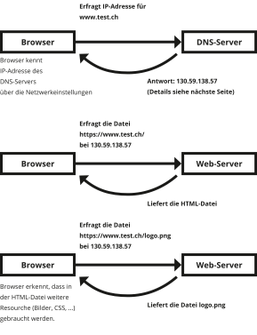

### HF Interactiondesign

# DNS

Stefan Huber · Zürich · 2019 <!-- .element: class="footer" -->
--s--
## Übersicht

* **12:45**
* Organisation/News/Agenda
* Rückschau
* DNS
* Praxisarbeit
* **16:15** · Ende

--s--
# Organisation
* [Tag der Schrift](http://tagderschrift.org/)
* Fonts bei Dominque
* [Liste Studierende & Lehrpersonen](https://logrinto.github.io/IAD.students/)

--s--
## Arbeitslast

# Umfrage
* Wie war die Arbeitslast in den letzten Wochen? (😭 💤 ☺️)

--s--
## News
* [50 Jahre Internet](https://webfoundation.org/2019/10/as-the-internet-turns-50-we-must-protect-it-as-a-force-for-good/)
* [Adobes design system](https://spectrum.adobe.com/)
* [Monotype für $ 825 Millionen verkauft](https://www.bizjournals.com/boston/news/2019/08/21/825m-monotype-deal-as-big-a-joke-as-comic-sans.html)
* [Sketch 💘 OpenType](https://blog.sketchapp.com/variable-fonts-improved-opentype-support-and-a-new-data-plugin-whats-new-in-sketch-e16f81bf8b75)
--s--
## 50 Jahre Internet

* 29. Oktober 1969 · 22:30 – erste Übertragung auf ARPANET
  * University of California, Los Angeles (UCLA)
  * Stanford Research Institute (SRI)
* `lo` (von `login`) wurde übertragen, danach crash
* ARPANET war die technologische Grundlage für das spätere WWW

--s--
# Sketch 💘 OpenType

* ab Sketch 59
* OpenType Features
* Variable Fonts
  * [BETA Amstelvar](https://github.com/TypeNetwork/Amstelvar/raw/master/fonts/Amstelvar-Roman-VF.ttf)
* Adobe Variable Fonts Support
  * Photoshop
  * Illustrator

--s--
## Agenda
* [Ausstellung «Wissen in Bildern – Informationsdesign heute»](https://www.zhdk.ch/veranstaltung/38977) · 20. September 2019 – 8. März 2020
* [IAD Lab](https://iad-lab.ch/) · 26. September 2019
* Black Friday · 29. November 2019

--s--

## Domains – Rückschau

--s--
## Domains
# http://www.test.ch/index.html

| Teil    | Bedeutung                 |
|---------|---------------------------|
| www     | Subdomain                 |
| test  | Domain                    |
| ch      | Top-Level Domain          |
--s--
# Domains – Koordination

  * International: [Internet Corporation for Assigned Names and Numbers – ICANN](https://www.icann.org/)
  * Schweiz: [NIC](https://www.nic.ch/de/)

--s--
# Wichtigkeit

# www.test.ch

1. ch – Top-Level Domain
2. test – Domain
3. www – Subdomain
--s--
# Top-Level Domain  
* .com
* .ch/.swiss
* [...](http://data.iana.org/TLD/tlds-alpha-by-domain.txt)

TLD = Top-Level Domain <!-- .element: class="footer" -->

--s--
## Registare – Domains kaufen

* Switch ist nicht mehr zuständig (seit 1. Januar 2015 )
* [Diverse Registrare](https://www.nic.ch/de/)
--s--
## .ch
* für Schweizer gut erkennbar als Domain
* Kann ohne Probleme erworben werden
* Fr. 10.– und 20.– pro Jahr → alle bieten die selbe Leistung
--s--
## .swiss
Gemäss BAKOM: «Gesuchsteller für einen .swiss Domain-Namen müssen eine ausreichende Verbindung zur Schweiz darlegen.»

* für Schweizer eher schwer als Domain erkennbar → hans.swiss
* kann mit Subdomain `www` unterstützt werden → www.hans.swiss
--s--
## Subdomains

--s--
## www...
* `www` ist nur eine mögliche Subdomain
* Unterscheidet sich technisch nicht von allen anderen Subdomains
--s--
## Subdomains

* Können beliebig vergeben werden
* Müssen nicht zentral registriert werden
* Handling auf Webserver
--s--
## DNS
# Domain Name System
* Menschen sind schlecht mit Nummern
* Menschen sind ok mit Domains (Namen)
* DNS verwandelt Domains zu Nummern
--s--
## Domains für den Browser
* Browser lösst Domains in IP's auf
* DNS sind dezentral und abhängig vom Client/ISP-Provider

ISP = Internet Service Provider <!-- .element: class="footer" -->
--s--
## DNS – Browser

 <!-- .element: class="pic" -->
--s--
## DNS – Struktur

 <!-- .element: class="pic" -->

--s--

## Doku mit eigener Domain

### Was brauchen wir?

* Website <!-- .element: class="fragment" -->
* Hoster <!-- .element: class="fragment" -->
* Domain <!-- .element: class="fragment" -->
* Nameserver <!-- .element: class="fragment" -->

--s--
## Doku mit eigener Domain

### Was haben wir?

* Website <!-- .element: class="fragment" -->
* Hoster <!-- .element: class="fragment" -->
--s--
## Doku mit eigener Domain

### Was fehlt?

* Domain <!-- .element: class="fragment" -->
* Nameserver <!-- .element: class="fragment" -->

--s--
## Doku mit eigener Domain

### Wir brauchen eine Domain
* Registrar verkauft Domains
* Es gibt freie Domains 😻🦄 (*.tk)
<!-- md* -->

--s--
## Domain

* [Beispiel Github](https://github.com/signalwerk/portfolio-iad2019)
* [iad-2019.tk](http://iad-2019.tk)

### [→ freenom.com](https://freenom.com/)
* Account erstellen
* Domain registrieren

--s--
## Nameserver

* [→ DNS A-Record erstellen](https://help.github.com/en/github/working-with-github-pages/managing-a-custom-domain-for-your-github-pages-site)

[→ Wikipedia – List of DNS record types](https://en.wikipedia.org/wiki/List_of_DNS_record_types)
<!-- .element: class="footer" -->
--s--
## Hoster

* Domain bei Hosting vermerken

--s--
## Übung
--s--

## Warum noch einmal?!

* kompliziert (eigentlich nicht...)
* Grundlage gegenüber dem Kunden

--s--

## Ausgangslage

* Sie erhalten ein Backup (Dateien) einer Website
* Die Website ist jetzt noch online (alter Hoster), muss aber zu einem neuen Hoster
* Alle anderen Dienste (Mail, ...) bleiben unberührt
* DNS-Hosting soll zu einem neuen Anbieter (von Kunde bereits gekauft).
* Registrar soll der selbe bleiben

### Hilfe [→ hier](https://signalwerk.github.io/learn.interaction/articles/internet-technology/)

--s--

## Aufgabe

* Listen Sie alle nötigen Schritte auf
* Brauche ich von einem bestehenden Dienstleiter noch weitere Angaben/Dateien? Welche?
* 3er-Gruppen

--s--

## Vorgehen

* Server bei neuem Hoster mieten
* Website installieren & testen
* Jetziger DNS-Hoster ausfindig machen
* Zonefile vom jetzigen DNS-Hoster anfordern
* Zonefile an neuen DNS-Hoster – Tests
* Bei Registrar neuen DNS eintragen
* 24h warten
* Bei neuem DNS auf den neuen Hoster zeigen

--s--
## Praxisarbeit

* [Aufgabestellung](https://signalwerk.github.io/IAD2019/exercise-exp-story/)
* Hausaufgabe – 14. 12. 2019 – Werkschau vor Klasse
* Abgabe: 18. Januar 2020

--s--
## Danke
