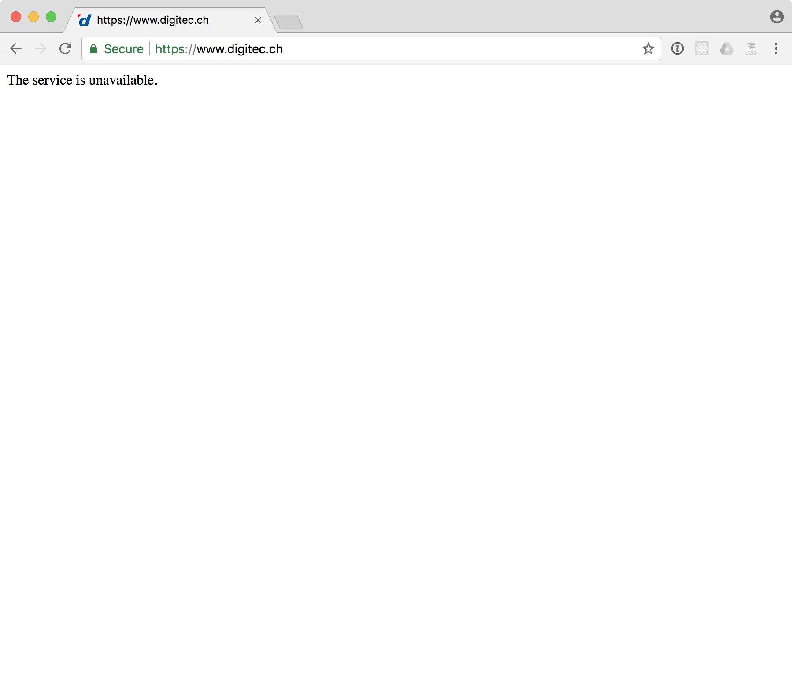
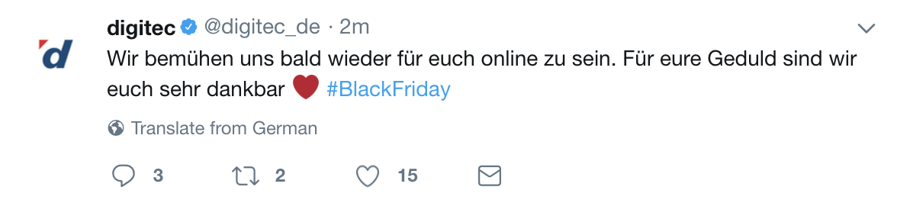
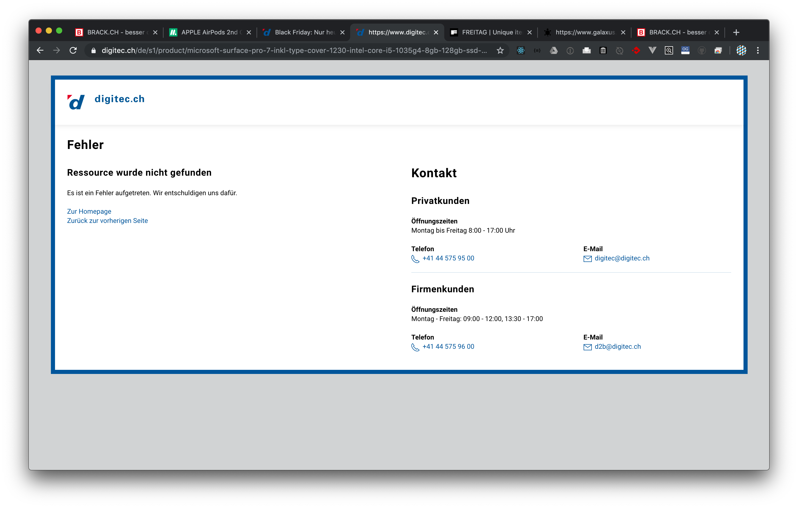
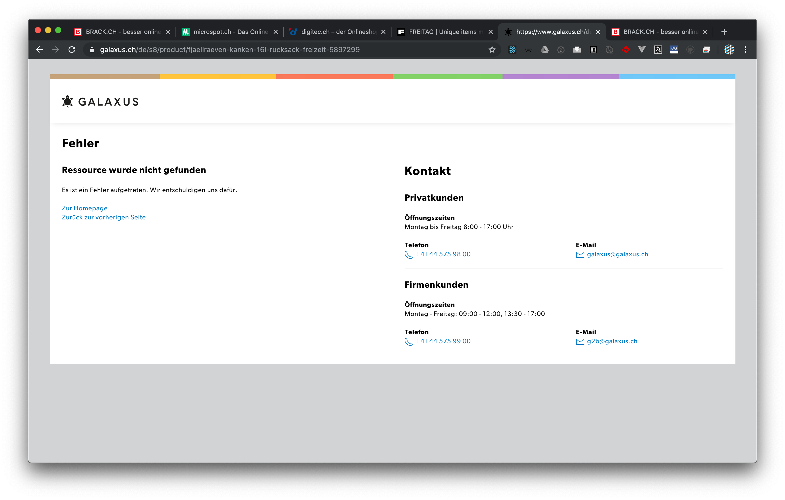
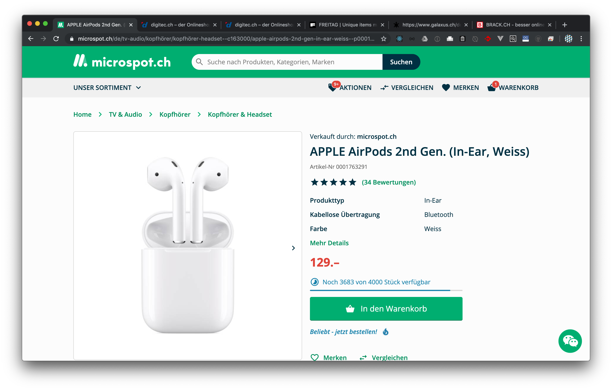
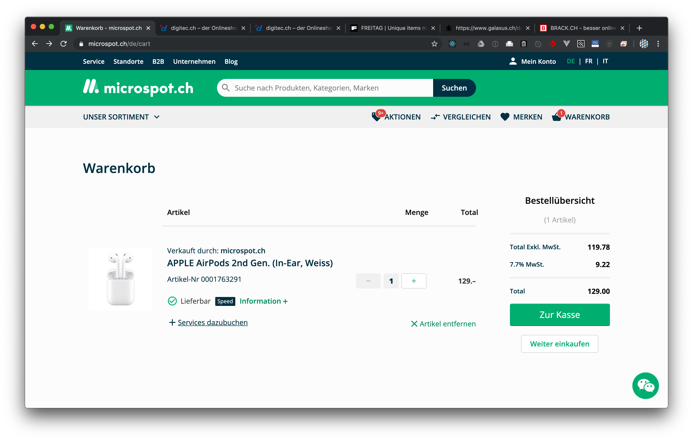
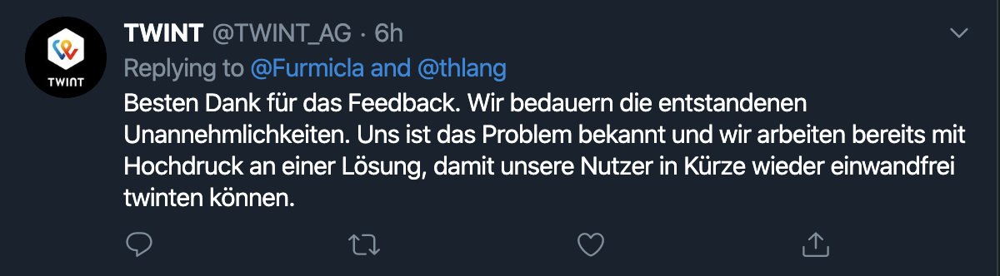
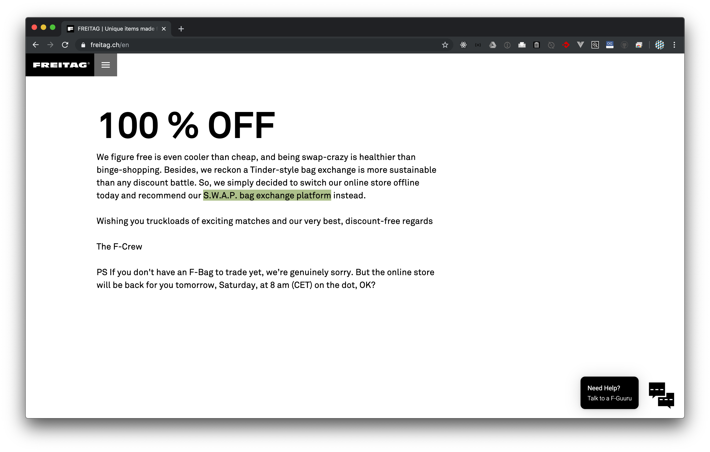
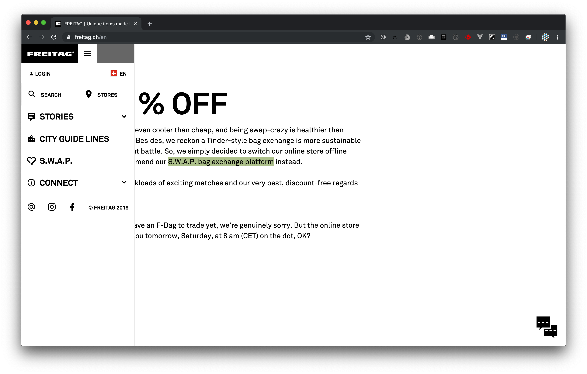
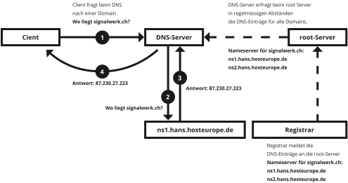

### HF Interactiondesign

# LAB · Domains

Stefan Huber · Zürich · 2019 <!-- .element: class="footer" -->
--s--
## Übersicht

* **12:45**
* Organisation/News/Agenda
* Domains
* Werkschau
* **16:15** · Ende

--s--
# Organisation
--s--
## Arbeitslast

# Umfrage
* Wie war die Arbeitslast in den letzten Wochen? (😭 💤 ☺️)
--s--

## Semesterprüfung

* 18. Januar 2020
* keine Vorbereitung notwendig

--s--
## News – short

* [Type Year Book](https://www.yearbookoftype.com/)
* [Beta 20min](https://beta.20min.ch/)
* [OpenType in Figma](https://www.figma.com/blog/opentype-font-features/)
* [InDesign 2020 mit VF & SVG](https://theblog.adobe.com/adobe-indesign-2020/)
* MacBook Pro 16″ – endlich
* [VF Recursive](https://www.recursive.design/)
* [10 Years – Interactive Things](https://10.interactivethings.com/)
* [Twitter 2019](https://blog.twitter.com/en_us/topics/insights/2019/ThisHappened-in-2019.html)

--s--
## News – long

* Emoji 12.1
* [ICANN](https://www.icann.org/) [vergibt .org-Registrar neu](https://arstechnica.com/tech-policy/2019/07/icann-eliminates-org-domain-price-caps-despite-lopsided-opposition/)
* Black Friday

--s--
## Emoji 12.1

* Unicode Emoji Subcommittee
* Emoji-Versionsnummern sind mit Unicode-Nummern in Sync
* [iOS 13.2 kann Emoji 12.1](https://www.theverge.com/2019/10/28/20936966/apple-ios-13-2-new-emoji-accessibility-inclusivity-gender-neutral-skin-color)

--s--
## Varianten

# ❤︎ = U+2764
* U+2764 HEAVY BLACK HEART  

# ❤️ = U+2764 & U+FE0F
* U+2764 HEAVY BLACK HEART  
* U+FE0F [VARIATION SELECTOR-16 (Emoji)](https://en.wikipedia.org/wiki/Variation_Selectors_(Unicode_block)) = ((nicht sichtbar))

--s--
## Hautton Modifier

# 👏 👏🏻 👏🏼 👏🏽 👏🏾 👏🏿

--s--
## Fitzpatrick

* [Diverse Modifier](https://en.wikipedia.org/wiki/Miscellaneous_Symbols_and_Pictographs#Emoji_modifiers) nicht nur Hautton
* [Dermatologe Thomas Fitzpatrick (1919 – 2003)](https://de.wikipedia.org/wiki/Hauttyp#Hauttypen_nach_Fitzpatrick)
* Skala I – VI
--s--
## Fitzpatrick Modifier

* U+1F3FB EMOJI MODIFIER FITZPATRICK TYPE-1-2 = 🏻
* U+1F3FC EMOJI MODIFIER FITZPATRICK TYPE-3 = 🏼
* U+1F3FD EMOJI MODIFIER FITZPATRICK TYPE-4 = 🏽
* U+1F3FE EMOJI MODIFIER FITZPATRICK TYPE-5 = 🏾
* U+1F3FF EMOJI MODIFIER FITZPATRICK TYPE-6 = 🏿
--s--

## Fitzpatrick Modifier

* 🏻 U+1F3FB EMOJI MODIFIER FITZPATRICK TYPE-1-2
* 🏼 U+1F3FC EMOJI MODIFIER FITZPATRICK TYPE-3
* 🏽 U+1F3FD EMOJI MODIFIER FITZPATRICK TYPE-4
* 🏾 U+1F3FE EMOJI MODIFIER FITZPATRICK TYPE-5
* 🏿 U+1F3FF EMOJI MODIFIER FITZPATRICK TYPE-6

--s--
## Fitzpatrick Modifier

* 🏻 U+1F3FB EMOJI MODIFIER FITZPATRICK TYPE-1-2 = 🏻
* 🏼 U+1F3FC EMOJI MODIFIER FITZPATRICK TYPE-3 = 🏼
* 🏽 U+1F3FD EMOJI MODIFIER FITZPATRICK TYPE-4 = 🏽
* 🏾 U+1F3FE EMOJI MODIFIER FITZPATRICK TYPE-5 = 🏾
* 🏿 U+1F3FF EMOJI MODIFIER FITZPATRICK TYPE-6 = 🏿

--s--
## U+1F44F Clapping Hands

# 👏 👏🏻 👏🏼 👏🏽 👏🏾 👏🏿

* U+1F44F = 👏
* U+1F44F & U+1F3FB = 👏🏻
* U+1F44F & U+1F3FC = 👏🏼
* U+1F44F & U+1F3FD = 👏🏽
* U+1F44F & U+1F3FE = 👏🏾
* U+1F44F & U+1F3FF = 👏🏿

--s--
## Zero Width Joiner (ZWJ)

* Wird eigentlich verwendet um eine Trennung zu vermeiden.

--s--
## Man Health Worker

# 👨 + ZWJ + ⚕ + Emoji = 👨‍⚕️
* U+1F468 MAN = 👨
* U+200D ZERO WIDTH JOINER = ((nicht sichtbar))
* U+2695 STAFF OF AESCULAPIUS = ⚕
* U+FE0F [VARIATION SELECTOR-16 (Emoji)](https://en.wikipedia.org/wiki/Variation_Selectors_(Unicode_block)) = ((nicht sichtbar))

--s--
## Woman Health Worker

# 👩 + ZWJ + ⚕ + Emoji = 👩‍⚕️
* U+1F469 WOMAN = 👩
* U+200D ZERO WIDTH JOINER = ((nicht sichtbar))
* U+2695 STAFF OF AESCULAPIUS = ⚕
* U+FE0F [VARIATION SELECTOR-16 (Emoji)](https://en.wikipedia.org/wiki/Variation_Selectors_(Unicode_block)) = ((nicht sichtbar))

--s--

## Woman Health Worker: Medium Skin Tone

# 👩 + 🏽 + ZWJ + ⚕ + Emoji = 👩‍⚕️
* U+1F469 WOMAN = 👩
* 🏽 U+1F3FD EMOJI MODIFIER FITZPATRICK TYPE-4
* U+200D ZERO WIDTH JOINER = ((nicht sichtbar))
* U+2695 STAFF OF AESCULAPIUS = ⚕
* U+FE0F [VARIATION SELECTOR-16 (Emoji)](https://en.wikipedia.org/wiki/Variation_Selectors_(Unicode_block)) = ((nicht sichtbar))

--s--
## 👩‍⚕️ Woman Health Worker

* 👩🏻‍⚕️ Woman Health Worker: Light Skin Tone
* 👩🏼‍⚕️ Woman Health Worker: Medium-Light Skin Tone
* 👩🏽‍⚕️ Woman Health Worker: Medium Skin Tone
* 👩🏾‍⚕️ Woman Health Worker: Medium-Dark Skin Tone
* 👩🏿‍⚕️ Woman Health Worker: Dark Skin Tone

--s--
## Fallstrick – Zeichenlängen

### Wie viele Zeichen sind: 👩‍⚕️?

# 👩 + ZWJ + ⚕ + Emoji = 👩‍⚕️
* U+1F469 WOMAN = 👩
* U+200D ZERO WIDTH JOINER = ((nicht sichtbar))
* U+2695 STAFF OF AESCULAPIUS = ⚕
* U+FE0F [VARIATION SELECTOR-16 (Emoji)](https://en.wikipedia.org/wiki/Variation_Selectors_(Unicode_block)) = ((nicht sichtbar))

--s--
## Fallstrick – Normalisation

* U+00DC LATIN CAPITAL LETTER U WITH DIAERESIS = Ü
* U+0055 LATIN CAPITAL LETTER U + U+0308 COMBINING DIAERESI = &#x0055;&#x0308;

--s--
## Gender

# 🧟
zombie

# 🧟‍♀
woman zombie

# 🧟‍♂️
man zombie

--s--
## man zombie

* U+1F9DF ZOMBIE = 🧟
* U+200D ZERO WIDTH JOINER = ((nicht sichtbar))
* U+2642 MALE SIGN = ♂
* U+FE0F [VARIATION SELECTOR-16 (Emoji)](https://en.wikipedia.org/wiki/Variation_Selectors_(Unicode_block)) = ((nicht sichtbar))

--s--
## .org

* bis anhin bei non-profit [Public Interest Registry](https://thenew.org/org-people/)
* Vertrag von 2013: pro Domain $8.25 (max. 10 % aufpreis pro Jahr)
* Gewinne bis anhin an [Internet Society](https://www.internetsociety.org/)
* neu von [Ethos Capital](https://ethoscapital.com/) (investment company) gekauft

--s--
## Black Friday

* brack.ch – tschüss
* microspot.ch – ok?
* interdiscount.ch – ok?
* [Apple Store war offline?](https://telebasel.ch/2019/11/29/twint-stuerzt-wegen-black-friday-ab/?channel=8950)
* digitec.ch/galaxus.ch – okish...

--s--
## Digitec 2017

* [kein schlaues Cache-System](https://www.digitec.ch/de/page/black-friday-wie-ein-riskantes-experiment-den-tag-gerettet-hat-6364)

--s--
## 2017 – digitec.ch – ab etwa 00:03

 <!-- .element: class="pic border" -->
--s--
## 2017 – digitec.ch – ab etwa 00:03
 <!-- .element: class="pic border" -->
--s--
## 2017 – digitec.ch auf Twitter – 00:11
 <!-- .element: class="border" -->

--s--
## Digitec 2018

 <!-- .element: class="border pic" -->

--s--
## Digitec 2019

* [Livestream](https://www.youtube.com/watch?v=1xUerVuwqxQ)
* 40 % mehr Umsatz als  Black Friday 2018 bei [digitec](https://telebasel.ch/2019/11/29/twint-stuerzt-wegen-black-friday-ab/?channel=8950)
* Server-Infrastruktur Digitec und Galaxus nicht unabhängig?

--s--
## 2019 – digitec.ch – ab etwa 00:20
 <!-- .element: class="pic" -->

--s--
## 2019 – galaxus.ch – ab etwa 00:18
 <!-- .element: class="pic" -->

--s--
## 2019 – microspot.ch – 00:35
 <!-- .element: class="pic" -->

--s--
## 2019 – microspot.ch – 00:35
 <!-- .element: class="pic" -->

--s--
## 2019 – twint – 00:38
 <!-- .element: class="pic border" -->

--s--
## 2019 – twint – 11:05
 <!-- .element: class="border" -->

--s--
## 2019 – freitag.ch – vortag
 <!-- .element: class="pic" -->

--s--
## 2019 – freitag.ch – Black Firday
 <!-- .element: class="pic" -->

--s--
## 2019 – freitag.ch – Black Firday
 <!-- .element: class="pic" -->

--s--
## DNS – Struktur

 <!-- .element: class="pic" -->

--s--

## Doku mit eigener Domain

### Was brauchen wir?

* Website <!-- .element: class="fragment" -->
* Hoster <!-- .element: class="fragment" -->
* Domain <!-- .element: class="fragment" -->
* Nameserver <!-- .element: class="fragment" -->

--s--
## Doku mit eigener Domain

### Was haben wir?

* Website <!-- .element: class="fragment" -->
* Hoster <!-- .element: class="fragment" -->
--s--
## Doku mit eigener Domain

### Was fehlt?

* Domain <!-- .element: class="fragment" -->
* Nameserver <!-- .element: class="fragment" -->

--s--
## Doku mit eigener Domain

### Wir brauchen eine Domain
* Registrar verkauft Domains
* Es gibt freie Domains 😻🦄 (*.tk)
<!-- md* -->

--s--
## Domain

* [Beispiel Github](https://github.com/signalwerk/portfolio-iad2019)
* [iad-2019.tk](http://iad-2019.tk)

### [→ freenom.com](https://freenom.com/)
* Account erstellen
* Domain registrieren

--s--
## Nameserver

* [→ DNS A-Record erstellen](https://help.github.com/en/github/working-with-github-pages/managing-a-custom-domain-for-your-github-pages-site)

[→ Wikipedia – List of DNS record types](https://en.wikipedia.org/wiki/List_of_DNS_record_types)
<!-- .element: class="footer" -->
--s--
## Hoster

* Domain bei Hosting vermerken

--s--
## Praxisarbeit
* Abgabe: 18. Januar 2020

--s--
## Werkschau

* Kurz Präsi
* Feedback von Klasse/Stefan

--s--
