### HF Interactiondesign

# Portfolio, Blog und Typografie

Stefan Huber · Zürich · 2020 <!-- .element: class="footer" -->
--s--
## Übersicht

* **8:15**
* Diplomgespräch
* Quiz
* Portfolio Experiment/Übung
* **11:45** · Ende
--s--
## Übersicht

* **12:45**
* Arbeit an Portfolio
* **16:15** · Ende

--s--
## Diplomgespräch

* Wir haben nun einen Termin für die Prüfung vom Bund
* 14. 6. 2020 ist die Abgabe der Arbeiten (unverändert)
* Am Donnerstag 18. 6. 2020 müssen vier Personen die Diplomarbeit präsentieren
* Freiwillige?

--s--
# Quiz

* Drei Gruppen
* Zettel 🅰️ / 🅱️
* Kein Internet

--s--
## 🅰️ Blog 🅱️ Magazin

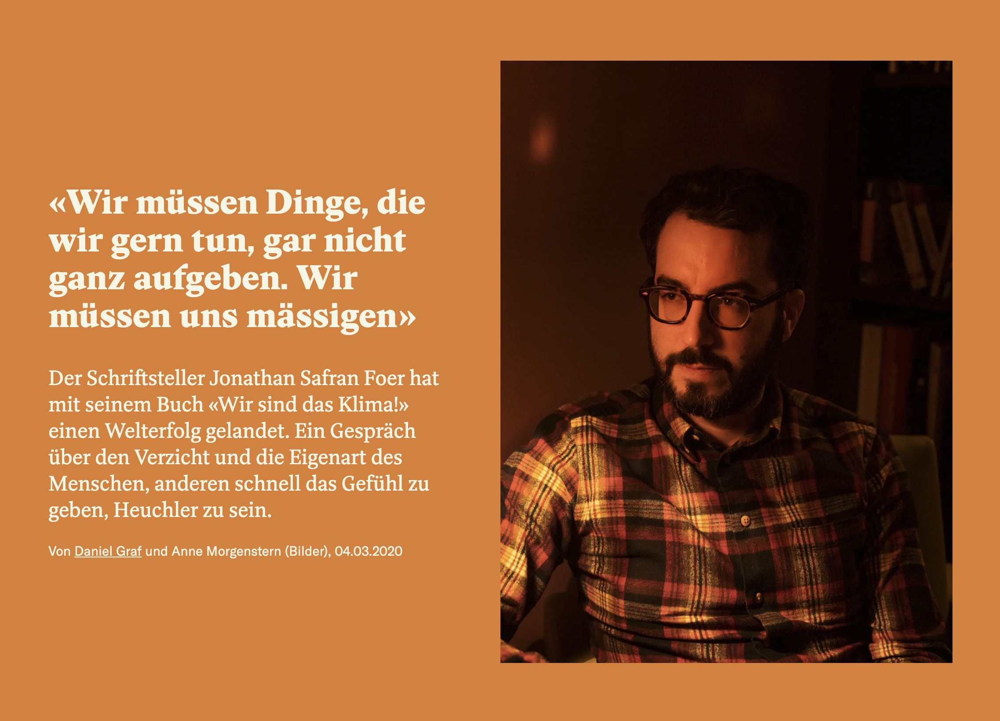  <!-- .element: class="pic" -->

--s--
## Magazin (Redaktion) – [Beitrag Republik](https://www.republik.ch/)

* Lead bewusst geschrieben (kein Anreisser)
* Autor
* Datum
* Häufig Schwarz auf Weiss – Lesbarkeit
* Rubriken

--s--
## 🅰️ News 🅱️ Blog

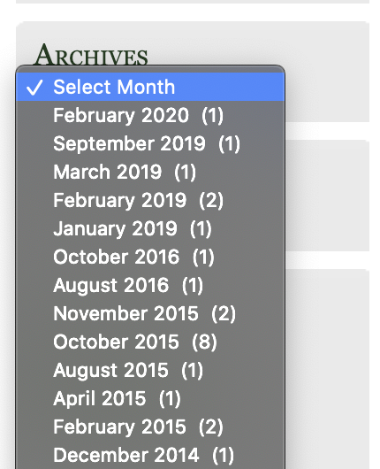  <!-- .element: class="pic" -->

--s--
## Blog – [Making Maps](https://makingmaps.net/)

* Blog = Weblog
* Wordpress hat Struktur geschaffen...
* Zeitliche Abfolge bei thematischen Seiten nicht relevant

--s--

## 🅰️ E-Learning 🅱️ Blog (Privat)

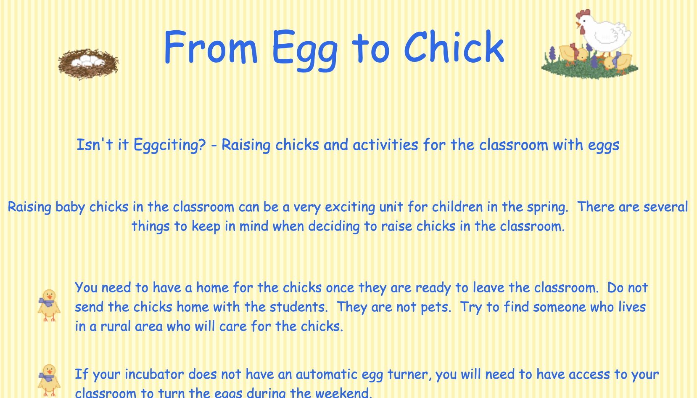  <!-- .element: class="pic" -->

--s--

## Enzyklopädie/Learning – [Geocities](https://www.cameronsworld.net/)

* [Wikipedia Haushuhn](https://de.wikipedia.org/wiki/Haushuhn)
* Oft Zeitunabhängig
* Ausgeprägte Textstruktur
* Viele Bilder/Grafiken

--s--
## 🅰️ Social Mailbox 🅱️ Web-Forum

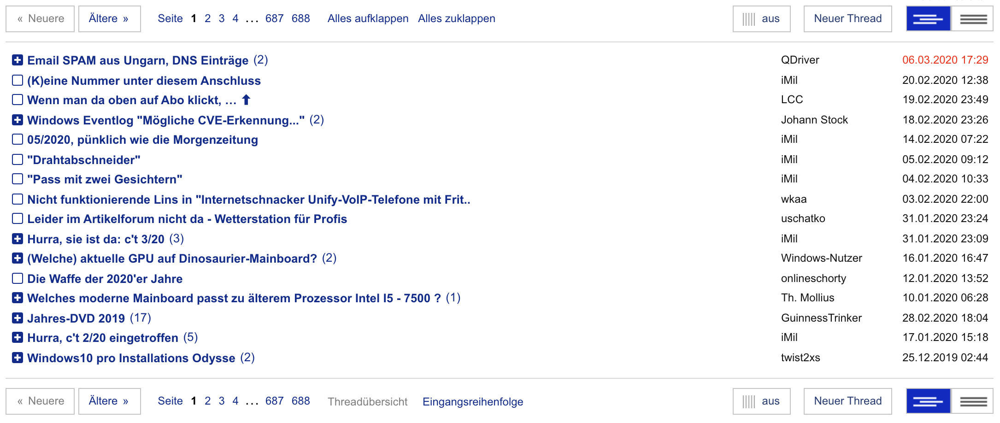  <!-- .element: class="pic" -->

--s--
## ~~Social Mailbox~~ frei erfunden

## Forum – [c't Forum](https://www.heise.de/forum/c-t/c-t-allgemein/forum-31637)

* User Content
* Häufig Fragen/Antworten
* Nicht mehr so aktuell
* Ähnlich einer Mailingliste
* Thread

--s--
## 🅰️ Magazin (Redaktion) 🅱️ Social Reading

  <!-- .element: class="pic" -->

--s--
## Magazin (Redaktion) – [Beitrag Republik](https://www.republik.ch/2019/11/18/brexit-in-echtzeit)

aber

## Social Reading

* Blast from the past
* Gemeinsam lesen
* Markierung sharen
* Notizen sharen
* Fortschritt sharen

--s--
## 🅰️ Blog 🅱️ News

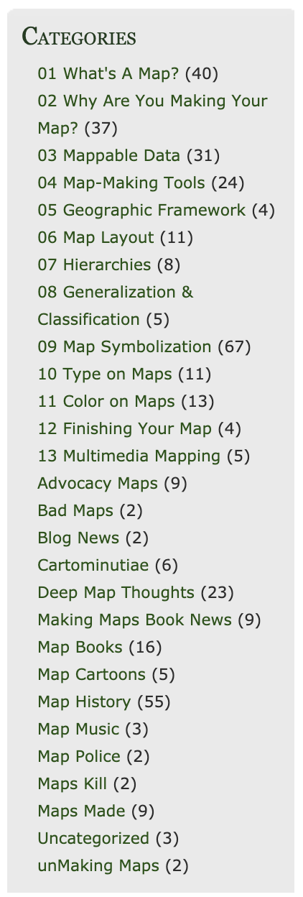  <!-- .element: class="pic" -->

--s--
## Blog – [Making Maps](https://makingmaps.net/)

* Kategorien
* Tags
* Hint: Eine News-Site zählt Beträge eher nicht

--s--
## 🅰️ Paper (Wissenschaft) 🅱️ Gesetz

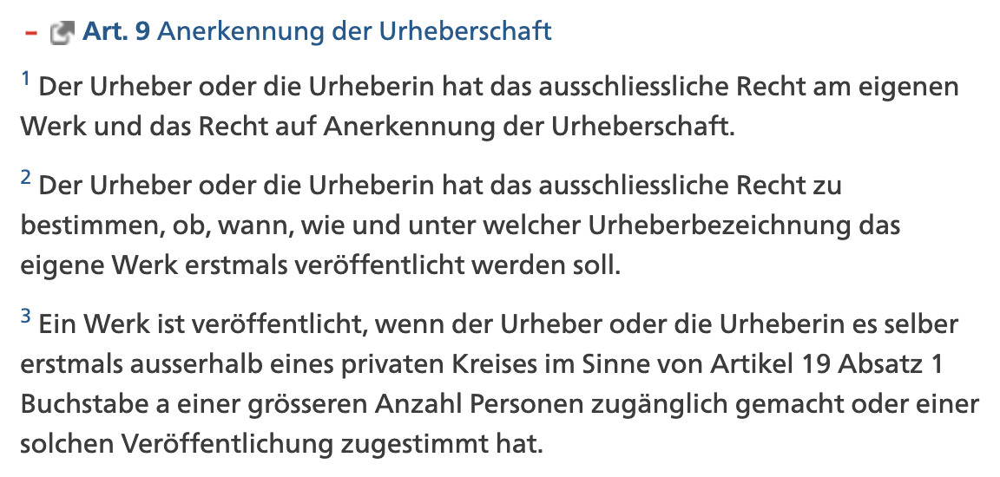  <!-- .element: class="pic" -->

--s--

## Gesetz – [Urheberrechtsgesetz](https://www.admin.ch/opc/de/classified-compilation/19920251/index.html#a9)

* «Versioniert»
* Ausgeprägte Textstruktur
* Art. – Abs. – Ziff. – lit. (littera)

--s--
## 🅰️ Paper 🅱️ Religiöse Textsammlung

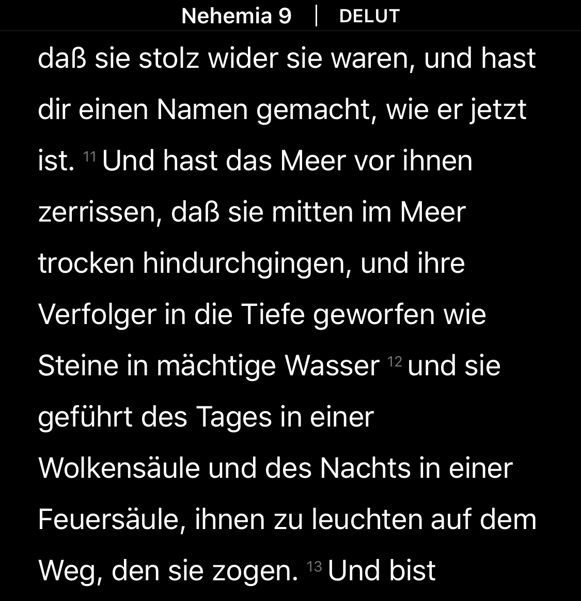  <!-- .element: class="pic" -->

--s--
## Religiöse Textsammlung – App Holy Bible

* Ausgeprägte Textstruktur
* Multiple Versionen vom «selben» Text
* Multiple Sprachen vom «selben» Text
* Kein «original»

--s--
## App Holy Bible

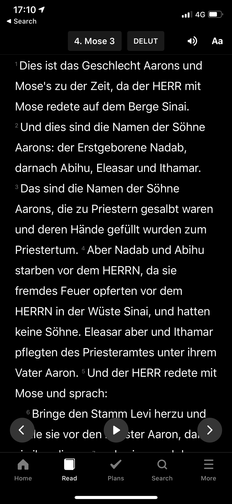  <!-- .element: class="pic" -->

--s--
## 🅰️ Special Interest 🅱️ Blog

  <!-- .element: class="pic" -->

--s--
## Blog – [Geocities](https://www.cameronsworld.net/)

* Persönlich
* Kann thematischen Fokus haben

## Special Interest
* Meist sachlich
* Thematischer Fokus

--s--
## 🅰️ Special Interest 🅱️ Blog

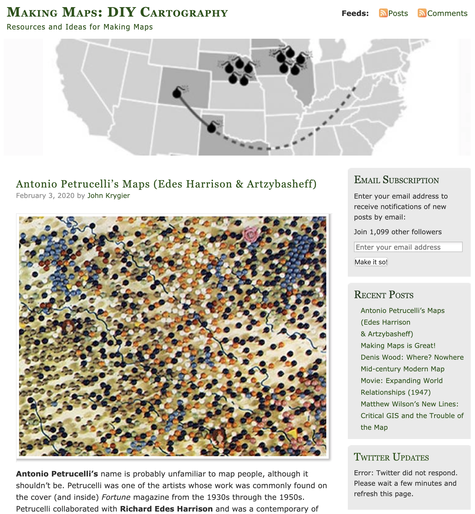  <!-- .element: class="pic" -->
--s--
## Blog – [Making Maps](https://makingmaps.net/)
* Meist eine Autorenschaft
* RSS
* Comments

## Special Interest
* Verein, Gruppe, Community

--s--
## 🅰️ Special Interest 🅱️ Papers

  <!-- .element: class="pic" -->

--s--

## Papers/Essay – [Bret Victor](http://worrydream.com/#!2/LadderOfAbstraction)

* Faktsich
* Mit Grafiken und Darstellungen
* Wissensvermittelnd
* Starkte Autorenschaft
--s--
## Noch fünf Fragen
--s--
## 🅰️ Blog 🅱️ Papers

  <!-- .element: class="pic" -->

--s--
## Blog – [Blog John Gruber](https://daringfireball.net/)

* Werbung
* Link-Schleuder?

--s--
## 🅰️ Blog 🅱️ Content-Marketing

  <!-- .element: class="pic" -->

--s--

## Content-Marketing – [WE Blog](https://wepresent.wetransfer.com/story/looking-for-leia/)

* Produkt und Inhalt hat «nichts» gemeinsames
* Content werbefrei (da bereits Werbung)
* Content meist sehr Hochwertig

--s--
## 🅰️ Social Media 🅱️ Social Reeading

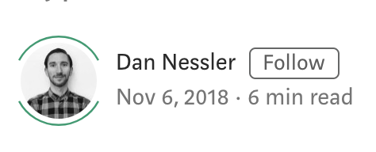  <!-- .element: class="pic" -->

--s--
## 🤷‍♂️ Medium... – [«Blog» Hinderling Volkart](https://medium.com/hinderlingvolkart/let-me-smell-your-stinky-beb5c9f06151)

* Mischung aus Social Media, Social Reading, Blog
* Extremes Augenmerk auf Typografie
* Diverse Transformationen im Konzept
  * Markierung Sharen
  * Custom Domain
* Nicht wirklich kostenlos

--s--
## Medium

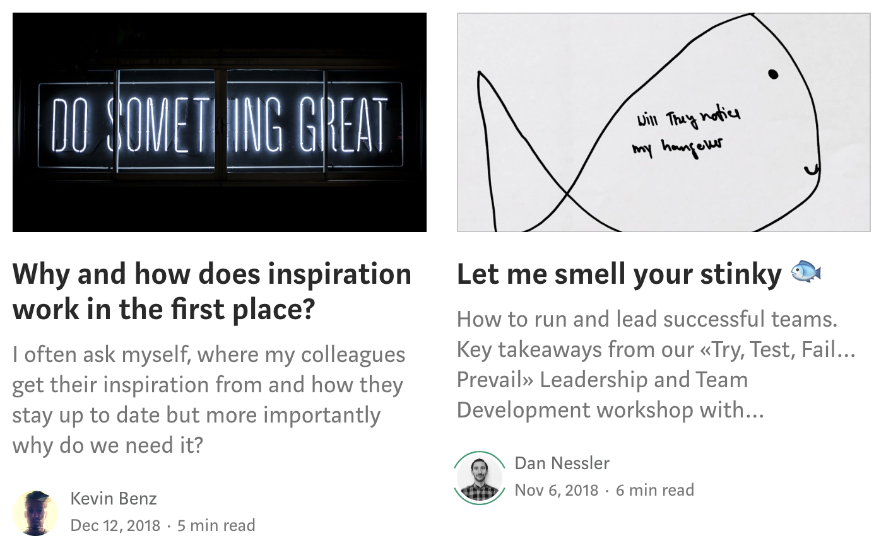  <!-- .element: class="pic" -->

--s--
## Medium

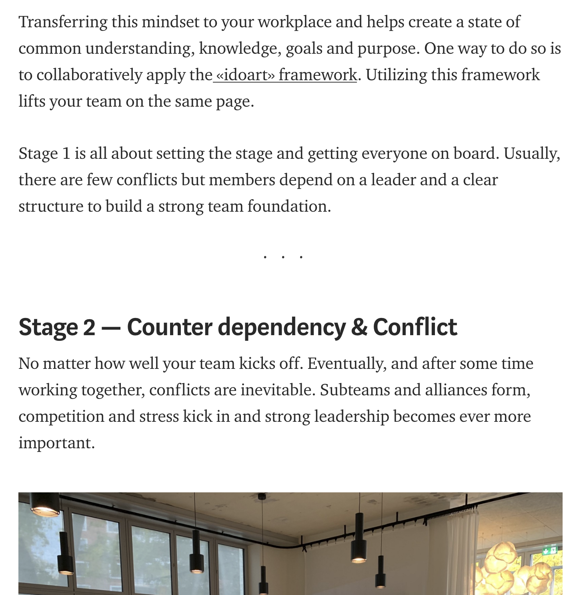  <!-- .element: class="pic" -->
--s--
## Noch zwei Fragen

--s--
## 🅰️ Blog 🅱️ Enzyklopädie

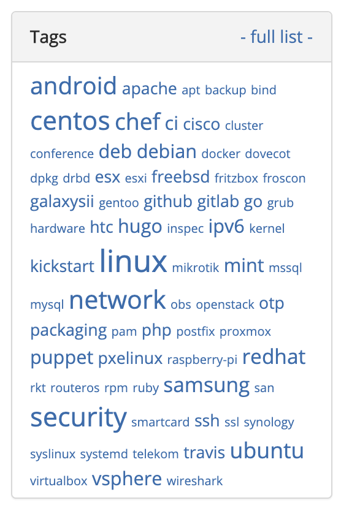  <!-- .element: class="pic" -->

--s--

## Blog – [Blog Artem Sidorenko](https://www.sidorenko.io/)

* Tags
* Tag-Clouds

--s--
## 🅰️ Blog 🅱️ Podcast Website

  <!-- .element: class="pic" -->
--s--
## Podcast Website – [Bits und So](http://www.bitsundso.de/)

* Blog und Podcast technisch sehr verwandt (RSS)
* Episoden-Nummern
* Shownotes oder zuätzliche Ergänzungen
* Beispiel [Methodisch inkorrekt](https://minkorrekt.de/)

--s--
## Winner?!
--s--
# Portfolio
--s--

# Form/Zeit vs Inhalt

* «gleicher» Inhalt  
* vorgegebene Form

--s--
# Zaha Hadid

* 1950 – 2016
* Iraq – Kindheit
* UK – Leben
* Wohl wichtigste Architektin
* Dekonstruktivismus || Parametrismus || 🤷‍♂️
* [Büro geht weiter](https://www.zaha-hadid.com/)

--s--
## Aufgabe Portfolio

* Drei Gruppen
* Jede Gruppe macht ein «Grobentwurf» für Zahas Portfolio
* Form ist vorgegeben
* Reduziert den Inhalt (realistisch)

--s--
## Aufteilung

* **Research** – individuell 10 min (Screenshots)
* **Teil 1** – Jede·r macht individuell 15 min für sich einen Konzept-Entwurf
* **Teil 2** – Sync in der Gruppe
* **Document** – Festhalten was sind Kernmerkmale (Screenshots)
* **Teil 3** – Do it!
  * Schiedsrichter von anderer Gruppe

--s--
## Form

* **Bibel** – aber digital (mit Bilder)
* **Geocities** – aber 2020 (technisch beschränkt )
* **Socialmedia** – aber als «Website»

--s--
## Freie Arbeit

* Wie kann ich helfen?

--s--
