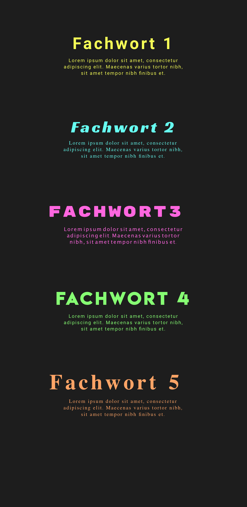

### HF Interactiondesign

# Fachwörter

Stefan Huber · Zürich · 2020 <!-- .element: class="footer" -->
--s--
## Übersicht

* **12:45**
* Organisation
* Diary
* Arbeit an Fachwörter
* **16:15** · Ende

--s--
# Organisation
--s--
## COVID-19

* **27. Mai 2020** – Bundesrat erteilt für Präsenzunterricht ab 8. Juni 2020 grünes Licht
* zwei Meter Abstand, vier Quadratmeter pro Person
* **29. Mai 2020** – Regierungsrätin Steiner veröffentlicht Pressemitteilung
* **29. Mai 2020** – Schulbeschluss: maximal 12 Studierende pro Zimmer

--s--
## Vorläufiger Stand

* Bis und mit **6. Juni 2020** Fernunterricht
* Danach entweder Fernunterricht oder auf zwei Zimmer verteilt (Infos folgen)
* Interaktion mit DIY–Hardware → Lehrperson steckt noch immer in Bolivien fest
* 26. Juni 2020 – Alternative wird gesucht

--s--
## Wie geht es euch?

--s--
## Arbeitslast

# Umfrage
* Wie war die Arbeitslast in den letzten Wochen? (😭 💤 ☺️)

--s--
# Verbleibender Unterricht

--s--
## 3. Juli 2020

* Morgen Aufgabe abschliessen
* Nachmittag Präsentation
* Abschluss Semester

--s--
## Heute

* Diary
* Bis zum **30. 5. 2020** wurden der Artikel in HTML gestaltet und ist auf GitHub. Es muss noch nicht alles Perfekt sein.
* Menü/Start
* Einzelbesprechungen

--s--
## Menü/Start

  <!-- .element: class="pic" -->

--s--
## Modus · COVID-19

## 📅 → See Diary

((guter Name wird noch gesucht…))

--s--
## News

* [Bundesverfassungsgericht (DE) vs. Geheimdienste](https://netzpolitik.org/2020/das-neue-bnd-gesetz-ist-verfassungswidrig/)
* [Facebook kauft Giphy](https://appleinsider.com/articles/20/05/15/facebook-acquires-giphy-for-400-million-promises-deeper-instagram-integration)
* [Corona-App](https://www.nzz.ch/technologie/was-sie-zur-contact-tracing-app-wissen-muessen-ld.1555664)

--s--
## Bundesverfassungsgericht (DE) vs. Geheimdienste

* Meilenstein zum Schutz der Pressefreiheit und Bürger
* Grundrechte gelten für Geheimdienste! Auch im Ausland! Auch keine Weltraumtheorien 🤦‍♂️ mehr! Grundgesetzt schützt Bürger vor dem Staat.
* Massenüberwachung verfassungswidrig (in der jetzigen Form)
* Thank you Edward Snowden!

Quelle: <!-- .element: class="footer" --> [Netzpolitik](https://netzpolitik.org/2020/das-neue-bnd-gesetz-ist-verfassungswidrig/)

--s--
## Facebook kauft Giphy

* $400 Millionen
* Weitere Möglichkeit für Datenanalyse
* Sehr «kreative» Art für Werbung → make it viral…

--s--
## Gif-Format

> Animation – The Graphics Interchange Format is not intended as a platform for
animation, even though it can be done in a limited way.

Quelle: <!-- .element: class="footer" --> [GIF89a Specification](https://www.w3.org/Graphics/GIF/spec-gif89a.txt)

--s--
## Übersicht

* [Graphics Interchange Format](https://en.wikipedia.org/wiki/GIF#Animated_GIF)
* Seit 1987 → wohl jeder Personal Computer kann diese anzeigen
* Seit 1989 → mit Animation (keine Loops)
* 1995 → Netscape Navigator 2.0 erweitert Loops
* Zur Kompression wird [LZW](https://en.wikipedia.org/wiki/Lempel%E2%80%93Ziv%E2%80%93Welch) verwendet
* LZW-Kompression war bis 2004 mit einem Patent belegt

--s--
## Technisches

* Maximal 256 frei wählbare Farben. Transparent zählt als eine Farbe.
* Es gibt nur 100 % transparent oder eine Farbe. Keine Halbransparenz.
* [Dithering](https://en.wikipedia.org/wiki/Floyd%E2%80%93Steinberg_dithering) wird oft verwendet um diese Einschränkung zu «vertuschen»
* Ungeeignet für längere «Filme» – dann Video-Formate verwenden

--s--

## Corona-App

* Contact Tracing → Das Gesundheitsamt versucht das ohnehin (auch ohne App)
* App soll nun helfen

--s--
## Grundlagen-Information

* [Video](https://youtu.be/OI7RBBSx510)

--s--
## Mögliche Technologien

* GPS → zu ungenau
* GSM-Zellen → zu ungenau
* Bluetooth LE → ideal

--s--
## Bluetooth LE

* LE → Low Energy
* Bluetooth broadcast ermöglicht es sich anderen Geräten bemerkbar zu machen
* Zwei Geräte können sich erkennen und in etwa die Distanz abschätzen
* unter iOS ist diese Funktion von Apple geschützte aber vorhanden

--s--
## Grundsatz

* [Zentralistischer Weg wie in Frankreich](https://www.heise.de/news/StopCOVID-Franzoesisches-Parlament-genehmigt-Corona-Warn-App-4767380.html)
* [Dezentraler Weg – Rest von Europa](https://github.com/DP-3T/documents)

--s--

## Zusammenarbeit Google & Apple

* [Dezentraler Weg in Arbeitsgruppe DP-3T entwickelt](https://covid19-static.cdn-apple.com/applications/covid19/current/static/contact-tracing/pdf/ExposureNotification-FAQv1.1.pdf)
* [iOS 13.5](https://www.heise.de/news/iOS-13-5-Apple-bringt-Corona-Update-4726116.html)
* [Android über Google Play Services](https://www.connect.de/ratgeber/corona-tracking-android-ios-google-apple-3200671.html)
* [Hintergrund](https://www.cnbc.com/2020/04/28/apple-iphone-contact-tracing-how-it-came-together.html)

--s--
## Wording

* Von [Contact Tracing](https://web.archive.org/web/20200410171553/https://www.apple.com/covid19/contacttracing/)
* Zu [Exposure Notification](https://www.apple.com/covid19/contacttracing/)

--s--
## Stand heute

* Apple und Google sind parat
* Fast alle europäischen Staaten sind in Test-Phasen für nationale Apps
* Schweiz hat wohl die erste «halb-öffentliche» Test-Phase
* Gesetzliche Grundlage wird anfangs Juni für die Schweiz parat sein
* Grenzüberschreitend wird wohl noch bisschen dauern…

--s--

## Danke
