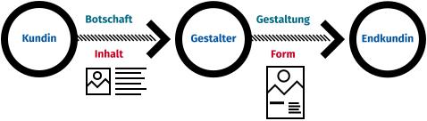
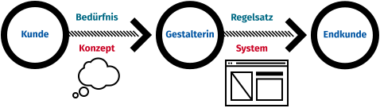
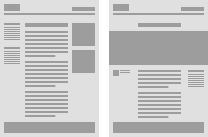
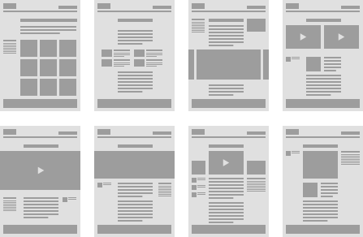

### HF Interactiondesign

# API & CMS

Stefan Huber · Zürich · 2020 <!-- .element: class="footer" -->
--s--
## Übersicht

* **12:45**
* API · Grundlage
* CMS · Grundlage
* Craft, Wordpress und Fostry
* Typo3, Neos und Drupal
* **16:15** · Ende

--s--
## Application programming interface (API)

--s--
## Was ist ein(e) API?

> Ein Programmteil, der anderen Programmen zur Anbindung zur Verfügung gestellt wird.

[Wikipedia](https://de.wikipedia.org/wiki/Programmierschnittstelle)

--s--
## Was ist ein(e) API?

* Schnittstelle zwischen zwei Systemen
* Viele Services bieten geschützte oder offene APIs

--s--
## Warum?

* Man hat etablierte Systeme, die man verknüpfen möchte?

--s--
## Woher kennt ihr APIs?
<!--
* Wetter
* Push-Notifications (Service meldet an Apple/Google)
* [RSS](https://en.wikipedia.org/wiki/RSS) (Podcast)

### «API»
* [Embeds/Includes/Cards](https://www.20min.ch/story/us-botschafter-belastet-trump-schwer-414098091122)
* [Share-Stats](https://www.watson.ch/schweiz/reisen/603396135-auffahrt-und-dann-frei-19-schoene-bruecken-fuer-den-brueckentag)
-->

--s--
## Klassische API
* Informationen erfragen
* Informationen übermitteln
* [Beispiel: The Star Wars API](https://swapi.dev/)

--s--
## API mit Graphen

Neue Art, wie in einer API Beziehungen ausgedrückt werden können.

* [Beispiel: The Star Wars API](https://swapi.graph.cool/)
--s--

## CMS als API
* CMS wird als Datenquelle gesehen
* Entkoppelung von Daten und Darstellung

--s--
## Content Management System (CMS)
--s--
## Was ist ein CMS?

> Software zur gemeinschaftlichen Erstellung, Bearbeitung und Organisation und Darstellung von digitalen Inhalten  

[Wikipedia](https://de.wikipedia.org/wiki/Content-Management-System)

--s--
## Kennt ihr Beispiele aus dem Berufsalltag?

--s--
## Gestaltung traditionell

 <!-- .element: class="pic" -->

--s--

## Gestaltung Interactiondesign

 <!-- .element: class="pic" -->

--s--
## Aufgabe

Tragt in 3 Gruppen zusammen, was für folgende CMS-User entscheidende Punkte sind.

* Kunden/Redaktoren
* Designer
* Admin/IT

--s--
## Kunden/Redaktoren

<!--
* Inhalt möglichst einfach zu pflegen
* Preview & Freigabeprozesse
* Zusammenhang zwischen Backend & Frontend
-->

--s--
## Designer

<!--
* Flexibilität beim Design
* Redaktion sollte keine Design-Entscheidungen treffen müssen/können
* Eigene Inhaltstypen/Inhalsstruktruen möglich
-->
--s--
## Admin/IT

<!--
* Betriebssicherheit
* Community/Entwickler
* Kosteneffizienz
* Ausbaubar
-->

--s--
## Templates
 <!-- .element: class="pic" -->

--s--
## Module
 <!-- .element: class="pic" -->

--s--
## Sprachen
* Schweiz hat vier Landessprachen
* heute oft auch Englisch
* Editor-Erlebnis sollte multilingual einfach machen

--s--
## Inhaltsdimensionen

* Sprachen
* Währung
* Audience

--s--
## Beispiel – Inhaltsdimensionen

* de_CH – German (CH)
* de_DE – German (DE)
* fr_CH – French
* it_CH – Italian
* rm_CH – Romansh

--s--
## Beispiel – Inhaltsdimensionen

* ~~de_CH – German (CH)~~
* ~~de_DE – German (DE)~~
* de_ALL – German
* fr_CH – French
* it_CH – Italian
* ~~rm_CH – Romansh~~

--s--
## Beispiel – Inhaltsdimensionen

* EUR
* CHF

--s--
## Versionen

* Edits/Fehler rückgängig machen
* Nachverfolgbarkeit
* Vorschau als «spezial Version»

--s--
## Medienneutrale Aufbereitung für CMS

* Bilder möglichst grosse Auflösung
* Bilder möglichst unkomprimiert
* Farbprofile erhalten
* Vektoren möglichst präzise behalten

--s--
## Medienneutrale Aufbereitung für Browser

* Bilder möglichst passende Auflösung
* Bilder möglichst idealer Kompromiss zwischen Kompression und Qualität
* Farbprofile...

--s--
## ICC-Farbprofile im Browser

* ICC-Profile im Browser werden unterstützt
* CMS kümmern sich oft nicht darum
* sRGB verwenden keine schlechte Idee
* Farbprofile mit grösserem Farbumfang sind top
--s--
## Bild- & Video-Services
* Optimiert Bilder auf Grösse
* Teils [WebP](https://en.wikipedia.org/wiki/WebP) ([Spec](https://developers.google.com/speed/webp))
* Teils mit [CDN](https://en.wikipedia.org/wiki/Content_delivery_network)
* [Beispiel Savings](https://savings.rokka.io/?url=https%3A%2F%2Fwww.swisscom.ch%2Fen%2Fresidential.html&profile=iphone6)
* [Beispiel](https://www.cloudimage.io/en/home)
--s--
## Demos

--s--
# Typo3
## Vorteile

[Beispiel](https://lm-a.ch/)

* Bulk-Edit
* Permissions
* Multilingual
* History

--s--

# Typo3
## Nachteile

* Eher kleine Community
* Eher kompliziertes Setup
* Updates sind eher Schmerzhaft

--s--
# Drupal

Beispiel E-Commerce & Beispiel grosse Content-Seite

## Vorteil
* Enterprise
* E-Commerce
* Modules

--s--
# Drupal
## Nachteile
* Eher kleine Community
* Wenige Devs auf dem Markt

--s--
# Neos
## Vorteile
* Editor Experience
* Content-Dimensions

--s--
# Neos
## Nachteile

* Kleine Community
* Wenig Module
* Backend hat kein gutes Rechtesystem

--s--

# Craft

## Vorteile

  * Custom Eingabemasken
  * Mehrsprachigkeit
  * Bild transformationen
  * E-Commerce (Plugin)

--s--
# Craft

## Nachteile

* Propietär und nur «Semi-Open-Source»
* Für ein kostenpflichtiges Produkt ist der Kundendienst etwas bemüht
* Neu

--s--

# Wordpress

## Vorteile

  * One click Setup bei Hostern
  * Bild transformationen
  * E-Commerce (Plugin [woocommerce](https://woocommerce.com/))
  * Mehrsprachigkeit (Plugin [wpml](https://wpml.org/))
  * Custom Eingabemasken (Plugin [ACF](https://www.advancedcustomfields.com/))
  * Sehr etabliert
--s--
# Wordpress

## Nachteile

  * viele Plugins → Gefahr von Konflikten
  * Plugin Qualität teilweise nicht sehr hoch

--s--

# Fostry

[Forestry](https://forestry.io/) speichert alle Inhalte in einem verbundenen Git repo als Dateien und eignet sich daher für Static Site Generators (Gatsby, Jekyll, 11ty)

## Vorteile

  * Alle Inhalte sind versioniert
  * Inhalts blöcke und custom Eingabemasken
  * Instant Preview

--s--
# Fostry

## Nachteile

* Von Haus aus keine Mehrsprachigkeit
* Von Haus aus keine Bildtransformation
* Propietär 
* Neu

--s--
## Fragen?
