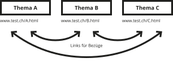
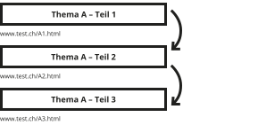
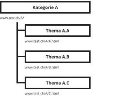
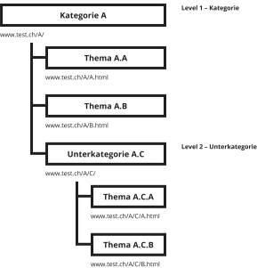
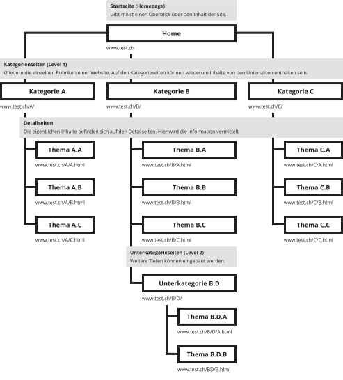
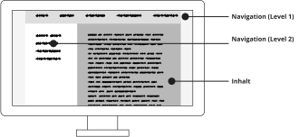
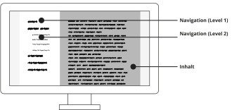
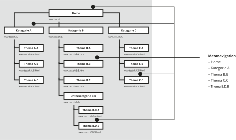
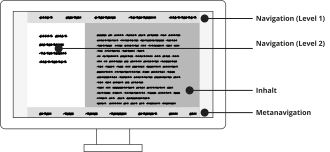
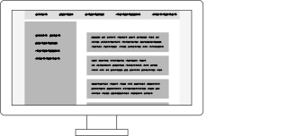

### HF Interactiondesign

# Navigation

Stefan Huber · Zürich · 2020 <!-- .element: class="footer" -->
--s--
## Übersicht

* **12:45**
* Organisation/News/Agenda
* Navigation
* Aufgabe
* **16:00** · Schulleitung
* **16:15** · Ende

--s--
# Organisation
--s--
## Arbeitslast

# Umfrage
* Wie war die Arbeitslast in den letzten Wochen? (😭 💤 ☺️)

--s--
## Semesterumfrage

* [2. Semester](https://de.surveymonkey.com/r/WQNWKZ8)

--s--
## Lohnumfrage

* Wieviel verdienst du pro Jahr bei einem Anstellungsgrad von 100 %?
* M oder W?

--s--
## OpenSource und Communities

* [Linksammlung](https://signalwerk.github.io/IAD2019/opensource-communities/)

--s--
## News

* [August 2020 · Geschlechtergerechter Sprachgebrauch](https://www.duden.de/sprachwissen/sprachratgeber/Geschlechtergerechter-Sprachgebrauch)
* [Gene werden umbenannt](https://www.bionews.org.uk/page_151346) · z. B.: SEPT1 wird SEPTIN1
* [Twitter Breach](https://securityboulevard.com/2020/07/biggest-twitter-breach-accounts-of-us-high-profiles-hacked-in-bitcoin-scam/)
* [TikTok](https://de.wikipedia.org/wiki/TikTok)
* …

--s--

## TikTok

### Was ist TikTok?
* Und wie funktioniert es?
* fyp?

--s--
## TikTok

* **2014** · Start musical.ly · Playback-Video-Plattform
* **2016** · ByteDance started Douyin in Asien
* **2017** · ByteDance kauft musical.ly
* **2018** · musical.ly wird TikTok (Funktion von Douyin)

--s--
## TikTok 2020

* **Juni 2020** · Kevin Mayer (Walt Disney DTCI) wird CEO
* **April 2020** · Douyin (ohne TikTok) hat 500 Mio. User
* **July 2020** · TikTok (ohne Douyin) hat 700 Mio. User
* **August 2020** · TikTok hat in den USA etwa 100 Mio. User
* **August 2020** · TikTok hat in Europa etwa 100 Mio. User

--s--
## TikTok

* **3\. August 2020** · Trump verkündet Ultimatum · 45 Tage
  * Nationale Sicherheit soll gefährdet sein
  * WeChat (Tencent) und TikTok (ByteDance) betroffen
  * Soll amerikanisch werden

--s--
## TikTok

* **Microsoft** versucht TikTok zu kaufen
* Ende August · China verkündet, dass AI unter speziellem **Export-Bedingungen** steht.
* 19. September 2020 · **Oracle und Walmart** werden künftig 20 % Aktienanteil an TikTok halten
* Künftig soll etwa 50 % in amerikanischer Hand sein
* Bis Montag muss es eine endgültige Einigung geben

--s--
## Oracle und Walmart

* **Oracle** · Welche Produkte sind wichtig?
* **Walmart** · Was machen die?

--s--
## TikTok Konkurenz

* [YouTube Shorts](https://www.theverge.com/2020/9/14/21436158/youtube-starts-tiktok-competitor-short-form-video-instagram-reels-beta-test)
* [Reels von Instagram](https://fortune.com/2020/08/05/instagram-reels-facebook-tiktok-launch/)
* TikTok-Clones (Likee, …)

--s--
## Agenda

* [28. 10. – 1. 11. 2020 – The fest of digital art and music](https://www.da-z.net/)

--s--
## Aufgabe
* [Aufgabe · News Portal](https://signalwerk.github.io/IAD2019/exercise-news-site/)

--s--
## Gruppenarbeit

* Welche Komponenten werden auf der Front eingesetzt?
* Wie ist die Navigation? Besonderheiten?
* Gruppen
  * [The Guardian](https://www.theguardian.com/)
  * [NZZ](https://www.nzz.ch/)
  * [20min](https://www.20min.ch/)
  * [iTreseller](https://www.itreseller.ch/)

--s--
## Navigation

--s--

## Links

  <!-- .element: class="pic" -->

--s--

## Warum Navigation? Wohin?

* Website
* Webseite
* Homepage

--s--

## Paging

  <!-- .element: class="pic" -->

--s--

## Logische Einheiten

  <!-- .element: class="pic" -->

--s--

## Strukturtiefe

  <!-- .element: class="pic" -->

--s--

## Hierarchische Navigation

  <!-- .element: class="pic" -->

--s--

## Abtrennen der Levels

  <!-- .element: class="pic" -->

--s--
## Verschachtelte Levels

  <!-- .element: class="pic" -->

--s--

## Breadcrumb-Navigation (Brotkrümelnavigation)

  <!-- .element: class="pic" -->

--s--
## Metanavigation

  <!-- .element: class="pic" -->

--s--
## Metanavigation

  <!-- .element: class="pic" -->

--s--

## Zeitliche Navigation

  <!-- .element: class="pic" -->

--s--

## Zeitliche Navigation

  <!-- .element: class="pic" -->

--s--
## Aufgabe
