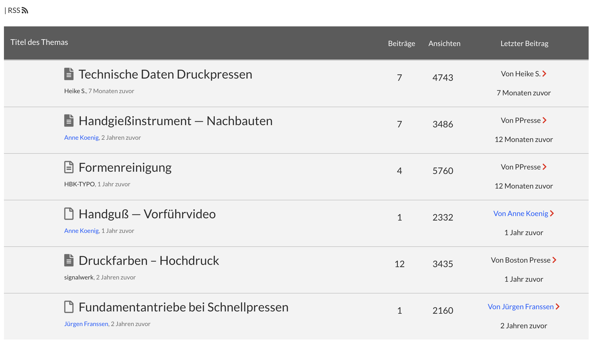
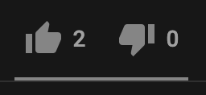
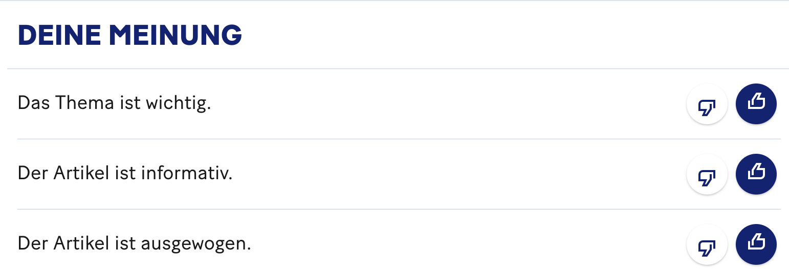
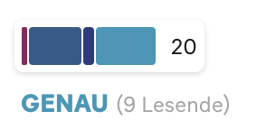
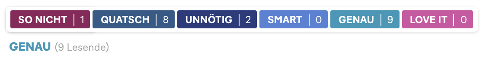

### HF Interactiondesign

# Werkstatt

Stefan Huber · Zürich · 2020 <!-- .element: class="footer" -->

--s--

## Übersicht

- **12:45**
- Organisation/News/Agenda
- Baustein Like
- Realisation & Besprechungen
- **16:15** · Ende

--s--

# Organisation

--s--

## Arbeitslast

# Umfrage

- Wie war die Arbeitslast in den letzten Wochen? (😭 💤 ☺️)

--s--

## Planung

- **Sa · 09. 01. 2021** → Realisation & Besprechungen · Baustein Progress
- **Sa · 16. 01. 2021** → 👁 Review von Design (Realisation)
- **Sa · 23. 01. 2021** → Finish

--s--

## News

- [US-Handelsaufsicht verklagt Facebook](https://www.heise.de/news/US-Handelsaufsicht-verklagt-Facebook-wegen-Kauf-Instagrams-und-WhatsApps-4985259.html)

* [Premieren von Warner Bros. ab 2021 auch per Stream](https://www.spiegel.de/kultur/kino/zum-kinostart-warner-bros-bietet-2021-alle-neuen-filme-auch-als-streaming-an-a-f79d4084-d02d-4666-b8e2-87502047701c)

--s--

## US-Staaten vs Facebook

- Justizbehörden von 48 US-Staaten und **US-Handelsaufsicht (FTC)** der USA verlangen Zerschlagung von Facebook.
- Klage in Washington eingereicht – mehrjähriges Verfahren erwartet

--s--

## US-Staaten vs Facebook

- Im Zentrum stehen Monopolvorwürfe. Insbesondere seien gezielt Konkurrenten aufgekauft worden.
  - **2012** Instagram – 1 Milliarde US-Dollar
  - **2014** WhatsApp – 19 Milliarden US-Dollar
- Übernahmen von Instagram und WhatsApp damals von FTC abgesegnet

--s--

## Bell System

- Ab ~1877 Organisation die in «Bell Systems» endete
- Diverse Zusammenschlüsse
- Ab etwa den 1920er Monopolstellung auf Ferngespräche
- Grossteil der lokalen Telefonnetze bei «Bell Systems»

Quelle: [Wikipedia](https://en.wikipedia.org/wiki/Breakup_of_the_Bell_System)

<!-- .element: class="footer" -->

--s--

## Zerschlagung Bell System

- **1974** Antitrust-Verfahren vom U.S. Department of Justice gegen Bell
- **1984** Zerschlagung von Bell in mehrere Regionale Holdings (AT & T)

--s--

## Warner Bros.

* Seit 1923 als Filmstudio tätig
* Gehört zum Konglomerat WarnerMedia
* WarnerMedia gehört seit 2018 zu AT & T
* Zweitgrösstes Filmstudio der Welt
* Etwa 14 % Marktanteil in der USA
* WarnerMedia gehört das Streaming-Unternehmen HBO Max

Quelle: [Wikipedia](https://en.wikipedia.org/wiki/Major_film_studios)

<!-- .element: class="footer" -->

--s--
## Markt

* China wird zunehmend wichtiger
* Corona sorgt für massiv wenigere Kino-Besuche
* Seit 2007 wird Streaming – angeführt von Netflix – zunehmend wichtiger

--s--
## Markt

 <!-- .element: class="pic" -->


Quelle: [The Economist](https://www.economist.com/business/2020/08/27/hollywoods-chinese-conundrums)

<!-- .element: class="footer" -->


--s--
## Streaming

* Warner Bros. filme sollen im 2021 zeitgleich bei HBO Max und im Kino erscheinen
* Filme bleiben einen Monat auf HBO Max
* 17 Premieren im 2021

--s--

## Agenda

- Stay home and stay save
- Hausaufgaben…

--s--

## Grid


--s--

## Starterkit

* `npm run start`
* Konami code: Up Up Down Down Left Right Left Right B A


--s--

## Baustein Like

--s--
## Likes/Stats

* Es gab schon sehr früh «Metriken» um soziale Stimmung abzulesen
* Seit 1994 vermehrt Internet Foren mit Countern

--s--
## Foren

 <!-- .element: class="pic" -->


--s--
## Facebook (2004)


* Seit Februar 2009 in Facebook
 <!-- .element: class="pic" -->

--s--
## Funktion

* Inhalte Liken, die dann auf dem News-Feed meiner Freunde erscheinen
* Dem Social-Graph zeigen was man mag
* Wenn der «original Facebook» Button eingebunden wird, so werden Infos an Facebook übermittelt.

--s--
## Facebook (2004)

 <!-- .element: class="pic" -->


* Seit May 2017 auch «Reactions»
* Reactions: Love, Haha, Wow, Sad, and Angry

--s--
## Twitter

* ⭐️ wurde 2006 [als «Bookmark» eingeführt](https://www.theverge.com/2015/11/3/9661180/twitter-vine-favorite-fav-likes-hearts)
* Im November 2015 ersetzt durch ♥️ als «like»

--s--
## Instagram (2010)

* Einführung von Herz im September 2015
* Seit July 2019 verschiedene Tests die Anzahl «likes» auszublenden
* Umfrage letzte Woche


--s--
## YouTube

* Eine der wenigen grossen Plattformen mit Dislike
 <!-- .element: class="pic" -->

--s--
## 20min – Artikel




--s--
## 20min – Kommentaren








--s--
## Ranking driven

* Ranking ergibt Startseite/Aufbau
* Seiten wie [reddit](https://www.reddit.com/) oder [Hacker News](https://news.ycombinator.com/)


--s--
## Gefahren

* Optimierung der Inhalte um Likes zu generieren
* «Dislikes» kann soziales Wohlwollen auf einer Plattform stören

--s--
## Code?

--s--


## Frontend Framework


* Wie baut man moderne Websites?


--s--


## Grundsätze

* Daten «fliessen» durch die Applikation und bestimmen das Aussehen
* Abstraktion der Applikation in Komponenten

--s--

## Geschichte


* **2006** – jQuery → JavaScript-Library um interaktion mit DOM (Browser) zu erleichtern
* **2010** – Backbone.js → JavaScript-Library um Model–view–presenter (MVP) zu realisieren

--s--

## New Kids on the Block

* **2010** – Angular.js / **2016** Angular
* **2011** – Ember.js
* **2013** – React.js
* **2014** – Vue.js

--s--

## Erkennungsmerkmale

* Daten ergeben das Aussehen (State)
* Router spielen oft eine wichtige Rolle
* Komponenten, Komponenten, Komponenten...


--s--

## Komponenten?


--s--


## Tags

```html

```


--s--


## Tags

```html

```

--s--


## HTML

```html

<h1>...</h1>
<p>...</p>

```


--s--

## Verschachtelungen


```html
<ul>
  <li>...</li>
</ul>
```


--s--

## Framework rendert HTML

Aber die Aufteilung ist nach logischen Komponenten...

--s--


## Atomic Design

* [READ](http://atomicdesign.bradfrost.com/chapter-2/#atomic-design-is-for-user-interfaces)

--s--


## Komponenten

```jsx
<Avatar
  firstname="Hans"
  familyname="Muster"
  picture="hans.jpg"
/>
```

--s--

## Komponenten

```jsx
<Avatar
  firstname="Franziska"
  familyname="Muster"
  picture="franziska.jpg"
/>
```


--s--

## HTML


```html
<div class="avatar">
  <div class="avatar--picture">
    
  </div>
  <div class="avatar--name">
    <h3>Hans Muster</h3>
  </div>
</div>

```

--s--

## CSS

```css
.avatar {
  ...
}

```


--s--

## Verschachtelungen

```jsx
<Sidebar>
  <Avatar
    firstname="Hans"
    familyname="Muster"
    picture="hans.jpg"
  />
  <Avatar
    firstname="Franziska"
    familyname="Muster"
    picture="franziska.jpg"
  />
</Sidebar>
```
--s--

## Logik ist in der Komponente

* Siehe `src/components/Like/index.jsx`


--s--
## Like-Button

```jsx
const Like = ({ start }) => {
  const [count, setCount] = useState(start);

  return (
    <div className="like">
      <button className="like__btn" onClick={() => setCount(count + 1)}>
        {count} – Click me
      </button>
    </div>
  );
};

export default Like;
```

--s--
## Like-Button mit zusätzlicher Klasse


```jsx
const Like = ({ start }) => {
  const [count, setCount] = useState(start);

  return (
    <div className={`like like--has${count > 0 ? "Likes" : "NoLikes"}`}>
      <button className="like__btn" onClick={() => setCount(count + 1)}>
        {count} – Click me
      </button>
    </div>
  );
};

export default Like;
```


--s--
## Verwendung

* Bisschen Komplizierter... Aber für uns so:

```jsx
<div component="like"></div>
<div component="like" start="54"></div>
```


--s--

## Besprechungen

--s--

## Danke
