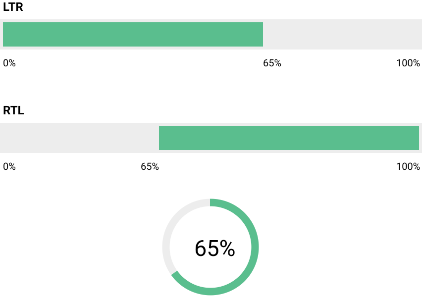
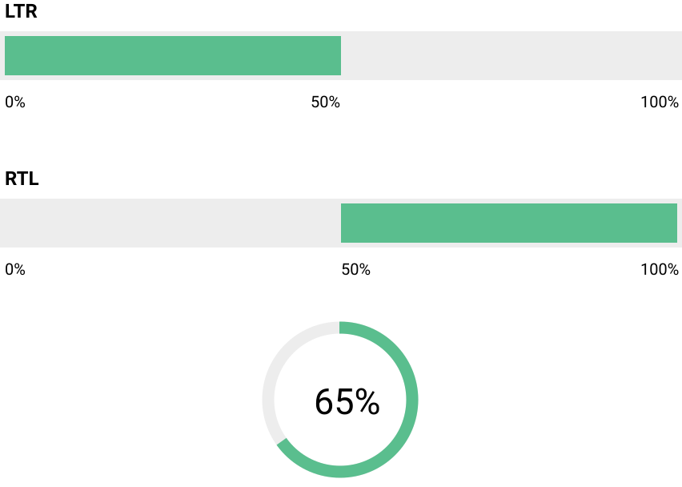
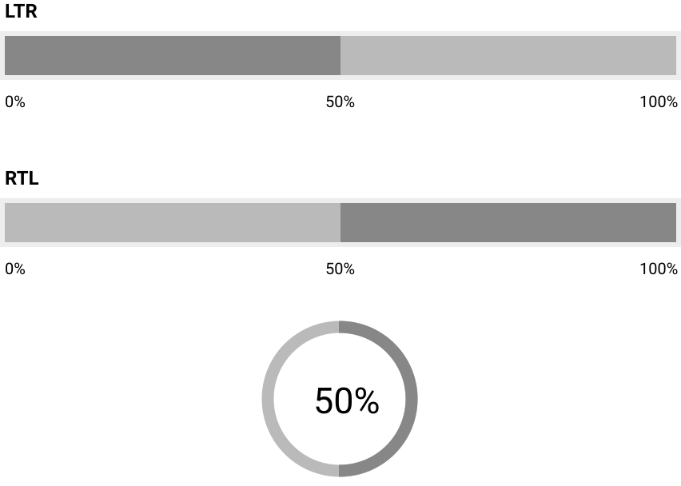

### HF Interactiondesign

# Werkstatt

Stefan Huber · Zürich · 2020 <!-- .element: class="footer" -->

--s--

## Übersicht

- **8:15**
- Organisation/News/Agenda
- Anforderungen
- Fehler & Probleme
- Responsive Ansicht
- Baustein Progress
- Realisation & Besprechungen
* **11:45** · Ende

--s--

## Übersicht

* **12:45**
- Schulterblick
- Realisation & Besprechungen
- **16:15** · Ende

--s--

# Organisation

--s--

## Arbeitslast

# Umfrage

- Wie war die Arbeitslast in den letzten Wochen? (😭 💤 ☺️)


--s--

## Planung

- **Sa · 09. 01. 2021** → 8 h · Realisation & Besprechungen · Baustein Progress
- **Sa · 16. 01. 2021** → 4 h · 👁 Review von Design (Realisation)
- **Fr · 22. 01. 2021** → 8 h · Finish

--s--

## Abgabe Arbeit

> Am 21. Januar 2021 muss die Website <br>(per GitHub in eigenem Repo) online sein.


--s--

## Planung

- **Sa · 09. 01. 2021** → Realisation & Besprechungen · Baustein Progress
- **Sa · 16. 01. 2021** → ~~👁 Review von Design (Realisation)~~ *Schulterblick & Besprechungen*
- **Sa · 23. 01. 2021** → *Realisation (bis 14 Uhr) &* Finish

--s--

## Planung

- **Di · 12. 1. 2021** → Online Besprechungen <br> (Anmeldung bis 11. 1. 2021 · 9 Uhr · Slack)
- **Di · 19. 1. 2021** → Online Besprechungen <br> (Anmeldung bis 18. 1. 2021 · 9 Uhr · Slack)

--s--

## News

* [Google ist offline](https://techcrunch.com/2020/12/14/gmail-youtube-google-docs-and-other-services-go-down-simultaneously-in-multiple-countries/)
* [Assange wird nicht in die USA ausgeliefert](https://netzpolitik.org/2021/gerichtsurteil-nur-gesundheitszustand-von-assange-steht-seiner-auslieferung-entgegen/)


--s--
# WikiLeaks

Gründer: Julian Assange

Nutzt das Internet um Whistleblowern eine anonyme Leaking-Plattform zu geben.

Sehr viele Publikationen. Sehr viele Reviewers und Zusammenarbeiten mit renomierten Medien.

--s--
# WikiLeaks

* 2010 · Collateral Murder (Iraq)
* 2010 · U.S. diplomatic cables
* 2016 · Hillary Clinton Mails
* 2017 · Vault 7 (CIA)

--s--
## Julian Assange

* 2006 · Gründet WikiLeaks
* August 2010 · Vergewaltigungsvorwurf in Schweden  
* 18\. November 2010 Haftbefehl von Schweden
* 7\. Dezember 2010  Stellt sich in London
* 16\. Dezember 2010 auf Bewährung frei

--s--
## Julian Assange

* 19\. Juni 2012 Flucht in ecuadorianische Botschaft in London
* 11\. April 2019 ecuadorianischen Botschaft lässt Londoner Polizei zugreifen
* 11\. April 2019 Auslieferungsersuchen der USA


--s--
## Julian Assange

* 19\. November 2019 schwedische Staatsanwaltschaft stellt Untersuchung ein
* 4\. Januar 2021 · Westminster Magistrates’ Court in London lehnt auslieferung in die USA ab
  * nicht nur journalistische Tätigkeiten (Hacker)
  * erwartenden Haftbedingungen = Suizidgefahr
  * USA wollen in Berufung gehe

--s--
## ~~Agenda~~ Read


* [W3C · Tim Berners-Lee · Cool URIs don't change](https://www.w3.org/Provider/Style/URI.html)
* [W3C · Richard Ishida · Personal names around the world](https://www.w3.org/International/questions/qa-personal-names)
* [Bert Hubert · Reverse Engineering the source code of the BioNTech/Pfizer SARS-CoV-2 Vaccine](https://berthub.eu/articles/posts/reverse-engineering-source-code-of-the-biontech-pfizer-vaccine/)


--s--
## Anforderungen

* [Aufgabe · News Portal](https://signalwerk.github.io/IAD2019/exercise-news-site/)


--s--
## Anforderungen


* Navigation
* Teaser zu Artikeln
* Teaser zu Kolumne (Meinung)
* Wetter-Widget
* Werbung
* Herz/Thumbs Up/Like


--s--
## Meine Reihenfolge wäre...

* Teaser zu Artikeln
* Teaser zu Kolumne (Meinung)
* Werbung
* Navigation
* Herz/Thumbs Up/Like
* Wetter-Widget


--s--
## Fehler & Probleme

--s--
## Vorgehen

* `npm run start`
* 🥳 alles läuft
* Git-Commit machen

--s--
## Fehler & Probleme

* 😡 Etwas stimmt nicht
* Terminal ist zum Teil nicht so hilfreich…
* Je nach Editor werden Fehler angezeigt
* Sonst zurück zur letzten Git-Version

--s--
## Responsive Ansicht

--s--
## Responsive Ansicht

* Mobile first ist eine gute Idee
* Wenig Aufwand, grosse Wirkung
  * Fontsize
  * Grid


--s--
## CSS Mediaquery

Je nach Eigenschaft des Ausgabemediums andere CSS-Definition


--s--
## Default (mobile)

```css
html {
  font-size: 16px;
}
```

--s--
## CSS Mediaquery

```css
@media screen and (min-width: 700px) {
  html {
    font-size: 18px;
  }
}
```

Mediaquery wird aktiv, wenn das Ausgabemedium ein Bildschirm ist und die Breite mehr als `700px` ist.

--s--
## CSS Mediaquery

```css
html {
  font-size: 16px;
}
@media screen and (min-width: 700px) {
  html {
    font-size: 18px;
  }
}
```
--s--
## Optional SCSS-Include

statt
```css
@media (min-width: 700px) {
  /* code */
}
```

include
```scss
@include media(m) {
  /* code */
}
```
--s--
## Optional SCSS-Include

statt

```css
html {
  font-size: 16px;
}
@media screen and (min-width: 700px) {
  html {
    font-size: 18px;
  }
}
```

include
```css
html {
  font-size: 16px;
  @include media(m) {
    font-size: 18px;
  }  
}
```


--s--
## Grid · Responsive Ansicht

```scss

.grid-12 {
  display: grid;
  grid-template-columns: repeat(12, 1fr);
  grid-column-gap: 3%;
}

.column-1 {
  grid-column: span 12;
}

.column-3 {
  grid-column: span 12;
}

```


--s--
## Grid · Baustein Progress

```scss

.grid-12 {
  display: grid;
  grid-template-columns: repeat(12, 1fr);
  grid-column-gap: 3%;
}

.column-1 {
  grid-column: span 12;
  @include media(m) {
    grid-column: span 1;
  }
}

.column-3 {
  grid-column: span 12;
  @include media(m) {
    grid-column: span 3;
  }
}
```


--s--
## Responsive Ansicht


```scss
@media (min-width: 700px) {
  .column-1 {
      grid-column: span 1;
  }
}
```

```css
@media (min-width: 700px) {
  .column-1 {
      grid-column: span 1;
  }
}
```


--s--
## Baustein Progress


--s--
## Scrollbar

* Neuere Browser zeigen Scrollbars nur während dem Scrollen
* Wenn Maus angeschlossen ist → auf MacOS immer mit Scrollbars
* Zeigt proportional den Fortschrit auf der Seite an
* [History](https://scrollbars.matoseb.com/)

--s--
## Steps – Checkout


* Wo befindet sich der Kunde
* Wann wird der Kauf ausgelöst

Quelle: [commaconsulting.com](https://www.commaconsulting.com.au/articles/best-practice-checkout-progress-bar)
<!-- .element: class="footer" -->


--s--
## Progress – klassisch

* Leserichtung beachten
* Radial, Linear, Torte, …
* (Farb-)kontrast beachten
* Fortschrit verhält sich linear und absehbar
* Auf was wird gewartet?

--s--
## Progress – klassisch
  <!-- .element: class="pic" -->

--s--
## Progress – klassisch
  <!-- .element: class="pic" -->

--s--
## Progress – klassisch
  <!-- .element: class="pic" -->

--s--
## Spinner
* Fortschrit ist nicht richtig messbar
* Auf was wird gewartet?
  <!-- .element: class="pic upscale" -->


--s--

--s--
## Realisation & Besprechungen

* [Timetable](https://docs.google.com/spreadsheets/d/1FhjgZ8ucKH7aP9TJN3k1qf6nz3QwWn36JI1yQ7-VmcE/edit?usp=sharing)
* Supporter·in & fragende Person

--s--
## Schulterblick

* Alle Screenshots `375px` Breite und `800px` Höhe
* Auch Desktop auf diesem Frame positionieren
* [HackMD](https://hackmd.io/@signalwerk/rJmMLq8Av)


--s--

## Planung

- **Sa · 09. 01. 2021** → Realisation & Besprechungen · Baustein Progress
- **Sa · 16. 01. 2021** → ~~👁 Review von Design (Realisation)~~ *Schulterblick & Besprechungen*
- **Sa · 23. 01. 2021** → *Realisation (bis 14 Uhr) &* Finish

--s--

## Planung

- **Di · 12. 1. 2021** → Online Besprechungen <br> (Anmeldung bis 11. 1. 2021 · 9 Uhr · Slack)
- **Di · 19. 1. 2021** → Online Besprechungen <br> (Anmeldung bis 18. 1. 2021 · 9 Uhr · Slack)

--s--

## Support–Hotline

--s--


## Danke
