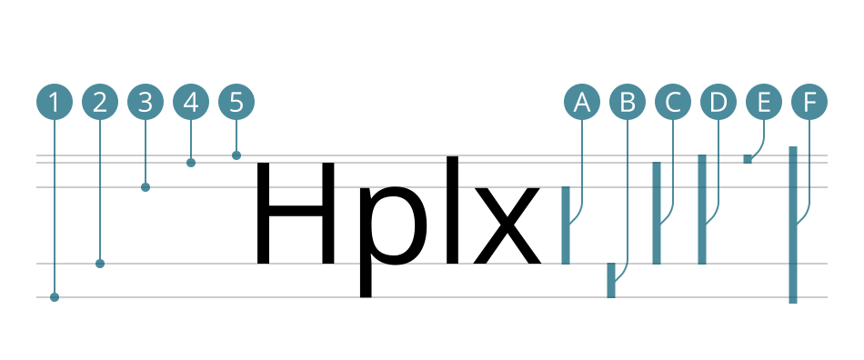
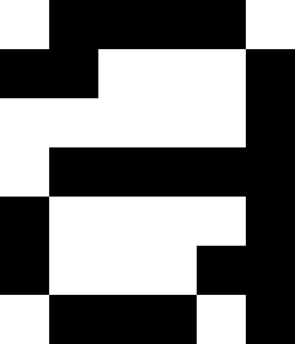
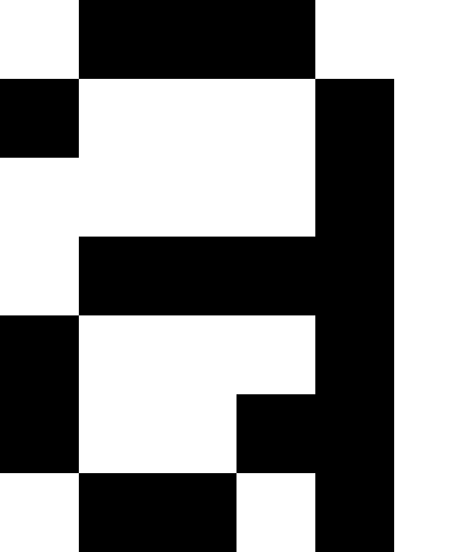
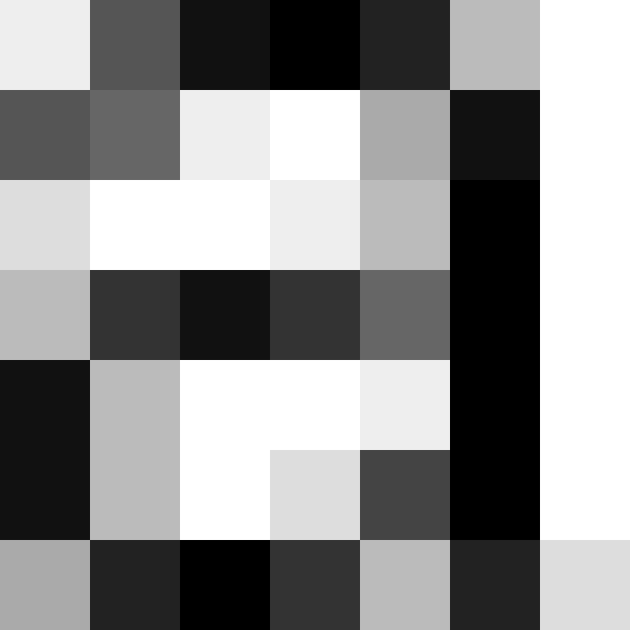
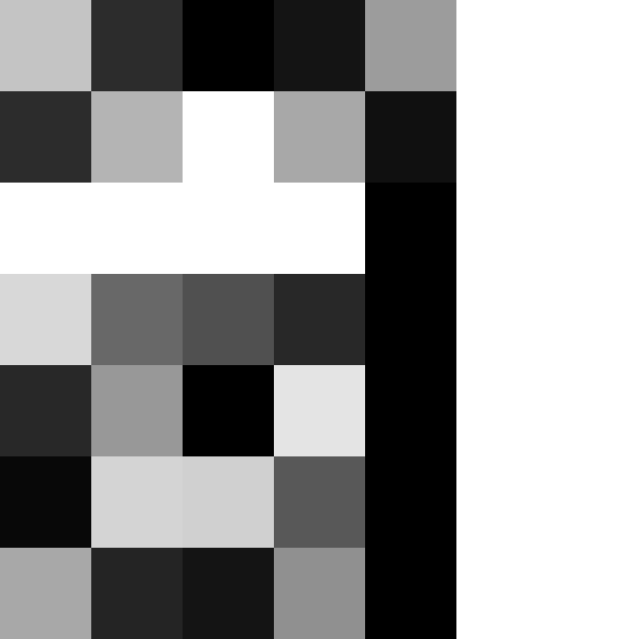
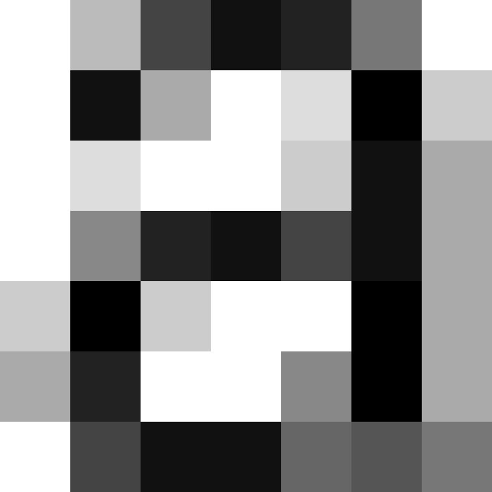

### HF Interactiondesign

# Bildschirme · Fonts <br> OpenSource

Stefan Huber · Zürich · 2021 <!-- .element: class="footer" -->

<!--


### Flavia Bachmann

### Natascha Alenka Meili

### Catharina Liza  Doll 

### Noah Joshua Ortner 

### Mirjam Düggelin 

### Alexandra Rothlin 

### Sario Haladjian 

### Robin Schnurrenberger 

### Cédric Juan 

### Katrin Schweizer 

### Juri Seger 

### Melissa Thoma 

### Alexandra Ziegler 

* 13 Personen


Mitbringen
* iPhone
* eReader
* Lupe
* Mikroskop
* Typometer – resolution
* Massband

-->

--s--

## Dokumentation


[iad2021.signalwerk.ch](https://iad2021.signalwerk.ch/)

- Slides
- Dokumente mit Links
- Slack #typo

--s--

## Hello World!

**Stefan Huber** · Lebt und arbeitet als Entwickler und Gestalter in Zürich. Ist selbständig und hat eine Teilzeitanstellung bei [Liip](https://www.liip.ch/). Macht die Konzeption und Realisation für blinkende Dinge im Web und ist Dozent an der Schule für Gestaltung Zürich.


--s--

## Wer seit ihr?

* 😩 schon wieder?!


--s--

 ## Arbeitsdokument

* [HackMD](https://hackmd.io/@signalwerk/SJjogxQ7Y/edit)
* Dokument wird als Privatkopie erachtet (keine öffentliches Dokument)


--s--
## Aufgabe

### Zeit: 3 min

* Notiere ein Begrif zu Typografie (Fachwort/Schrift/Person/Erlebnis)
* Notiere ein Satz weshalb du diesen Begrif ausgesucht hast
* Poste ein Bild dazu


--s--

## Planung

- **Sa · 18. 09. 2021** → 4h Bildschirme und Fonts
- **Sa · 18. 09. 2021** → 4h Open Source Communities
- **Fr · 19. 11. 2021** → 4h Typografische System
- **Sa · 04. 12. 2021** → 8h Typografische System
- **Fr · 07. 01. 2022** → 4h Typografische System
- **Fr · 07. 01. 2022** → 4h Open Source Communities
- **Fr · 14. 01. 2022** → 4h Technologiegeschichte der Schrift

--s--

## Make it more fun…

Damit wir Praxis und Theorie besser mischen können, möchte ich immmer Theorie und Praxis abwechseln.


--s--
## Zeiten
- **8:15**
- ½ h Pause
- **11:45** 

### Mittag

- **12:45**
- ½ h Pause
- **16:15** 


--s--

## Übersicht 

- **8:15**
- Bildschirme und Fonts
- Übungen/Werkstatt
- **11:45** · Ende

--s--

## Übersicht

- **12:45**
- Bildschirme und Fonts
- Open Source Communities
- Übungen/Werkstatt
- **16:15** · Ende


--s--

## Aufgabestellung

[Aufgabe · Blog Post](https://iad2021.signalwerk.ch/exercise-blog-post/) – Dazu später mehr


--s--

## Bildschirme und Fonts


--s--
## Welt wird Digital
 <!-- .element: class="pic" -->


--s--

## Bildschirmauflösung
 <!-- .element: class="pic" -->
--s--
## Bildschirmauflösung
 <!-- .element: class="pic" -->

--s--
## Übung

* Bildschirmauflösung in [→ Spreadsheet](https://docs.google.com/spreadsheets/d/1C1EyRh_HGEXX_5WeOwIGFIHr4KgV5VvuxrLpnPiRV1U/edit) eintragen
* Spalten A bis E verfollständigen
  * Welche Geräte nehmen wir?
--s--

## Standards


Bildquelle: [Wikipedia · Display resolution](https://en.wikipedia.org/wiki/Display_resolution)
<!-- .element: class="footer" -->
--s--
## Verwendung

* [Browser Market](http://gs.statcounter.com/)
* [Browser Display Statistics](http://www.w3schools.com/browsers/browsers_display.asp)

--s--
## Bildschirmabmessung

# 15" von was?

Warum Zoll?

<!-- =SQRT(SUMSQ(A1,B1)) -->

--s--
## Zoll
```
1 Zoll (Inch) = 25.4 mm  
1 dpi ≈ 0.39 dpcm  
1 dpcm = 2.54 dpi  
```
--s--
## Übung
* Bildschirmabmessung in [→ Spreadsheet](https://docs.google.com/spreadsheets/d/1C1EyRh_HGEXX_5WeOwIGFIHr4KgV5VvuxrLpnPiRV1U/edit) eintragen
* Spalten F bis H verfollständigen


--s--
## Visuelle Grösse


Bildquelle: [Size Calculator](https://sizecalc.com/)
<!-- .element: class="footer" -->

--s--
## Übung

* Typischer Leseabstand in [→ Spreadsheet](https://docs.google.com/spreadsheets/d/1C1EyRh_HGEXX_5WeOwIGFIHr4KgV5VvuxrLpnPiRV1U/edit) eintragen
* Spalten J verfollständigen

--s--
## Übung
* Kann die Spalte des abgegebenen Blattes auf dem Screen visuell gleich dargestellt werden? (nur Breite beachten)
* Meinungen?
* [Size Calculator](https://sizecalc.com/)

--s--
## Auflösung

# 1920 ✕ 1080
--s--
## Auflösung
# 72 dpi
--s--
## Auflösung
# 1920 ✕ 1080 vs. 72 dpi
--s--
## Auflösungsdichte – DPI

Angabe, wieviel Pixel (Punkte) auf einer Strecke von 1 Inch (25.4 mm) dargestellt werden.

--s--
## Auflösungsdichte – DPI

1. Alle Screens haben 72 dpi
2. Alle Mac haben 72 dpi, alle PC haben 92 dpi
3. Alle Mac haben 72/144 dpi, alle PC haben 92 dpi
4. Es gibt keine Regel

--s--

## DPI Wert ermitteln
Höhe oder Breite des Bildes in Pixel <br>÷<br> Höhe oder Breite in Ausgabe (in Inch) <br>=<br> Auflösung in DPI (Dots per Inch)
--s--
## Rechnungsbeispiel

Höhe oder Breite des Bildes in Pixel <br>÷<br> Höhe oder Breite in Ausgabe (in Inch) <br>=<br> Auflösung in DPI (Dots per Inch)
>> 3000 Pixel ÷ 10 Inch (25,4 cm) = 300 Dots per Inch

--s--
## Übung

* Wieviele Punkte (Pixel) pro Inch (DPI) hat euer Screen? (Spalte K)
--s--
## Auflösungsdichte – DPI

1. Alle Screens haben 72 dpi
2. Alle Mac haben 72 dpi, alle PC haben 92 dpi
3. Alle Mac haben 72/144 dpi, alle PC haben 92 dpi
4. Es gibt keine Regel

--s--
## `1px` in CSS

--s--
## Übung

* Zeichne eine 1px Linie in CSS mit [→ Codepen](https://codepen.io/)
* Screenshot erstellen
* Screenshot untersuchen


--s--
## Übung

* 1px Linie in [→ Spreadsheet](https://docs.google.com/spreadsheets/d/1C1EyRh_HGEXX_5WeOwIGFIHr4KgV5VvuxrLpnPiRV1U/edit) eintragen
* Spalten M verfollständigen

--s--
## Device Pixel Ratio/Pixel Density

[The Ultimate Guide To iPhone Resolutions](https://www.paintcodeapp.com/news/ultimate-guide-to-iphone-resolutions)

--s--
## Media-Query mit Pixel Density
```css
@media
only screen and ( min-device-pixel-ratio: 2),
only screen and ( min-resolution: 2dppx)
{
  /* Definitionen hier */
}
```

[Support-Matrix für Browser](https://caniuse.com/#feat=css-media-resolution)
<!-- .element: class="footer" -->
--s--
## Media-Query mit DPI

```css
@media
only screen and ( min-resolution: 190dpi),
only screen and ( min-resolution: 75dpcm)
{
  /* Definitionen hier */
}
```
[Support-Matrix für Browser](https://caniuse.com/#feat=css-media-resolution)
<!-- .element: class="footer" -->

--s--

## Display Technologien
--s--

## Kathodenstralröhre
 <!-- .element: class="pic" -->

--s--

## Elektrophoretische Anzeige


--s--
## Geräte mit eInk

--s--
## LCD-Anzeige


--s--

## Geräte mit LCD

--s--
#### OLED

<video controls>
  <source src="../../2018/KW25-screens/img/REC016.mp4" type="video/mp4" />
  <source src="../../2018/KW25-screens/img/REC016.webm" type="video/webm" />
</video>

--s--
#### OLED


Bildquelle: [LG](http://www.lg.com/global/business/information-display/technology-solution/oled)
<!-- .element: class="footer" -->

--s--
#### OLED


Bildquelle: [Gamezone/LG](https://www.mweb.co.za/games/NewsArticles/tabid/2561/Article/30977/Samsung-QLED-How-does-its-display-work-and-is-it-better-than-OLED.aspx)
<!-- .element: class="footer" -->

--s--
## Übung


* Welche Screen-Technologie verwendet euer Screen?
* Spalten N verfollständigen

--s--
## Dark Mode
--s--
## Betriebsystem
* **MacOS Mojave (2018)** erster Dark Mode auf Desktop
* **Android 9 (2018)** erster Dark Mode auf Mobile
* **iOS 13 (2019)** Dark Mode auch auf Apple Mobiles

--s--
## Dark Mode

* **OLED-Displays** → brauchen für hellere Farben mehr Strom
* **LCD-Displays** → bruachen für alle Farben immer (etwa) gleichviel Strom


--s--
## Stolpersteine

* Dark ≠ Black
* Farbabstufung muss neu gelernt werden
* [Black Smearing](https://gist.githack.com/signalwerk/a4084f47fb6b56f79ca33055dd2ea9a3/raw/592a8821f8f7448d57c25f39ddcc3778f649ebdc/black-smearing.html)

--s--
## Black Smearing

* Welche Mobiles haben wir?
* Let's test it!


--s--
## Bildwiederholrate


* Animation flüssig: ab [20 – 30 Frames pro Sekunde (fps)](https://en.wikipedia.org/wiki/Frame_rate#/media/File:Animhorse.gif)
* Ideal: [60 Frames pro Sekunde](https://www.youtube.com/watch?v=pfiHFqnPLZ4)
* iPad Pro? Filme? TV? Games?
* [Apple Beispiel für adaptieven Framerate](https://youtu.be/EvGOlAkLSLw?t=3706)

--s--

## Kennzahlen zu Bildschirmen
* [Lichtstärke – Lumen](https://de.wikipedia.org/wiki/Lumen)
* [Leuchtdichte – Nits](https://de.wikipedia.org/wiki/Leuchtdichte)
* [Farbraum](https://de.wikipedia.org/wiki/Farbraum)
* [Farben im Web – unterscheiden und interpolieren](https://signalwerk.github.io/publisher/colors/)

--s--
# Text auf dem Bildschirm

--s--
## Vektor zu Pixel


 <!-- .element: class="pic" -->


--s--
## Schriftgrösse
 <!-- .element: class="pic" -->


- [Fonts · Eigenschaften](https://interaction.signalwerk.ch/articles/font-anatomy/)


--s--
## Renderer

 <!-- .element: class="pic" -->

--s--
## 1-Bit (Bitmap)

 <!-- .element: class="pic" -->

--s--
## Auflösung


Microsoft Arial Unicode – MS-Renderer – S/W – 8 bis 48 Pixel Höhe (PPM) <!-- .element: class="footer" -->

--s--
## Wirkung


  <!-- .element: class="pic" -->


Microsoft Arial Unicode – MS-Renderer – S/W – 8 bis 18 Pixel Höhe (PPM) <!-- .element: class="footer" -->


--s--
## Wirkung


 <!-- .element: class="picWide" -->

Microsoft Arial Unicode – 8 Pixel Höhe (PPM) – MS-Renderer – S/W <!-- .element: class="footer" -->


--s--
## Wirkung

 <!-- .element: class="picWide" -->

Microsoft Arial Unicode – 24 Pixel Höhe (PPM) – MS-Renderer – S/W <!-- .element: class="footer" -->


--s--
## Unterschiede im Rendering

 <!-- .element: class="pic" -->

--s--
## FreeType-Renderer – S/W

 <!-- .element: class="pic" -->

13 Pixel Höhe (PPM) – Microsoft Arial Unicode <!-- .element: class="footer" -->

--s--
## MS-Renderer – S/W

 <!-- .element: class="pic" -->


13 Pixel Höhe (PPM) – Microsoft Arial Unicode <!-- .element: class="footer" -->

--s--
## Apple-Renderer – S/W

 <!-- .element: class="pic" -->

13 Pixel Höhe (PPM) – Microsoft Arial Unicode <!-- .element: class="footer" -->

--s--
## Hinting

--s--
## Outline

 <!-- .element: class="pic" -->

--s--
## Buchstabe a als Pixel ohne Hinting


 <!-- .element: class="pic" -->

--s--
## Buchstabe a als Outline mit Hinting

 <!-- .element: class="pic" -->

--s--
## Buchstabe a als Pixel mit Hinting

 <!-- .element: class="pic" -->


--s--
## TrueType vs. PostScript

* OpenType kennt beide «flavors»
* Woff 1/2 (Web-Fonts) sind technologisch (beinahe) OpenType-Fonts
* TrueType erlaubt bessere Steuerung von Hints

--s--
## TrueType mit von Hand eingefügten Hints


Microsoft Arial Unicode – MS-Renderer – S/W <!-- .element: class="footer" -->
--s--
## Autohints in PostScript


AMB Newut Medium – MS-Renderer – S/W <!-- .element: class="footer" -->


--s--
## Darstellung mit Graustufen

 <!-- .element: class="pic" -->


Microsoft Arial Unicode  – 8 bis 18 Pixel Höhe (PPM) – MS-Renderer – Graustufen   <!-- .element: class="footer" -->

--s--
## Wirkung
 <!-- .element: class="picWide" -->

Microsoft Arial Unicode – 8 Pixel Höhe (PPM) – MS-Renderer – Graustufen  <!-- .element: class="footer" -->

--s--
## Wirkung
 <!-- .element: class="picWide" -->

Microsoft Arial Unicode – 24 Pixel Höhe (PPM) – MS-Renderer – Graustufen  <!-- .element: class="footer" -->
--s--
## FreeType-Renderer – Graustufen
 <!-- .element: class="pic" -->

13 Pixel Höhe (PPM) – Microsoft Arial Unicode <!-- .element: class="footer" -->
--s--

## MS-Renderer – Graustufen
 <!-- .element: class="pic" -->

13 Pixel Höhe (PPM) – Microsoft Arial Unicode <!-- .element: class="footer" -->
--s--

## Apple-Renderer – Graustufen
 <!-- .element: class="pic" -->

13 Pixel Höhe (PPM) – Microsoft Arial Unicode <!-- .element: class="footer" -->


--s--
## Fonts im Browser

* Web Safe Fonts (Systemfonts)
* Fonts mitsenden (Webfonts)
--s--
## Web Safe Fonts (Systemfonts)
--s--
## Web Safe Fonts (Systemfonts)

```CSS
p {
  font-family: Arial, Helvetica, sans-serif;
}
```

* Schrift ist auf Host installiert
* Fallbacks um mehrere mögliche Schriften ab zu decken

[→ sfgz.ch](http://sfgz.ch/)
<!-- .element: class="footer" -->

--s--
## Fonts mitsenden (Webfonts)

--s--
## Browser mit Webfont-Unterstüzung
* Internet Explorer 4+ (seit 1997 möglich!)
* Chrome 4.0+
* Firefox 3.5+
* Safari 3.1+

[→ Can I use …](https://caniuse.com/#feat=fontface)
<!-- .element: class="footer" -->

--s--
## Verschiedene Formate

* Embedded OpenType (.eot)
* Web Open Font Format (.woff)
* Web Open Font Format 2.0 (.woff2)
* andere (svg/otf/fft)
--s--
## Fallbacks


```css
@font-face {
  font-family: 'Open Sans';
  src: url('opensans-regular-webfont.eot');
  src: url('opensans-regular-webfont.eot?#iefix') format('embedded-opentype'),
  url('opensans-regular-webfont.woff2') format('woff2'),
  url('opensans-regular-webfont.woff') format('woff'),
  url('opensans-regular-webfont.ttf') format('truetype');
  font-weight: normal;
  font-style: normal;
}
```

--s--
## Moderne Formate – Web Open Font Format
* **2009** [WOFF](https://www.w3.org/TR/WOFF/) (.woff)
  * Komprimierter OpenType-Font
* **2014** [WOFF 2.0](https://www.w3.org/TR/WOFF2/) (.woff2)
  * wie WOFF aber mit [Brotli-Kompression](https://en.wikipedia.org/wiki/Brotli)


[→ sfgz.ch](http://sfgz.ch/)
<!-- .element: class="footer" -->
--s--
## Browser mit WOFF-Unterstüzung
* Chrome 6+
* Internet Explorer 9+
* Microsoft Edge 1+
* Firefox 3.6+
* Safari 5.1+


[→ Can I use …](https://caniuse.com/#feat=woff)
<!-- .element: class="footer" -->
--s--
## Fonts mitsenden (Webfonts)


```css
@font-face {
  font-family: 'Open Sans';
  src: url('opensans-regular-webfont.woff2') format('woff2'),
  url('opensans-regular-webfont.woff') format('woff');
  font-weight: normal;
  font-style: normal;
}
```

anwenden
```CSS
p {
  font-family: "Open Sans", Arial, Helvetica, sans-serif;
}
```

[→ Webfont konvertieren](http://www.fontsquirrel.com/tools/webfont-generator)
<!-- .element: class="footer" -->


--s--
## Fonts vom CDN

### CSS

```CSS
@import url('https://fonts.googleapis.com/css2?family=Open+Sans&display=swap');

p {
  font-family: 'Open Sans', sans-serif;
}
```
--s--
## Fonts vom CDN

### HTML

```
<link rel="preconnect" href="https://fonts.googleapis.com">
<link rel="preconnect" href="https://fonts.gstatic.com" crossorigin>
<link href="https://fonts.googleapis.com/css2?family=Open+Sans&display=swap" rel="stylesheet">
```
### CSS

```CSS
p {
  font-family: 'Open Sans', sans-serif;
}
```


--s--
## Colored Fonts


* [Demo](https://color.typekit.com/)

--s--


# Variable Fonts

--s--
## Variable Fonts

### Vorläufer
* [Viewport Sized Typography](https://css-tricks.com/examples/ViewportTypography/)
* [A List Apart – Live font interpolation](https://alistapart.com/article/live-font-interpolation-on-the-web/)
* [Font‑To‑Width](http://font-to-width.com/)
--s--
## Variable Fonts

* [→ Oktober 2016 Standardisiert](https://blog.typekit.com/2016/09/14/variable-fonts-a-new-kind-of-font-for-flexible-design/)
* [→ Browser Support](https://caniuse.com/#feat=variable-fonts)

--s--
## Variable Fonts

* Demo [→ nobotoflex](https://www.axis-praxis.org/specimens/nobotoflex)
* [Demo](https://v-fonts.com/)
--s--
## CSS

```CSS
p {
  font-variation-settings: "wdth" 600, "wght" 200, "opsz" 48;
}
```


--s--


# OpenSource und Communities


--s--
## uff...


--s--
## Lernziele

Die Studierenden…
* Versthen die **wirtschaftliche Bedeutung** von OpenSource
* Kennen **Vor- und Nachteile** von OpenSource-Software und freien Inhalten
* Können **die Bedeutung** von OpenSource-Software **im Bereich des Interactiondesigns** abschätzen


--s--
## Umfeld
Die Studierenden…
* verstehen wie **technologische Standards** im Internet geschafft wurden und aktuell entwickelt werden. K2
* verstehen wie **eine Community aufgebaut** werden kann. K2
* kennen technische Systeme um **Features, Fehler und Anforderungen zu dokumentieren** (Documentation & Reporting). K4

--s--
## Nicht Lernziele
* Detaillierte Betrachtung von Lizenzen


--s--
## Was ist OpenSource?

* Open source
* Open-Source
* OpenSource
--s--
## OpenSource

* Programmcode/Quellcode frei zugänglich
* meist mit dem Recht zu editieren
* häufig mit Pflichten verknüpft
--s--
## Was hat das mit Interactiondesign zu tun?

* Websites sind heute häufig Informatik-Projekte
* Technologie kann verursacht Kosten – dieses Geld fehlt dann für Design und UX

--s--
## Influencer·in

* Freie Inhalte? Wem gehören die Inhalte?
* Finanzierungsmodelle?

--s--
## Freie Inhalte

* Bilder/Texte/Medien/Auido frei zugänglich
* teils mit dem Recht zu editieren
* häufig mit der Pflicht zur nennung des Autors

--s--
## Freie Inhalte

* Was für freie/gratis Inhalte kennt ihr?
* 3 – 5 min. für Link & kurze Lizenz-Bedingungen

<!--
* flicker
* unsplash
* wikipedia
* the noun project
* figma
 -->


--s--

## Übung Zeichensetzung

* Korrigiere die abgegebene Arbeit auf Mikrotypografie
* [Korrekte Zeichensetzung](https://webtypo.signalwerk.ch/)

--s--

# Merci
