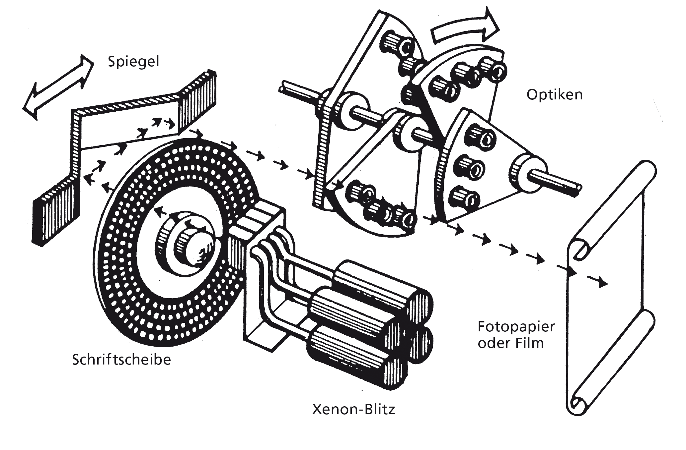

## HF Interactiondesign

# Typografische Systeme   Technologiegeschichte der Schrift   Communities

Stefan Huber, Zürich – 2021 <!-- .element: class="footer" -->

--s--
## Übersicht 

- **8:15**
- Technologiegeschichte der Schrift
- Werkstatt · Typografische Systeme
- **11:45** · Ende

--s--

## Übersicht
* **12:45**
- Communities
- Werkstatt · Typografische Systeme
* **16:15** · End
--s--

## Planung

- **Sa · 18. 09. 2021** → 4h Bildschirme und Fonts
- **Sa · 18. 09. 2021** → 4h Open Source Communities
- **Fr · 19. 11. 2021** → 4h Typografische System
- **Sa · 04. 12. 2021** → 8h Typografische System
- **Fr · 07. 01. 2022** → 4h Typografische System
- **Fr · 07. 01. 2022** → 4h Open Source Communities
- **Fr · 14. 01. 2022** → 4h Technologiegeschichte der Schrift

--s--
# Technologiegeschichte der Schrift

--s--
## Unterlagen

* [Technologiegeschichte der Schrift](https://interaction.signalwerk.ch/articles/font-history/)

--s--
## Römische Capitalis Monumentalis

--s--
## Karolingische Minuskel

--s--
## Werkzeug
 <!-- .element: class="pic" -->
--s--
## Achslage

--s--
## Breitfeder

  <iframe src="https://www.youtube.com/embed/i6fWPSMwJT8?start=322&end=345" frameborder="0" allow="autoplay; encrypted-media" allowfullscreen></iframe>

--s--
## Spitzfeder

  <iframe src="https://player.vimeo.com/video/62849657" frameborder="0" webkitallowfullscreen mozallowfullscreen allowfullscreen></iframe>

--s--
## Buchdruck
--s--
## Johann Gensfleisch zum Gutenberg

 <!-- .element: class="pic" -->

Kupferstich nach André Thevet, 1584. <!-- .element: class="footer" -->

--s--
## B42 – Gutenberg-Biebel

 <!-- .element: class="pic" -->

B42 Bd. / Vol. 1 - fol. 102r <!-- .element: class="footer" -->
--s--
## Bleibuchstaben
 <!-- .element: class="pic" -->
--s--
## Buchproduktion pro Jahr
Vergleich handschriftliche Codices vs. modernem Buch <!-- .element: class="small" -->

 <!-- .element: class="pic" -->

--s--
## Schriftherstellung

--s--
## Stempel herstellen

--s--

## Stempel schneiden

Quelle: [Wikipedia](https://en.wikipedia.org/wiki/Punchcutting#/media/File:Cutting_a_punch_for_a_Qu_ligature.jpg)
<!-- .element: class="footer" -->
--s--

## Stempel schlagen

 <!-- .element: class="pic" -->

--s--

## Matrizen schlagen

 <!-- .element: class="pic" -->

Quelle: [Dutchtypelibrary](https://www.dutchtypelibrary.nl/index_desktop.html)
<!-- .element: class="footer" -->
--s--
## Matrizen schlagen

 <!-- .element: class="pic" -->

Quelle: [Wikipedia](https://en.wikipedia.org/wiki/Punchcutting#/media/File:De_Vinne_1904_-_Punch_and_matrix.jpg)
<!-- .element: class="footer" -->
--s--

## Handsatz

 <!-- .element: class="pic" -->
--s--
## Setzmaschinen
* Linotype ~1886
* Monotype ~1890

--s--
## Linotype
 <!-- .element: class="pic" -->

--s--

## Monotype

 <!-- .element: class="pic" -->

--s--

## Linotype

  <iframe src="https://www.youtube.com/embed/13trF0_XIMs?start=34" frameborder="0" allow="autoplay; encrypted-media" allowfullscreen></iframe>

--s--
## Linotype

  <iframe src="https://www.youtube.com/embed/avDuKuBNuCk" frameborder="0" allow="autoplay; encrypted-media" allowfullscreen></iframe>

--s--

## Montoype Keyboard

  <iframe src="https://www.youtube.com/embed/LcphfMlOzk4?start=20" frameborder="0" allow="autoplay; encrypted-media" allowfullscreen></iframe>

 
--s--

## Montoype Caster

  <iframe src="https://www.youtube.com/embed/M9DV95IEKGU?start=690" frameborder="0" allow="autoplay; encrypted-media" allowfullscreen></iframe>

--s--
## Fotosatz ab ~1960

 <!-- .element: class="pic" -->

--s--
## Fotosatz ab ~1960

 <!-- .element: class="pic" -->

--s--
## Übung

* Versuche den «unscharfen» Buchstabe so zu verändern, dass er nach der Reproduktion «schärfer» wirkt.
--s--
## Demo

--s--
## Beispiel
 <!-- .element: class="pic" -->

--s--

## Rubbelbuchstaben (Lettraset) ab ~1960

 <!-- .element: class="pic" -->
--s--

## Rubbelbuchstaben (Lettraset) ab ~1960

 <!-- .element: class="pic" -->

--s--
## Licht- & Lasersatzsysteme ab ~1965

--s--
## Systeme ohne Monitor
 <!-- .element: class="pic" -->
--s--
## Systeme ohne Monitor
 <!-- .element: class="pic" -->

--s--
## Kathodenstralröhre
 <!-- .element: class="pic" -->

--s--

## Erste WYSIWYG-Systeme ~1980

 <!-- .element: class="pic" -->
--s--

## Erste WYSIWYG-Systeme ~1980

 <!-- .element: class="pic" -->

--s--
## Fonts werden Digital
 <!-- .element: class="pic" -->

--s--

## Aufgabe

* Zeichne die Zeichen «Aakg» als `.pbm` in einem Texteditor

--s--
## Nadeldrucker

 <!-- .element: class="pic" -->

--s--
## Prinzip
 <!-- .element: class="pic" -->

--s--
## Schriftbild

--s--
## Nadeldrucker vs. Tintenstrahldrucker  

--s--
## Ikarus von URW · 1975

 <!-- .element: class="pic" -->

--s--
## Aufgabe

* Versuche ein s mit einem [→ «Ikarus-ähnlichen»](https://codepen.io/osublake/pen/wKGvVG) System zu Zeichnen

--s--
## Apple und Fonts
 <!-- .element: class="pic" -->

--s--
## MacOS 1 – Pixelfonts · 1984

Fonts von Susan Kare

--s--
## Adobe und PostScript · 1982

* John Warnock &  Charles Geschke 
* Ehemals bei Xerox PARC gearbeitet

--s--
## Adobe und Apple · 1984

 <!-- .element: class="pic" -->

LaserWriter <!-- .element: class="footer" -->

--s--
## Kubische Kurven (PostScript)

--s--

### Laserdrucker · 1985

  <iframe src="https://www.youtube.com/embed/WB0HnXcW8qQ" frameborder="0" allow="autoplay; encrypted-media" allowfullscreen></iframe>

--s--
## MacOS 7 – TrueType · 1991

--s--
## Quadratische Kurven (TrueType)

--s--
## Aufgabe

* [→Teste](https://pomax.github.io/bezierinfo/) den Unterschied zwischen quadratische Kurven und kubische Kurven

--s--
# OpenType
## Yay! Let's talk about today!
* WOFF (Webfont) ist ein «Container» für OpenType-Fonts.

--s--

## ~1445 · Handsatz

 <!-- .element: class="pic" -->

Bildquelle: Stefan Huber · 2018 <!-- .element: class="footer" -->

--s--

## ~1445 · Kerning Handsatz

 <!-- .element: class="pic" -->

Bildquelle: Stefan Huber · 2018 <!-- .element: class="footer" -->

--s--
## Digitalisierung

 <!-- .element: class="pic" -->

Font: Paratype · PT Sans · Bold <!-- .element: class="footer" -->

--s--

## Kerning mit PostScript-Fonts · 1984

 <!-- .element: class="pic" -->

Font: Paratype · PT Sans · Bold <!-- .element: class="footer" -->

--s--

## Globalisierung

 <!-- .element: class="pic" --> <!-- .element: class="pic" -->

Font: Paratype · PT Sans · Bold <!-- .element: class="footer" -->

--s--

## Kerning mit OpenType · 1996

 <!-- .element: class="pic" -->

Font: Paratype · PT Sans · Bold <!-- .element: class="footer" -->

--s--

## Kerning mit OpenType · 1996

 <!-- .element: class="pic" -->

Font: Paratype · PT Sans · Bold <!-- .element: class="footer" -->

--s--
## Kerning & Tracking

 <!-- .element: class="pic" -->

Font: Adobe · Garamond Premier Pro · Regular <!-- .element: class="footer" -->

--s--
## Kerning & Tracking

 <!-- .element: class="pic" -->

Font: Adobe · Garamond Premier Pro · Regular <!-- .element: class="footer" -->

--s--
## Kerning & Tracking

 <!-- .element: class="pic" -->

Font: Adobe · Garamond Premier Pro · Regular <!-- .element: class="footer" -->

--s--
## Kerning & Tracking

 <!-- .element: class="pic" -->

Font: Adobe · Garamond Premier Pro · Regular <!-- .element: class="footer" -->

--s--
## Kerning & Tracking

 <!-- .element: class="pic" -->

Font: Adobe · Garamond Premier Pro · Regular <!-- .element: class="footer" -->

--s--
## Kerning & Tracking

 <!-- .element: class="pic" -->

Font: Adobe · Garamond Premier Pro · Regular <!-- .element: class="footer" -->

--s--
## OpenType · Ligaturen

  <iframe src="https://signalwerk.github.io/fontkit-demo/?url=AdobeVFPrototype.otf&hideInput=true&sampleText=fi f i fl f l ffi&fontSize=300" frameborder="0" webkitallowfullscreen mozallowfullscreen allowfullscreen></iframe>

Font: Adobe VF Prototype <!-- .element: class="footer" -->

--s--
## OpenType · Zahlensätze

  <iframe src="https://signalwerk.github.io/fontkit-demo/?url=AdobeVFPrototype.otf&hideInput=true&sampleText=Typ%206917.10&fontSize=300" frameborder="0" webkitallowfullscreen mozallowfullscreen allowfullscreen></iframe>

Font: Adobe VF Prototype <!-- .element: class="footer" -->

--s--

## Zeichenersetzungen

> OpenType is a game changer | Still beta but ebpic.

    <Video
    loop={true}
    src="https://cdn.jsdelivr.net/gh/signalwerk/talk.fonts2019@c45cf9b95b03f1c597db1484072bcdb80a3524ed/img/replace/SansBullshitSans/text-entry.mp4"
    />

Font: [Sans Bullshit Sans](http://www.sansbullshitsans.com/) · Roel Nieskens · 2015 
<!-- .element: class="footer" --> 

--s--
## Zeichenersetzungen

<iframe
  className="browser "
  src="https://player.vimeo.com/video/154854315?title=0&byline=0&portrait=0vz#t=2m42s">
</iframe>

FontShop · Chartwell <!-- .element: class="footer" -->

--s--
# 2018 · OpenType specification 1.8 

## Variable Fonts

--s--
## Design-Achsen · Variable Fonts

  <iframe src="https://signalwerk.github.io/fontkit-demo/?url=AmstelvarAlpha-VF.ttf&hideInput=true&sampleText=HALLO&fontSize=350" frameborder="0" webkitallowfullscreen mozallowfullscreen allowfullscreen></iframe>

Font: Amstelvar Alpha <!-- .element: class="footer" -->

--s--
# Zukunft?

--s--

## Blocksatz · Variable Fonts

<iframe
  className="browser "
  src="//speakerdeck.com/player/3bfec54809c1438ca260d6a97ad925bf?slide=67">
</iframe>

Bram Stein · Vortrag <!-- .element: class="footer" -->

--s--

## Color-Fonts · vier Standards …

<iframe
  className="browser "
  src="https://player.vimeo.com/video/213887934?title=0&byline=0&portrait=0vz#t=0m25s">
</iframe>

Fontself · Gilbert Color Bold  <!-- .element: class="footer" -->

--s--
## TrueType · 1991

--s--
## OpenType 1.x · 1996

--s--

## OpenType 2.0 ?

--s--

## [Werkstatt](https://docs.google.com/spreadsheets/d/1FhjgZ8ucKH7aP9TJN3k1qf6nz3QwWn36JI1yQ7-VmcE/edit?usp=sharing)
* Chrome mit Dokument und Web-Inspector
* Editor offen halten
* Nicht endloss grosser Bildschirm

--s--

# Communities

--s--
## Heute

* «Wir» schauen uns kurz ein paar «wichtige» Communities & Organisationen an
* Ich möchte kleine «Recherchegruppen» bilden
* Ich gebe ein paar Stichwörter, soll aber kein Muss sein

--s--
## Recherche

* Koordination
* Website & Wikipedia besuchen
* Fragen anschauen und «Was ist …» googlen
* Wenn ihr meine Frage nicht versteht → nicht wichtig.

--s--
## Zeit

* Recherche etwa 25 min
* Präsentation etwa 5 min

--s--
## Communities

* Mozilla Foundation
* ISOC/IETF/ICANN/IANA
* Wikipedia
* Digitale Gesellschaft & Piraten Partei

--s--
## Mozilla Foundation

* Was ist die «Mozilla Foundation»?
* Was hat Netscape damit zu tun? Was ist Netscape?
* Was ist das Verhältnis «Mozilla Foundation» zu «Firefox»
* Wie finanziert sich die «Mozilla Foundation»?
* Ist Firefox wichtig? Wieviele Browser-Engiges gibt es noch?
* Welche Rolle spielt [Bugzilla](https://bugzilla.mozilla.org/). Beispiel zeigen?
* [DNS-over-HTTPS](https://hacks.mozilla.org/2018/05/a-cartoon-intro-to-dns-over-https/)?

--s--
## ISOC/IETF/ICANN/IANA

* Was macht/ist die ISOC?
* Was macht/ist die IETF?
* Was macht/ist die ICANN?
* Was macht/ist die IANA?
* Was ist ein [RFC](https://en.wikipedia.org/wiki/Request_for_Comments) und wozu dient es? Beispiel?
* Bisschen «trocken» alles. Vielleicht mal [hier](https://en.wikipedia.org/wiki/IP_over_Avian_Carriers) oder [hier](https://en.wikipedia.org/wiki/April_Fools%27_Day_Request_for_Comments) rein schauen?
* Wie stimmt IETF ab? [Please Hum Now](https://hackcur.io/please-hum-now/)

--s--
## Wikipedia

* Wer gründete wann Wikipedia?
* Was steht in Wikipedia? Wie ist die Form?
* Was ist das Verhältnis «Wikimedia Foundation» zu «Wikipedia»
* Was ist die Lizenz von Wikipedia inhalten?
* Welches sind die drei grössten Wikipedias und warum?
* Könnt ihr zeigen, wie man einen Artikel editieren würde?
* Könnt ihr die Versionsgeschichte eines Artikels zeigen?

--s--
## Digitale Gesellschaft & Piraten Partei

* Was macht die Digitale Gesellschaft Schweiz?
* Was sind wichtige/aktuelle Themen der DigiGes? Kongress?
* Was ist die «Piraten Partei»?
* Was ist LiquidFeedback?
* Wichtigkeit der «Piraten Partei» in Deutschland mitte 2010er?

--s--

## [Werkstatt](https://docs.google.com/spreadsheets/d/1FhjgZ8ucKH7aP9TJN3k1qf6nz3QwWn36JI1yQ7-VmcE/edit?usp=sharing)
* Chrome mit Dokument und Web-Inspector
* Editor offen halten
* Nicht endloss grosser Bildschirm
