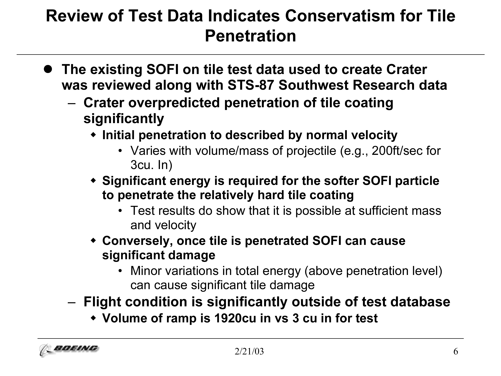

## HF Interactiondesign

# Portfolio, Blog und Typografie

Stefan Huber, Zürich – 2022 <!-- .element: class="footer" -->

--s--

## Planung

- ~~**FR 25. 02. 2022 · 08:15 – 16:15** – Stefan~~
- ~~**FR 04. 03. 2022 · 08:15 – 16:45** – Boris~~
- ~~**FR 11. 03. 2022 · 08:15 – 16:45** – Boris~~
- ~~**SA 12. 03. 2022 · 12:45 – 16:15** – Stefan~~

--s--

## Planung

- ~~**FR 18. 03. 2022 · 08:15 – 11:40** – Boris~~
- **FR 18. 03. 2022 · 12:45 – 16:15** – Stefan
- **SA 19. 03. 2022 · 08:15 – 16:15** – Stefan
- **FR 25. 03. 2022 · 08:15 – 16:45** – Boris
- **SA 26. 03. 2022 · 08:15 – 16:15** – Stefan

--s--

## Übersicht Freitag

- **12:45**

* Gruppenarbeiten · Hierarchie
* CV (Lebenslauf)
* Werkstatt

- **16:15** · End

--s--

## Übersicht Samstag

- **8:15**

* Bilder
* Arbeitgeber·in bewerten
* Werkstatt

- **11:45** · End

--s--

## Übersicht Samstag

- **12:45**

* Lohn & Lohnniveau
* Storytime
* Werkstatt

- **16:15** · End

--s--

## Ziel FR/SA

* Samstag kurzer Austausch in Klasse
* Finale Auswahl für Portfolio
* Technik gewählt und angewendet
* Feedback

--s--

# Gruppenarbeiten · Hierarchie

--s--

## Wie gruppieren wir Information?

* Remember: Portfolio, Blog und Typografie
* **Inhalt und Darstellung** muss ineinandergreifen

--s--

## Problem

> Eine ungünstige Gliederung von Information  
> kann falsche Ergebnisse liefern.

--s--

# Beispiel · Space Shuttle Columbia 

--s--

## Space Shuttle Columbia 

* 113er Flug vom Space Shuttle
* 28er Flug von Columbia
* Start: 16. Januar 2003 
* Eintritt: 1. Februar 2003
* Schaumstoffisolierung machte schon zuvor Schwierigkeiten

--s--

## Start · Rampe bricht ab

Bildquelle: [researchgate.net](https://www.researchgate.net/figure/Time-snap-shots-showing-the-impact-event_fig3_250145655)

<!-- .element: class="footer" -->

--s--

## Fällt auf Flügel

 <!-- .element: class="pic" -->

Bildquelle: [Wikipedia](https://en.wikipedia.org/wiki/Space_Shuttle_Columbia_disaster)

<!-- .element: class="footer" -->

--s--

## Rampe

 <!-- .element: class="pic" -->

Bildquelle: [Wikipedia](https://en.wikipedia.org/wiki/Space_Shuttle_Columbia_disaster)

<!-- .element: class="footer" -->

--s--

## Grösse

 <!-- .element: class="pic" -->

Bildquelle: [The Gainesville Sun](https://eu.gainesville.com/story/news/2003/02/06/nasa-doubts-foam-theory/31627224007/)

<!-- .element: class="footer" -->

--s--

## Ausgangslage 

* Leute von Boeing präsentieren NASA
* Boeing hat die Expertiese/Untersuchung
* NASA trift die Entscheidung
* Es gibt eine Messsreihe für dieses Szenario

--s--

## Mögliche Szenarien

* Alles gut → gemäss Plan
* Weltraumspaziergang → prüfen der Aussenschicht
* Nächstes Space Shuttle los schicken zur Rettung

--s--

## Zentraler Slide aus Präsentation

 <!-- .element: class="pic border" -->

Bildquelle: [NASA](https://www.nasa.gov/pdf/2203main_COL_debris_boeing_030123.pdf)

<!-- .element: class="footer" -->

<!-- 

## Review of Test Data Indicates Conservatism for Tile Penetration

* The existing SOFI on tile test data used to create Crater was reviewed along with STS-87 Southwest Research data
  * Crater overpredicted penetration of tile coating significantly
    * Initial penetration to described by normal velocity
      * Varies with volume/mass of projectile (e.g. 200 ft/sec for 3 in³)
    * Significant energy is required for the softer SOFI particle to penetrate the relatively hard tile coating
      * Test results do show that it is possible at sufficient mass and velocity
    * Conversely, once tile is penetrated SOFI can cause significant damage
      * Minor variations in total energy (above penetration level) can cause significant tile damage
  * Flight condition is significantly outside of test database
    * Volume of ramp is 1920 in³ vs 3 in³ for test

> SOFI = spray on foam insulation = Impact on the foam insulation that caused the hole

 -->

--s--

## Übersetzung

> Sorry it's rocket science …

Übersetzung wurde möglichst lesbar gemacht. 

--s--

## Überprüfung der Testdaten deuten auf Vorsicht bei den Kachelschäden hin

* Die bestehenden SOFI Testdaten zum Einschlag auf den Kacheln wurden zusammen mit den STS-87 Southwest Research Daten überprüft.
  * Die Durchschlagskraft des Einschlags übersteigt die Kachelbeschichtung erheblich.
    * Die initiale Durchschlagskraft wird durch die normale Geschwindigkeit beschrieben.
      * Variiert mit Volumen/Masse des Projektils (z.B. 200 ft/sec für 3 in³)
    * Es ist eine erhebliche Energie erforderlich, damit das weichere SOFI-Partikel die relativ harte Kachelbeschichtung durchdringen kann.
      * Testergebnisse zeigen, dass dies bei ausreichender Masse und Geschwindigkeit möglich ist.
    * Umgekehrt kann SOFI, sobald die Fliese durchdrungen ist, erhebliche Schäden verursachen.
      * Geringfügige Schwankungen der Gesamtenergie (oberhalb der Eindringtiefe) können zu erheblichen Schäden an den Kachel führen.
  * Die Flugbedingungen liegen deutlich ausserhalb der Testdatenbank.
    * Das Volumen des Partikels (Rampe) beträgt 1920 in³ gegenüber 3 in³ beim Test

> SOFI = spray on foam insulation = Einschlag auf der Schaumstoffisolierung, der das Loch verursachte

--s--

## Aufgabe

* 4 Gruppen
* Ziel: zwei Slides
* Briefing an NASA. Basierend auf Info von Boeing.
* 5 min 
  * Wie teilt ihr Slide 1 und Slide 2 auf? 
  * Warum?
* 10 min – Slides aufbereiten

--s--

## Weitere Infos zu den Slides

* [Edward Tufte](https://www.edwardtufte.com/bboard/q-and-a-fetch-msg?msg_id=0001yB)
* [James Thomas](https://mcdreeamiemusings.com/blog/2019/4/13/gsux1h6bnt8lqjd7w2t2mtvfg81uhx)
<!-- * [Joachim Lasoen](https://medium.com/@JoachimLasoen/the-powerpoint-slide-that-crashed-a-space-shuttle-c820c907d0ae) -->

--s--

## curriculum vitae

--s--

## Worum geht es?

- Wie kann der CV herausstechen?
- Wie kann der CV in 1 min eine Prüfung «überleben»?
- Wen möchte ich erreichen?

--s--

## Übermittlung CV

- Welche Technologie wird verwendet?
- Formular
- Privacy
- Upload → PDF mit Link auf Portfolio/CV?

--s--

## Aufbau CV

- Kontakt
- Schulische Bildung
- Praxiserfahrung
- Skills

--s--

## Sprache

* Deutsch oder Englisch
* Kann ich zwei/mehrere Sprachen bewirtschaften?
* Englisch kann in der Schweiz gut oder schlecht sein
* Nie Schweizerdeutsch

--s--

## Kontakt

- Welche Infos?
- Ausland?
- Telefonnummern nach [ITU-T Recommendation E.123](https://webtypo.signalwerk.ch/telefonnummern/)

--s--

## Angloamerikanische Bewerbung

* Keine Adresse
* Keine Religion
* Kein Alter
* Kein Geschlecht
* Kein Foto

--s--

## Schulische Bildung

- Wie weit zurück?
- Welche Lehrgänge?
- Welche Kurse?

--s--

## Praxiserfahrung

- Kennt man die Firma?
- Was habe ich dort genau gemacht?

--s--

## Skills

- Was kann ich sozial?
- Was kann ich technisch?
- Was kann ich gestalterisch?

--s--

## Beispiele

- [Jürgen Wössner – Typograf und Frontend-Entwickler](https://j.wssnr.ch/)
- [Robby Leonardi](http://www.rleonardi.com/interactive-resume/)
- [Cornel Widmer](https://pixelarium.ch)
- Stefan Huber

--s--

## Werkstatt

--s--

# Danke
