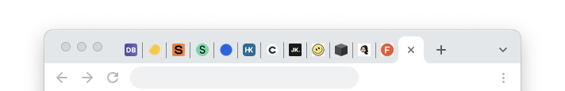
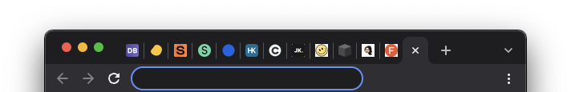
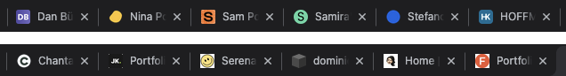

## HF Interactiondesign

# Portfolio, Blog und Typografie

Stefan Huber, Zürich – 2022 <!-- .element: class="footer" -->

--s--

## Schulbesuch 

Hello Urs 👋 

--s--

## Elevator Pitch an Urs

> Boris Périsset und ich haben unsere Module verknüpft und die Studierenden in der Erarbeitung von Portfolio-Arbeiten unterstütz. Boris hatte den Fokus auf UI/UX ich eher auf den Recruiting-Prozess.

--s--

## Wenn er schon da ist… 

* 1️⃣  Infos
* 2️⃣ Frage

--s--

## Back to normal

--s--

## Planung

- ~~**FR 25. 02. 2022 · 08:15 – 16:15** – Stefan~~
- ~~**FR 04. 03. 2022 · 08:15 – 16:45** – Boris~~
- ~~**FR 11. 03. 2022 · 08:15 – 16:45** – Boris~~
- ~~**SA 12. 03. 2022 · 12:45 – 16:15** – Stefan~~

--s--

## Planung

- ~~**FR 18. 03. 2022 · 08:15 – 11:40** – Boris~~
- ~~**FR 18. 03. 2022 · 12:45 – 16:15** – Stefan~~
- ~~**SA 19. 03. 2022 · 08:15 – 16:15** – Stefan~~
- ~~**FR 25. 03. 2022 · 08:15 – 16:45** – Boris~~
- **SA 26. 03. 2022 · 08:15 – 16:15** – Stefan

--s--

## Letzer gemeinsamer Schultag 🥲

Ich kann an der Diplomausstellung  am 9. July 2022 leider nicht teilnehmen.

--s--

## Übersicht · Morgen

- **8:15**

* Avatar & Fav-Icon 
* Review
* **9:00 – 9:15** · Stefan & Urs Besprechung
* **9:55 – 10:10** · Stefan & Urs Besprechung
* Werkstatt

- **11:45** · End

--s--

## Übersicht · Nachmittag

- **12:45**

* Werkstatt
* **13:30** · Besprechung

- **16:15** · End

--s--

## Wie geht es weiter? 

Boris und ich werden euch ein gemeinsames Feedback geben.

Benotung gemäss [→ Aufgabe · Portfolio](https://iad2019.signalwerk.ch/exercise-portfolio/)

--s--

## Material

* [iad2019.signalwerk.ch](https://iad2019.signalwerk.ch/) bleibt
* [W3C · Tim Berners-Lee · Cool URIs don't change](https://www.w3.org/Provider/Style/URI.html)

### 1️⃣  Urs · Info
* Lizenz für alle meine Assets → [CC BY-SA 4.0](https://creativecommons.org/licenses/by-sa/4.0/)
* Lizenz eure Arbeiten → [CC BY-SA 4.0](https://creativecommons.org/licenses/by-sa/4.0/)

--s--

## Followup

--s--
## Titelbezeichnung

* [Englische Titelbezeichnung](https://www.sbfi.admin.ch/sbfi/de/home/bildung/hbb/englische-titelbezeichnungen.html#103236228) (Merci Dan)

--s--
## Lehrgang

### Diplomierte Gestalterin HF · Fachrichtung Kommunikationsdesign, Vertiefung Interaction Design
### Diplomierter Gestalter HF · Fachrichtung Kommunikationsdesign, Vertiefung Interaction Design

### Advanced Federal Diploma of Higher Education in Interaction Design

--s--

## Lehrgang

* **School of Design Zurich**  gemäss Mail Jonas Schudel · 12. Dezember 2018

### 2️⃣ Urs · Frage
* Noch gültig?

--s--
## Abgrenzung

* SfGZ = School of Design Zurich
* ZHdK = University of the Arts 

--s--

## Auszug CV Stefan Huber

* Zurich University of the Arts (ZHdK) · Department of Design · Zurich – Switzerland
* School of Design (SfGZ) · Zurich – Switzerland

--s--

# Avatar & Fav-Icon 

--s--

## Bedeutung

# Was ist ein Avatar?

--s--

## Avatar

> In der Informatik ist ein Avatar eine  grafische Darstellung von User·innen,  deren Charaktere (Computerspiele)  oder deren Persona (Persönlichkeiten).

Quelle: [→ Wikipedia EN](https://en.wikipedia.org/wiki/Avatar_(computing))
<!-- .element: class="footer" -->

--s--
## Herkunft

* Aus dem Sanskrit 
* अवतार (Avatāra) «Abstieg»
* Herabsteigen einer Gottheit in irdische Sphären
* 1985 · Richard Garriott · Game «Ultima IV: Quest of the Avatar»

Quelle: [→ Wikipedia DE](https://de.wikipedia.org/wiki/Avatar_(Internet))
<!-- .element: class="footer" -->

--s--

## Synonyme

* Profile picture
* User picture
* Picons (personal icons) · veraltet
* Buddy Icon · veraltet

--s--

## Was ist es?

* Wie man sich auf einer **Plattform präsentiert**
* Kann **grafisch** oder **fotografisch** sein

--s--

## Warum sprechen wir darüber? 

* **Avatare** vergebt ihr hundertfach 
* **Usernamen** vergebt ihr hundertfach
* Gehört zur «**Psersönlichkeit** im Internet» wohl dazu
* Post-Privacy/Privacy-Preserving

--s--
## Usernamen

* Könnt ihr teils nicht setzen (Mail)
* Sind teils schon vergeben

--s--

## Avatare

* Können fast überall gesetzt werden
* Konsistenz? Privacy?

--s--

## Beispiel 

Quelle: [Perf Rocks](https://perf.rocks/people/mathias-bynens/)
<!-- .element: class="footer" -->
--s--

## Beispiel 

Quelle: [MB's Homepage](https://mathiasbynens.be/)
<!-- .element: class="footer" -->

--s--

## Mathias Bynens 

* «Bekannt» auf [GitHub](https://github.com/mathiasbynens) 
* Hatte einen ikonischen Avatar
* Heute ein «normales» Bild
* Ich musste einen Freund fragen, wie er heisst

--s--

## Beispiel Stefan Huber

* Konsistenz ([Doku](https://avatar.signalwerk.ch/))
* Seit 2011 in Verwendung
* ~ 400 User-Accounts 
* Erkennbarkeit über Avatar und Name (signalwerk)

--s--

## Wie kann man Avatare «automatisieren»?

Patrick? Hilf uns!

--s--

## Gravatar to the rescue

* [Gravatar](https://en.gravatar.com/)
* Gehört Automattic
* Liefert aufgrund von Mail-Adressen Avatare aus

--s--

## Automattic

* Gegründet von [Matt Mullenweg](https://en.wikipedia.org/wiki/Matt_Mullenweg) (WordPress – 2003)
* [Decoder Podcast mit Matt Mullenweg](https://www.theverge.com/2022/3/15/22977857/wordpress-tumblr-simplenote-internet-automattic-matt-mullenweg-interview)
* Brands	
  * WordPress.com
  * Tumblr
  * Gravatar
  * Simplenote
  * WooCommerce

--s--

## Services können Avatare beziehen

* [gravatar.com/avatar/ec48841e140d5189bcf376014d585987](https://www.gravatar.com/avatar/ec48841e140d5189bcf376014d585987?size=500) → Patrick <!-- .element: class="small" -->
* [gravatar.com/avatar/545345c83f095bbc785578c37878d62e](https://www.gravatar.com/avatar/545345c83f095bbc785578c37878d62e?size=500) → Stefan <!-- .element: class="small" -->

--s--

## Hash-Funktionen

* Haben wir bereits einmal bei Passwörtern gehabt

--s--
## Hash-Funktionen

### Beispiel Quersumme als «Hash»
* **115 → 7** kann in eine Richtung ausgeführt werden  
* **7 → ???** nicht aber in die Andere

--s--

### Stefan
* sh@signalwerk.ch → Hash (MD5) = 545345c83f095bbc785578c37878d62e
* [gravatar.com/avatar/545345c83f095bbc785578c37878d62e](https://www.gravatar.com/avatar/545345c83f095bbc785578c37878d62e?size=500) <!-- .element: class="small" -->

---

### Patrick
* patrick.hoffmann@-----.com → Hash (MD5) = 545345c83f095bbc785578c37878d62e
* [gravatar.com/avatar/ec48841e140d5189bcf376014d585987](https://www.gravatar.com/avatar/ec48841e140d5189bcf376014d585987?size=500)  <!-- .element: class="small" -->

--s--

### Eure Avatare

* [Euer Favicon/Avatar](https://hackmd.io/@signalwerk/HyA0HqfG5/edit)
  * Selina → Unterschied Social Media/LinkedIn
* [Noch einmal](https://github.com/orgs/logrinto/teams/iad2019/members)

--s--

## Avatare

### Runder Ausschnitt
  * Flavia
  * Samira

--s--

## Avatare

### Foto oder Ding
  * Josh
  * Nina
  * Dan

--s--

## Avatare

### Fallback
  * [GitHub](https://github.com/orgs/logrinto/teams/iad2019/members)
  * [Twitter](https://medium.com/on-marketing/don-t-be-an-egghead-on-twitter-4401853c707f)
  * [Defaults](https://www.google.com/search?q=accounts+avatar&tbm=isch)

--s--

# Fav-Icons
--s--

## Namen

* favorite icon
* shortcut icon
* website icon
* tab icon
* URL icon
* bookmark icon

Quelle: [→ Wikipedia](https://en.wikipedia.org/wiki/Favicon)
<!-- .element: class="footer" -->

--s--
## Fav-Icon & Touch icons

* Tab
* Bookmarks
* Schaltflächen
* …

--s--

## Fav-Icon

* Merci für [Dokumentation](https://hackmd.io/@signalwerk/HyA0HqfG5/edit) 

--s--

## Fav-Icon

* Transparenter Hintergrund?
* Wie gross ist mein «Inhalt»?

--s--

## Light und Dark

* Bastelei für Dark-Fav-Icons/Light-Fav-Icons

--s--

## Seitentitel

* Was ist wichtig?
* Was wird abgeschnitten?

--s--

## Fragen?

--s--
## Review

* Zwei Personen
  * Jede Person macht 10 min ein Review
  * Avatar und Fav-Icon in Ordnung?
  * 3 Empfehlungen zur Verbesserung
  * Nett sein bringt nicht so viel…

* [Besprechungsliste](https://docs.google.com/spreadsheets/d/1FhjgZ8ucKH7aP9TJN3k1qf6nz3QwWn36JI1yQ7-VmcE/edit?usp=sharing)

--s--

## Werkstatt

* [Besprechungsliste](https://docs.google.com/spreadsheets/d/1FhjgZ8ucKH7aP9TJN3k1qf6nz3QwWn36JI1yQ7-VmcE/edit?usp=sharing)

--s--

## Danke!
