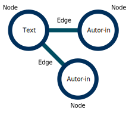

## HF Interactiondesign

# Open Source & Open Data

Stefan Huber · Zürich · 2022 <!-- .element: class="footer" -->

--s--

## Slack

# #typo

--s--

<style>
.small {
  font-size: 0.65em;
}

.reveal table {
  margin: 0
}
</style>

## Planung

- ~~**SA 01. 10. 2022 · 08:15 – 15:55** – Intro~~
- **SA 12. 11. 2022 · 08:15 – 15:55** – Arbeit
- **FR 13. 01. 2023 · 08:15 – 15:55** – Präsentation/Abgabe

--s--

## Übersicht

- **8:15**

* Edge & Node
* API
* Wo steht die Schweiz?
* Werkstatt

- **11:40**

--s--

## Übersicht

- **12:30**

* Private Daten & öffentliche Daten
* Werkstatt

- **14:45** · Hannes Gassert von [CH++](https://chplusplus.org/)
- **15:55** · End

--s--

## News

- 21\. September 2022 – [Bundesgesetz über den Einsatz elektronischer Mittel zur Erfüllung von Behördenaufgaben (EMBAG)](https://www.parlament.ch/de/services/news/Seiten/2022/20220921125029604194158159038_bsd083.aspx)
- 30\. September 2021 – [MeteoSchweiz · als Open Government Data](https://www.meteoschweiz.admin.ch/home/aktuell/meteoschweiz-blog.subpage.html/de/data/blogs/2022/9/entwurf-einer-datenplattform-im-testlauf.html)

--s--

## Daten · Struktur

### Lernziel

- **Datensätze (Node)** und **Verknüpfung (Edge)** sind verstanden

--s--

## Node · Knote · Datensätze

- In der [Graphentheorie](https://de.wikipedia.org/wiki/Graphentheorie) – **Node** (Knote) genannt
- In der [Datenbank](https://de.wikipedia.org/wiki/Datenbank) – **Datensatz** genannt
- Im [Spreadsheet](https://de.wikipedia.org/wiki/Tabellenkalkulation) - **Zeile** genannt
- ...

--s--

## Blogpost · Beispiel

```md
16.12.2022

## Der kluge Knecht

von Erika Erzinger (34) und Jacob Müller (27)

...
Text
...
```

--s--

## Blogpost · Beispiel

### Datenset · Datenbank

<div class="small">

| Titel            | Publikation | Autorenschaft                             | Text |
| ---------------- | ----------- | ----------------------------------------- | ---- |
| Marienkind       | 02.12.2022  | Erika Erzinger (34) und Jacob Müller (27) | ...  |
| Der junge Riese  | 09.12.2022  | Erika Erzinger (34)                       | ...  |
| Der kluge Knecht | 16.12.2022  | Jacob Müller (27)                         | ...  |

</div>

### Node

<div class="small">

| Titel      | Publikation | Autorenschaft                             | Text |
| ---------- | ----------- | ----------------------------------------- | ---- |
| Marienkind | 02.12.2022  | Erika Erzinger (34) und Jacob Müller (27) | ...  |

</div>

--s--

## Blogpost · Beispiel

### Datenbank

<div class="small">

| Titel      | Publikation | Autorenschaft                             | Text |
| ---------- | ----------- | ----------------------------------------- | ---- |
| Marienkind | 02.12.2022  | Erika Erzinger (34) und Jacob Müller (27) | ...  |

</div>

### Website

```md
16.12.2022

## Der kluge Knecht

von Erika Erzinger (34) und Jacob Müller (27)

...
Text
...
```

--s--

## Gibt es hier Probleme?

<div class="small">

| Titel            | Publikation | Autorenschaft                             | Text |
| ---------------- | ----------- | ----------------------------------------- | ---- |
| Marienkind       | 02.12.2022  | Erika Erzinger (34) und Jacob Müller (27) | ...  |
| Der junge Riese  | 09.12.2022  | Erika Erzinger (34)                       | ...  |
| Der kluge Knecht | 16.12.2022  | Jacob Müller (27)                         | ...  |

</div>

--s--

## Probleme

<div class="small">

| Titel            | Publikation | Autorenschaft                             | Text |
| ---------------- | ----------- | ----------------------------------------- | ---- |
| Marienkind       | 02.12.2022  | Erika Erzinger (34) und Jacob Müller (27) | ...  |
| Der junge Riese  | 09.12.2022  | Erika Erzinger (34)                       | ...  |
| Der kluge Knecht | 16.12.2022  | Jacob Müller (27)                         | ...  |

</div>

### Probleme

- **Vermischung** von Blog-Post und Autorenschaft (atomarität verletzt)
- **Kontext** nicht Berücksichtigt (im Jahr 2036 sind die Personen gealter)

--s--

## Warum [Graphentheorie](https://de.wikipedia.org/wiki/Graphentheorie)?

- Information kommt selten alleine
- Information ist **verknüpft**
- Information ist in mehreren **Kontexten** relevant
- ...

--s--

## Author·innen · Beispiel

| Vorname | Nachname | Alter |
| ------- | -------- | ----- |
| Jacob   | Müller   | 27    |
| Erika   | Erzinger | 34    |

### Probleme

- ~~**Vermischung** von Blog-Post und Autorenschaft (atomarität verletzt)~~
- **Kontext** nicht Berücksichtigt (im Jahr 2036 sind die Personen gealter)

--s--

## Author·innen · Beispiel

| Vorname | Nachname | Geburtsdatum |
| ------- | -------- | ------------ |
| Jacob   | Müller   | 05.08.1988   |
| Erika   | Erzinger | 15.04.1995   |

--s--

## Author·innen · Beispiel

| id  | Vorname | Nachname | Geburtsdatum |
| --- | ------- | -------- | ------------ |
| 1   | Jacob   | Müller   | 05.08.1988   |
| 2   | Erika   | Erzinger | 15.04.1995   |

--s--

## Texte · Beispiel

<div class="small">

| id  | Titel            | Publikation | Autorenschaft&nbsp;(ID) | Text |
| --- | ---------------- | ----------- | ----------------------- | ---- |
| 1   | Marienkind       | 02.12.2022  | 2, 1                    | ...  |
| 2   | Der junge Riese  | 09.12.2022  | 2                       | ...  |
| 3   | Der kluge Knecht | 16.12.2022  | 1                       | ...  |

</div>

<br>

---

<br>

<div class="small">

| id  | Vorname | Nachname | Geburtsdatum |
| --- | ------- | -------- | ------------ |
| 1   | Jacob   | Müller   | 05.08.1988   |
| 2   | Erika   | Erzinger | 15.04.1995   |

</div>

--s--

## Website

```md
16.12.2022

## Der kluge Knecht

von Erika Erzinger (34) und Jacob Müller (27)

...
Text
...
```

- Alter wird bei der Anzeige errechnet
- Zusammenhang wird durch die ID hergestellt

--s--

## Edge · Kante · Join

- In der [Graphentheorie](https://de.wikipedia.org/wiki/Graphentheorie) – **Edge** (Kante) genannt
- In der [Datenbank](https://de.wikipedia.org/wiki/Datenbank) – **Join** genannt
- Im [Spreadsheet](https://de.wikipedia.org/wiki/Tabellenkalkulation) - **Lookup** genannt
- ...

--s--

## Graph

 <!-- .element: class="pic" -->

--s--

## Übung API

# Was ist ein(e) API?

--s--

## Application programming interface (API)

> Ein Programmteil, der anderen Programmen zur Anbindung zur Verfügung gestellt wird.

[Wikipedia](https://de.wikipedia.org/wiki/Programmierschnittstelle)

--s--

## API

- Schnittstelle zwischen zwei (Fremd-) Systemen
- Viele Services bieten geschützte oder offene APIs

--s--

## Einfach gesprochen

- Informationen erfragen
- Informationen übermitteln
<!-- - [Beispiel: The Star Wars API](https://swapi.dev/) -->

--s--

## API = Maschinenlesbar

> Daten in einem Datenformat, das von einem Computer automatisch gelesen und verarbeitet werden kann, wie z. B. CSV, JSON, XML usw. Maschinenlesbare Daten müssen strukturierte Daten sein. Vergleiche Menschenlesbar.

Quelle: <!-- .element: class="footer" -->[The Open Data Handbook](http://opendatahandbook.org/glossary/en/terms/machine-readable/)

--s--

## Menschenlesbar

> Daten in einem Format, das von einem Menschen bequem gelesen werden kann. Einige für den Menschen lesbare Formate wie PDF sind nicht maschinenlesbar, da es sich nicht um nicht strukturierte Daten handelt, d. h. die Darstellung der Daten auf der Festplatte entspricht nicht den tatsächlichen Beziehungen in den Daten.

Quelle: <!-- .element: class="footer" -->[The Open Data Handbook](https://opendatahandbook.org/glossary/en/terms/human-readable/)

--s--

## Beispiel aus dem Alltag


- ISBN-Text für die Menschen (Menschenlesbar)
- Barcode für Maschinen (Maschinenlesbar)

Quelle: <!-- .element: class="footer" -->[Menschenlesbarkeit](https://de.wikipedia.org/wiki/Menschenlesbarkeit)

--s--

## Beispiel aus API

## JSON-API

```json
{
  "birthday": 359995629
}
```

UNIX Timestamp – Sekunden seit 1.1.1970 · 00:00:00 · [UTC](https://de.wikipedia.org/wiki/Koordinierte_Weltzeit)

<br>

## Text

Freitag, 29. Mai 1981, 16:47:09 <br>(Mitteleuropäische Sommerzeit)

--s--

## Open Data

- API muss offen sein
- API ermöglicht einen **einfachen Zugriff** (für Maschinen)
- API können stetig **aktuell** bleiben
- API haben (im Idealfall) eine Dokumentation und **gleichbleibende Strukturen**

--s--

## Warum?

- Informationen erfragen
- Informationen übermitteln
- Man hat etablierte Systeme, die man verknüpfen möchte?

--s--

## Woher nutzt ihr eure Geräte APIs?

--s--

## Beispiele

- Wetter
- Push-Notifications (Anbieter/Service meldet an Apple/Google)
- [RSS](https://en.wikipedia.org/wiki/RSS) (Podcast)
- ...

--s--

## Beispiel

# Was ist das grösste Fahrzeug bei Star Wars?

- Datenquelle: [Star Wars · API](https://studio.apollographql.com/public/star-wars-swapi/explorer)

--s--

## Übung API Node & Edge

# Aufgabe: Wie gross (Median in cm) sind die Hauptdarstellenden im Film «Return of the Jedi»?

- Datenquelle: [Star Wars · API](https://studio.apollographql.com/public/star-wars-swapi/explorer)
  - Liste aller Filme erhalten
  - Hauptdarstellende (characters) auslesen
  - Median errechnen → Was ist der Median?

--s--

## Open Government Data in der Schweiz

# Wo sind nun die Daten?

--s--

## Open Government Data in der Schweiz

- [Strategie für offene Verwaltungsdaten in der Schweiz 2019 – 2023](https://www.fedlex.admin.ch/eli/fga/2019/125/de)
  - Betrieb von [opendata.swiss](https://opendata.swiss/)
  - Fördern von Datennutzung
  - nationale Koordination
  - qualitativ gute (Meta-)Daten

--s--

## Es ist komplizierter…

- [Offene Behördendaten Kanton Zürich](https://www.zh.ch/de/politik-staat/opendata.zhweb-noredirect.zhweb-cache.html)
- [Open Data Stadt Zürich](https://data.stadt-zuerich.ch/)
- [EU-Portal](https://data.europa.eu/en)

--s--

## Beispiel

### Daten der automatischen Fussgänger- und Velozählung

- [Erhebung · Stadt Zürich](https://data.stadt-zuerich.ch/dataset/ted_taz_verkehrszaehlungen_werte_fussgaenger_velo)
- [Schweizer Zentrale · opendata.swiss](https://opendata.swiss/de/dataset/daten-der-automatischen-fussganger-und-velozahlung-viertelstundenwerte)
- [Weitergabe · EU](https://data.europa.eu/data/datasets/83ca481f-275c-417b-9598-3902c481e400-stadt-zurich?locale=de)

--s--

## Beispiele aus Open Government Data

--s--

## Beispiele Open auch bei der Eingabe

### [FixMyStreet](https://www.fixmystreet.com/)

- Eines der frühen Projekte (2012)
- Sehr nahe bei den Bürger·innen
- [Open Source](https://github.com/mysociety/fixmystreet)
- Mit [OpenStreetMap](https://www.openstreetmap.org/) integration möglich

--s--

## Beispiel Stadt Zürich

- Dashboard [Polizeilich registrierte Verkehrsunfälle](https://data.stadt-zuerich.ch/showcase/polizeilich-registrierte-verkehrsunfalle-auf-dem-stadtgebiet-zurich-seit-2011)
- Lokaler Bezug

--s--

## Werkstatt

- Kurzer Austausch in 15 min
  - Zeit-Widget (screenshot)
  - Worauf ihr noch nicht stolz seit (max 5 Worte im screenshot)

--s--

## Private Daten & öffentliche Daten

--s--

## Einige Begriffe zuerst

- Daten
- Metadaten
- Big Data

--s--

## Daten

> Eine Sammlung diskreter Werte mit Informationsgehalt. Quantität, Qualität, Fakten, Statistiken und andere grundlegende Bedeutungseinheiten sind darin enthalten.

Beispiel Textnachricht:

```md
Sehen wir uns heute für Fondue?
```

Quelle: <!-- .element: class="footer" --> [Wikipedia · Daten](https://de.wikipedia.org/wiki/Daten)

--s--

## Metadaten

> Informationen über Merkmale anderer Daten

Beispiel Textnachricht:

```md
Sender·in: Max Mustermann
Empfänger·in: Moritz Müller
Datum: 12. Januar 2022
Zeit: 15:08:12
```

Quelle: <!-- .element: class="footer" --> [Wikipedia · Metadaten](https://de.wikipedia.org/wiki/Metadaten)

--s--

## Big Data

> Big Data ist ein Sammelbegriff für grosse Datensätze, die computergestützt analysiert werden, um Muster, Trends und Assoziationen zu erkennen.

Beispiel Textnachricht:

```md
Leute die Fondue mögen, mögen auch Raclette.
```

--s--

## Private Daten & öffentliche Daten

# Privat?

--s--

## Privatsphäre

> Die Privatsphäre ist der Bereich einer Person, der nicht öffentlich ist, also der nur die eigene Person angeht. Es ist der Bereich, der einen Menschen direkt umgibt.

Quelle: <!-- .element: class="footer" --> [Bundeszentrale für politische Bildung](https://www.bpb.de/kurz-knapp/lexika/das-junge-politik-lexikon/320971/privatsphaere/)

--s--

## Europäische Menschenrechtskonvention

### Art. 8 – Recht auf Achtung des Privat- und Familienlebens

> Abs 1 – Jede Person hat das Recht auf Achtung ihres Privat- und Familienlebens, ihrer Wohnung und ihrer Korrespondenz.

Quelle: <!-- .element: class="footer" --> [Europäische Menschenrechtskonvention](https://rm.coe.int/1680a6eaba)

--s--

## Bundesverfassung

### Art. 13 – Schutz der Privatsphäre

> Abs 1 – Jede Person hat Anspruch auf Achtung ihres Privat- und Familienlebens, ihrer Wohnung sowie ihres Brief-, Post- und Fernmeldeverkehrs.

> Abs 2 – Jede Person hat Anspruch auf Schutz vor Missbrauch ihrer persönlichen Daten.

Quelle: <!-- .element: class="footer" --> [Bundesverfassung der Schweizerischen Eidgenossenschaft](https://www.fedlex.admin.ch/eli/cc/1999/404/de#art_13)

--s--

## Private Daten & öffentliche Daten

- Der Staat schützt die Privatsphäre
- Der Staat publiziert öffentliche Daten

--s--

## Open Government Data

- [«Öffentliche Daten nützen, private Daten schützen.»](https://www.ccc.de/de/hackerethics)<br>
  in Abgrenzung zu [«Alle Informationen müssen frei sein.»](https://www.ccc.de/de/hackerethics)
- Ähnlich zu [«Public Money, Public Code»](https://fsfe.org/activities/publiccode/publiccode.en.html)

--s--

## Datenschutz

- **Vertraulichkeit** – Meine Daten bleiben privat
- **Integrität** – Mit meinen Daten wird sorgsam gearbeiet
- **Verfügbarkeit** – Meine Daten gehören auch mir
- …

--s--

## Recht auf digitale Unversehrtheit

- Persönlichkeitsrecht
- Privatsphäre
- digitale Identität
- digitaler «Fussabdruck» und die Konsequenzen
- Recht auf Vergessenwerden
- …

--s--

## Post-Privacy

- Freiwilliger Verzicht auf Privatheit/Privatsphäre
- Durch Aufkommen der Sozialen Netzwerke (ende 2000er)
- Meist nur Teile der Privatheit die Aufgelöst werden
- Beispiel Felton Reports (2005 – 2014)

Quelle: <!-- .element: class="footer" --> [Wikipedia · Post-Privacy](https://de.wikipedia.org/wiki/Post-Privacy)

--s--

## Übung

- A – Ich bekomme Spam von **qualipet.ch** <br>(ich bin nicht Kund·in)
- B – Ich bekomme Spam von **sfgz.ch**

### Fragen?

- Ist das erlaubt?
- Was kann ich machen?
- Was habe ich für Rechte?

--s--

## Unlauterer Wettbewerb

### Art. 3 – Unlautere Werbe- und Verkaufsmethoden und anderes widerrechtliches Verhalten

Unlauter handelt insbesondere, wer:

> Abs. o – Massenwerbung ohne direkten Zusammenhang mit einem angeforderten Inhalt fernmeldetechnisch sendet …

Quelle: <!-- .element: class="footer" --> [Bundesgesetz gegen den unlauteren Wettbewerb (UWG)](https://www.fedlex.admin.ch/eli/cc/1988/223_223_223/de#art_3)

--s--

## Auskunftsrecht

### Art. 8 – Auskunftsrecht

> Abs. 2 – Der Inhaber der Datensammlung muss der betroffenen Person mitteilen:  
> a. – alle über sie in der Datensammlung vorhandenen Daten einschliesslich der verfügbaren Angaben über die Herkunft der Daten;

Quelle: <!-- .element: class="footer" --> [Bundesgesetz über den Datenschutz (DSG)](https://www.fedlex.admin.ch/eli/cc/1993/1945_1945_1945/de#art_8)

--s--

## Nicht bearbeiten/verwenden

## Art. 12 – Persönlichkeitsverletzungen

> Abs. 2 – Er darf insbesondere nicht:  
> b. ohne Rechtfertigungsgrund Daten einer Person gegen deren ausdrücklichen Willen bearbeiten;

Quelle: <!-- .element: class="footer" --> [Bundesgesetz über den Datenschutz (DSG)](https://www.fedlex.admin.ch/eli/cc/1993/1945_1945_1945/de#art_12)

--s--

## Recht auf Löschung

## Art. 15 – Rechtsansprüche

> Abs. 1 – Klagen zum Schutz der Persönlichkeit richten sich nach den Artikeln 28, 28a sowie 28l des Zivilgesetzbuchs22. Die klagende Partei kann insbesondere verlan­gen, dass die Datenbearbeitung gesperrt wird, keine Daten an Dritte bekannt gege­ben oder die Personendaten berichtigt oder vernichtet werden.

Quelle: <!-- .element: class="footer" --> [Bundesgesetz über den Datenschutz (DSG)](https://www.fedlex.admin.ch/eli/cc/1993/1945_1945_1945/de#art_15)

--s--

## Werkstatt

--s--

## Danke
