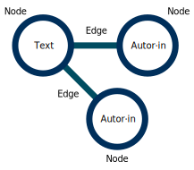

## HF Interactiondesign

# Open Source & Open Data

Stefan Huber · Zürich · 2023 <!-- .element: class="footer" -->

--s--

## Slack

# #typo

--s--

## Planung

- ~~**SA 01. 10. 2022 · 08:15 – 15:55** – Intro~~
- ~~**SA 12. 11. 2022 · 08:15 – 15:55** – Arbeit~~
- **FR 13. 01. 2023 · 08:15 – 15:55** – Präsentation/Abgabe

--s--

## Übersicht

- **8:15**

* Lizenzen
* Lernziel
* Besprechung/Werkstatt

- **11:40**

--s--

## Übersicht

- **12:30**

* Besprechung/Werkstatt

- **13:45** · Präsentation

* Auswertung
* Abgabe

- **15:55** · End

--s--

## Lizenzen

- [Urheberrechtsgesetz (URG)](https://www.fedlex.admin.ch/eli/cc/1993/1798_1798_1798/de)
- [Bundesgesetz gegen den unlauteren Wettbewerb (UWG)](https://www.fedlex.admin.ch/eli/cc/1988/223_223_223/de)
- [Bundesgesetz über den Schutz von Design](https://www.fedlex.admin.ch/eli/cc/2002/226/de)

--s--

## Urheber

- Schöpfer·in/Autor·in/Ersteller·in **ist die/der Urheber·in**
- **Schöpfungshöhe** muss erreicht sein
- Verzicht auf **Urheberrecht** ist nicht möglich
- **Nutzungsrechts** ist übertragbar (auch frei/gratis)

--s--

## Fair use – Schrankenregelungen

- «Fair use» im **angloamerikanischen Raum**
- «Fair use» ermöglicht die **freie Nutzung** von urheberrechtlich geschützten Werken (Schulen, non-commercial, ...)
- im **deutschsprachigen Raum meist nicht vorhanden**

--s--

## Lizenzen

### Besprochen in «Open Source & Communities»

- Software-Lizenzen
- Assets-Lizenzen

--s--

## Zwerge auf den Schultern von Riesen

> «Wenn ich weiter geblickt habe, so deshalb, weil ich auf den Schultern von Riesen stehe.»

**Isaac Newton, 5. Februar 1676**

Geht zurück auf das Gleichnis von Bernhard von Chartres um 1120 <!-- .element: class="footer" -->

--s--

## Software-Lizenzen

--s--

## Permissive licenses

## Freizügige Open-Source-Lizenz

- Beispiele: _MIT, BSD, ISC, ..._
- oft **kurz und leicht** zu verstehen
- Grundsätzlich: **Mach was du willst**
- Achtung! **Nie Copyrights entfernen** und zum Teil muss Lizenz mit Software ausgeliefert werden.

--s--

## Share-alike license

## Weitergabe unter gleichen Bedingungen

- Beispiele: _GPL, LGPL_
- Wenn GPL → Code wird auch zu GPL (**virale Lizenz**)
- Gewisse Bedingungen zur Veröffentlichung

--s--

## Assets-Lizenzen

- Assets (Bilder, Grafiken, Icons) fallen unter das Urheberrecht
- Lizenz Creative Commons Attribution-ShareAlike 4.0 International ([CC-BY-SA 4.0](https://creativecommons.org/licenses/by-sa/4.0/))
- [Rechtslage – ein kleines 1 × 1](https://interaction.signalwerk.ch/articles/legal/)

--s--

## Lizenz für Open Data

--s--

## Was wir meist mit Open Data meinen

- Datensets
- Maschinenlesbar
- Open Government Data

--s--

## Datensets

> A collection of data, published or curated by a single agent, and available for access or download in one or more formats.

### DE
Eine Sammlung von Daten, die von einem einzelnen Akteur veröffentlicht oder kuratiert wurde und in einem oder mehreren Formaten zum Zugriff oder Download verfügbar ist.

Quelle: <!-- .element: class="footer" --> [Data Catalogue Vocabulary (DCAT) · W3C](https://www.w3.org/TR/vocab-dcat-1/#class-dataset)

--s--

## Fünf Sterne von Open Data

### ★

stelle deine Daten im Web unter einer offenen Lizenz bereit. Das Format ist dabei egal
[Beispiel](https://5stardata.info/en/examples/gtd-1.pdf)

Quelle: <!-- .element: class="footer" --> [5stardata](https://5stardata.info/) von [Tim Berners-Lee](https://en.wikipedia.org/wiki/Tim_Berners-Lee)

--s--

## Gemeinfreiheit – Public Domain

- Inhalt hat kein Urheberrechte/Nutzungsrecht (oder sonstigen Immaterialgüterrechte)

### Mögliche Gründe

- Schöpfungshöhe nicht erreicht
- Urheberrechte abgelaufen
- Nutzungsrecht frei abgetreten

--s--

## Lizenz für Open Data

- [Creative Commons CC Zero License (cc-zero)](https://opendefinition.org/licenses/cc-zero/) – Gemeinfreiheit
- [Beispiel Stadt Zürich](https://data.stadt-zuerich.ch/dataset/ted_taz_verkehrszaehlungen_werte_fussgaenger_velo)

- [Open Database License](https://opendatacommons.org/licenses/odbl/1-0/)
  - Attribute
  - Share-alike
  - Keep open
- [Beispiel OpenStreetMap](https://www.openstreetmap.org/copyright)

--s--

## Lernziele

--s--

## Lernziele

- Der Begriff **«Open Data»** ist verstanden
- **Urheberrechte** für Datensammlungen sind verstanden
- **Datensätze (Node)** und **Verknüpfung (Edge)** sind verstanden

--s--

## Graph

 <!-- .element: class="pic" -->

--s--

## Texte · Beispiel

| id  | Titel            | Publikation | Autorenschaft&nbsp;(ID) | Text |
| --- | ---------------- | ----------- | ----------------------- | ---- |
| 1   | Marienkind       | 02.12.2022  | 2, 1                    | ...  |
| 2   | Der junge Riese  | 09.12.2022  | 2                       | ...  |
| 3   | Der kluge Knecht | 16.12.2022  | 1                       | ...  |

 

---

 

| id  | Vorname | Nachname | Geburtsdatum |
| --- | ------- | -------- | ------------ |
| 1   | Jacob   | Müller   | 05.08.1988   |
| 2   | Erika   | Erzinger | 15.04.1995   |

--s--

## Lernziele

- **Praktische Arbeit** vermittelt Umgang mit öffentlichen/privatend Daten
- **Austausch** zwischen Studierenden fördern
- Der Unterschied zwischen **privaten** Daten und **öffentlichen** Daten ist verstanden

--s--

## Private Daten & öffentliche Daten

# Privat?

--s--

## Privatsphäre

> Die Privatsphäre ist der Bereich einer Person, der nicht öffentlich ist, also der nur die eigene Person angeht. Es ist der Bereich, der einen Menschen direkt umgibt.

Quelle: <!-- .element: class="footer" --> [Bundeszentrale für politische Bildung](https://www.bpb.de/kurz-knapp/lexika/das-junge-politik-lexikon/320971/privatsphaere/)

--s--

## Europäische Menschenrechtskonvention

### Art. 8 – Recht auf Achtung des Privat- und Familienlebens

> Abs 1 – Jede Person hat das Recht auf Achtung ihres Privat- und Familienlebens, ihrer Wohnung und ihrer Korrespondenz.

Quelle: <!-- .element: class="footer" --> [Europäische Menschenrechtskonvention](https://rm.coe.int/1680a6eaba)

--s--

## Bundesverfassung

### Art. 13 – Schutz der Privatsphäre

> Abs 1 – Jede Person hat Anspruch auf Achtung ihres Privat- und Familienlebens, ihrer Wohnung sowie ihres Brief-, Post- und Fernmeldeverkehrs.

> Abs 2 – Jede Person hat Anspruch auf Schutz vor Missbrauch ihrer persönlichen Daten.

Quelle: <!-- .element: class="footer" --> [Bundesverfassung der Schweizerischen Eidgenossenschaft](https://www.fedlex.admin.ch/eli/cc/1999/404/de#art_13)

--s--

## Private Daten & öffentliche Daten

- Der Staat schützt die Privatsphäre
- Der Staat publiziert öffentliche Daten

--s--

## Nicht Lernziel

- Technik vermitteln (SPARQL, ...)
- Open Source wurde bereits behandelt aber wir haben diverse Berührungspunkte

--s--

## Abgabe

### Was muss abgegeben werden?

- [Aufgabe](https://iad2021.signalwerk.ch/exercise-open-data/)
- Datenquelle sollte nach heutiger Besprechung klar sein.
- PNG oder Link per Slack an mich senden
- Rückmeldung: Schriftliches Feedback (wie bisher)

--s--

## Besprechungen

- Zeigt jetzt einen Screenshot im Slack-Channel #typo
- [Timetable](https://docs.google.com/spreadsheets/d/1FhjgZ8ucKH7aP9TJN3k1qf6nz3QwWn36JI1yQ7-VmcE/edit?usp=sharing)
- **13:45** · etwa ~5 Minuten das Projekt vorstellen

--s--

## Auswertung

- [Umfrage](https://forms.gle/vpKuYUp1HMXPCm1B9)

--s--

## Merci

--s--
